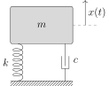

Vi betragter et dæmpet fjedermassesystem som på @fig-fjedersystem, hvor vi ønsker at beskrive $x(t)$, som er massens forskydning fra ligevægtstilstanden til tid $t$.
Dette modelleres ved differentialligningen
$$mx''+ cx' + kx = 0$${#eq-difflignOrig}
hvor $m$ er massens vægt, $c>0$ er en dæmpningsfaktor og $k$ er fjederstivheden.

@eq-difflignOrig omskrives ofte, så vi i stedet betragter
$$x'' + \eta x' + \lambda x = 0,$${#eq-difflign}
med $\eta = c/m$ og $\lambda = k/m$.

{width=50% #fig-fjedersystem}

Afhængigt af anvendelsen ønskes et mere eller mindre dæmpet system.
Når $\eta^2-4\lambda>0$ er systemet *overdæmpet*. Dette er eksempelvis ønskværdigt i en dørlukker, hvor et overslag vil medføre, at døren smækker mod dørkarmen.
Når $\eta^2-4\lambda <0$ er systemet underdæmpet. Affjedringen i en bil vil typisk være en smule underdæmpet, da et enkelt overslag er acceptabelt, og det underdæmpede system reagerer hurtigt ved ekstern påvirkning.
Endelig kaldes tilfældet $\eta^2-4\lambda=0$ for et kritisk dæmpet system.

I skal senere i jeres uddannelse se, at man kan løse differentialligningen @eq-difflign ved at benytte dens karakteristiske ligning
$$r^2+\eta r + \lambda = 0,$${#eq-karLigning}
hvor $r$ er den ubekendte. Løsningerne kan være komplekse, så vi undersøger dette nærmere i denne workshop.

## Delopgave 1
1. Betragt først et bestemt dæmpet fjedersystem, hvor $\eta=2$ og $\lambda=4$ ved et passende valg af enheder. Løs @eq-karLigning for disse værdier, og vis, at løsningerne er givet ved $-1\pm i\sqrt{3}$.

1. Skitser de to løsninger i det komplekse plan, og omskriv dem til polær form.

1. Omskriv $\frac{-1+i\sqrt{3}}{-1-i\sqrt{3}}$ til formen $a+ib$ og derefter til polær form. Kunne vi have opnået det samme ved at bruge resultaterne ovenfor?

## Delopgave 2{#sec-delopg2}
Vi ser nu på den karakteristiske ligning mere generelt, men under antagelse af, at systemet er underdæmpet. Altså antager vi, at $\eta^2-4\lambda<0$.

1. Argumenter for, at et den karakteristiske ligning for et underdæmpet system altid har to komplekse løsninger. 

1.
  Vis, at løsningerne til den karakteristiske ligning i dette tilfælde er
$$r_+ = \frac{-\eta+i\sqrt{4\lambda-\eta^2}}{2}
		\quad\text{og}\quad
		r_- = \frac{-\eta-i\sqrt{4\lambda-\eta^2}}{2}.$${#eq-kompLosning}

1. Vis, at $\mathrm{Re}(r_+)=\frac{r_++r_-}{2}$ og $\mathrm{Im}(r_+)=\frac{r_+-r_-}{2i}$.

Betragt nu funktionen $y(t)=e^{r_+ t}$. Vi ønsker at vise, at $y$ er en løsning til @eq-difflign, og gør dette via følgende trin.

1. Hvis $f$ er en funktion fra $\mathbb{R}$ til $\mathbb{C}$, så gælder, at $f'(t)=\mathrm{Re}(f)'(t) + i\mathrm{Im}(f)'(t)$. Altså, at vi kan differentiere realdelen og imaginærdelen hver for sig.
  Brug dette til at vise, at $f(t)=e^{(\alpha + i\beta)t}$ opfylder $f'(t)=(\alpha + i\beta)e^{(\alpha+i\beta)t}$, når $t$ er et reelt tal.

   ::: {.callout-tip title="Vink" collapse="true"}
   Brug Eulers formel.
   :::
  
1.
  Vis ud fra ovenstående resultat, at
  $$y'(t)=r_+e^{r_+ t}
  \quad\text{og}\quad
  y''(t) = r_+^2 e^{r_+ t}.$${#eq-yDiff}
  
1. Indsæt udtrykkene fra @eq-yDiff i differentialligningen @eq-difflign. Forklar, hvorfor dette viser, at $y(t)$ er en løsning til differentialligningen.

## Delopgave 3
Når den karakteristiske ligning (@eq-karLigning) har løsninger $\alpha\pm i\beta$, kan man vise, at differentialligningen @eq-difflign har en fuldstændig løsning givet ved
$$y_F(t) = e^{\alpha t}\big(c_1\cos(\beta t) + c_2\sin(\beta t)\big),$$
hvor $c_1$ og $c_2$ er reelle konstanter.

(@) Opskriv $y_F$ i tilfældet, hvor $\eta=2$, $\lambda=4$ ligesom i Delopgave 1.

```{pyodide-python}
import numpy
import matplotlib.pyplot as plt

endTime = 10

def yF(t, c1, c2):
	## Skriv jeres fundne funktionsudtryk herunder
	## (I får behov for numpy.exp, numpy.cos, numpy.sin og numpy.sqrt)
	return ???

## Generer ligeligt fordelte punkter mellem 0 og endTime
samplePoints = numpy.arange(0, endTime, step=1e-2)
c1, c2 = 1, 1
values = [ yF(t, c1, c2) for t in samplePoints ]

## Generer plot og indstil grænser
fig, ax = plt.subplots()
ax.plot(samplePoints, values)
ax.grid(True, linestyle="dotted")
plt.show()
```
   Brug derefter eksempelvis MATLAB eller Maple til at plotte den fundne funktion for forskellige valg af $c_1$ og $c_2$.
  Kan man sige noget generelt om den måde, graferne udvikler sig?

(@) Udnyt løsningerne $r_+$ og $r_-$ fra @eq-kompLosning til at opskrive $y_F$ i det generelle, underdæmpede tilfælde. Vis så, at $y_F$ altid konvergerer mod $0$, når $t$ vokser.

(@) Valget af $c_1$ og $c_2$ afhænger af fjedersystemets startbetingelser. Brug $y_F$ fra ovenfor, og sæt $c_1=1$ og $c_2=\frac{\eta}{\sqrt{4\lambda-\eta^2}}$. Undersøg effekten af dæmpningsfaktoren og fjederstivheden ved at plotte $y_F$ for forskellige valg af $\eta$ og $\lambda$. I kan f.eks. bruge [dette Geogebra-ark](https://www.geogebra.org/m/psx6mubh), der også er inkluderet herunder.

<div id="ggb-element" style="margin-left:auto; margin-right:auto;"></div>
<script type="text/javascript">
var params = {
            "appName": "graphing",
            "width": 1000,
            "height": 500,
            "showToolBar": false,
            "showAlgebraInput": false,
            "showMenuBar": false,
            "material_id":"psx6mubh"
            };
    var ggbApplet = new GGBApplet(params, true);
    window.addEventListener("load", function() {
        ggbApplet.inject('ggb-element');
    });
</script>
<br>

(@) Kan vi også argumentere for, at $y(t)=e^{r_+ t}$ fra @sec-delopg2 må konvergere mod $0$?

    ::: {.callout-tip title="Vink" collapse="true"}
    Kig på dens modulus.
	:::
