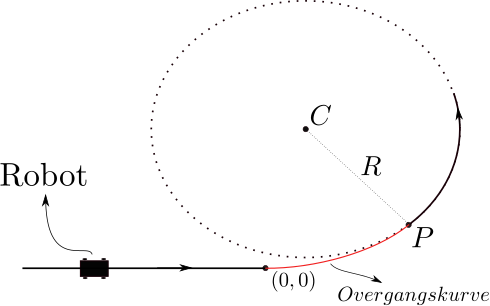
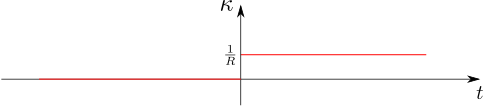
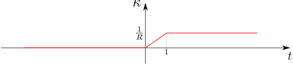

Forestil jer den rute, en skal robot følge, når den skal komme fra én position til en anden og samtidigt undgå forhindringer. Som skitseret på @fig-forhindring kan ruten sammensættes af to typer af kurver: rette linjer og cirkelbuer. Det kan dog være nødvendigt at benytte en tredje kurvetype, nemlig *overgangskurver*. Disse overgangskurver bruges til at forbinde de rette linjestykker med cirkelbuerne, sådan at en pludselig ændring i retning undgås -- I kan for eksempel overveje, hvad der ville ske, hvis robotten kører med høj fart, og forhjulene drejes 45 grader i løbet af få millisekunder.

{width=50% #fig-forhindring fig-alt="Robot med indtegnet rute omkring forhindring"}

Vi skal i denne workshop se på, hvordan sådanne overgangskurver konstrueres. Vi antager, at vi har et lige stykke af ruten, der skal sammensættes med en cirkelbue. Den tilladte krumning af ruten er bestemt af parametre såsom underlaget, robottens maksimale styrevinkel, og robottens fart (ved for stor krumning og fart risikerer vi, at robotten vælter eller skrider ud). Vi antager, at den tilladte krumning er $\kappa=\tfrac{1}{R}$. Vi ønsker at føre det lige rutestykke ind i en cirkel med præcis denne krumning og altså radius $R$.  Lad os først antage, at det lige rutestykke er tangent til cirkelbuen i punktet $(0,0)$, som vist på Figur @fig-forhindring.

Da den rette linje er tangent til cirklen, er en parametriseret kurve, der gennemløber den sammensatte vej med konstant fart, differentiabel. Der er imidlertid et andet problem: krumningen er diskontinuert. Den rette linje har konstant krumning $0$, mens cirklen har konstant krumning $\tfrac{1}{R}$. Det vil sige, at i punktet $(0,0)$ skal robotten momentant dreje rattet, sådan at forhjulene danner en bestemt vinkel med baghjulene for fortsat at følge vejens ideallinje. Dette er ikke ønskværdigt, da robotten oplever et voldsomt ryk, der evt. kan få den til at vælte. I stedet anvender man en overgangskurve mellem den rette linje og cirkelbuen, der sikrer, at krumning forløber kontinuert. Det betyder, at robotten skal freje hjulene med en jævn vinkelhastighed gennem hele overgangskurven. Vores opgave er at bestemme denne overgangskurve samt den tilhørende krumningscirkel. Dette er illustreret på @fig-Fig:2.

{width=50% #fig-Fig:2 fig-alt="Lige linjestykke forbundet med cirkelbue via en overgangskurve"}

Workshoppen består af tre delopgaver. I delopgave 1 bestemmer vi et teoretisk udtryk for overgangskurven og den tilhørende krumningscirkel. I delopgave 2 ser vi på et praktisk eksempel i Python og i delopgave 3 ser vi på et par generelle matematiske spørgsmål. For yderligere litteratur henvises læseren til @Bolet1, @Bolet2 og @Vejdirektoratet.

## Delopgave 1{#sec-1}
Vi starter med at indføre et koordinatsystem til at plotte krumningen $\kappa$ som funktion af tiden $t$ idet vi gennemløber kurven med konstant fart 1.  Vi lader $t=0$ svare til punktet $(0,0)$, hvor den rette linje ophører. Hvis vi ikke anvender en overgangskurve, men blot lader det lige rutestykke tangere cirkelbuen, når $t=0$, så bliver krumningen diskontinuert som vist på @fig-Fig:3.

{width=80% #fig-Fig:3 fig-alt="Plot af diskontinuert krumning"}

Lad $\textbf{r}(t)$ betegne den sammensatte kurve, der indeholder den rette linje, overgangskurven og cirkelbuen. Vi konstruerer $\textbf{r}(t)$ således, at $t\leq 0$ svarer til den rette linje, $0< t< 1$ svarer til overgangskurven og $t\geq 1$ svarer til cirkelbuen. Vi ønsker at konstruere $\textbf{r}(t)$ således, at krumningen er kontinuert for alle $t$ som vist på @fig-Fig:4.

{width=80% #fig-Fig:4 fig-alt="Plot at kontinuert krumning"}


Vi antager, at kurven er parametriseret med konstant fart $|\textbf{r}'(t)|=1$ (dvs. at kurven er buelængdeparametriseret). Parameterfremstillingen for $\textbf{r}(t)$ er dermed givet ved:
$$\mathbf{r}(t)=\left[\begin{array}{c}
x(t) \\ y(t)
\end{array}\right]= 
\begin{cases}
\begin{bmatrix}
t \\ 0
\end{bmatrix} & \text{for }t\leq  0 \\
\begin{bmatrix}
? \\ ?
\end{bmatrix} & \text{for }0< t< 1\\
C+R\begin{bmatrix}
\cos(\tfrac{t}{R}-\theta) \\ \sin(\tfrac{t}{R}-\theta)
\end{bmatrix} & \text{for }t\geq 1
\end{cases}$$
Her er $\theta$ en parameter, der sikrer, at cirkelbuen starter i $P$ til tiden $t=1$ (se @fig-Fig:2). Vi bestemmer et udtryk for både $P$, $C$ og $\theta$ senere i denne delopgave. 

(@) Argumenter for at parameterfremstillingen for $\textbf{r}(t)$ rent faktisk giver en ret linje for $t\leq 0$ og en cirkel med radius $R$ og centrum $C$ for $t\geq 1$. Vis at $\textbf{r}(t)$ har konstant fart $|\textbf{r}'(t)|=1$ på den rette linje og på cirkelbuen. Vis at krumningen er $\kappa(t)=0$ på den rette linje og $\kappa(t)=\tfrac{1}{R}$ på cirkelbuen. Overvej desuden, hvordan sammenhængen er mellem $t$ og strækningen langs kurven fra positionen $\textbf{r}(0)$ til $\textbf{r}(t)$

(@) Vores opgave er at bestemme en overgangskurve, sådan at $\textbf{r}(t)$ får en krumning som vist på @fig-Fig:4. Når denne overgangskurve er bestemt, så kan vi bagefter finde $P$,  $C$ og $\theta$. For en buelængdeparametriseret kurve har hastighedsvektoren længde 1 og kan derfor skrives som
$$\mathbf{r}'(t)=
\left[\begin{array}{c}
\cos\left(\varphi(t)\right) \\ 
\sin\left(\varphi(t)\right)
\end{array}\right],\qquad 0\leq t\leq 1,
$$
hvor $\varphi(t)$ er vinklen mellem $\textbf{r}'(t)$ og $x$-aksen. Vis, under antagelsen at $\varphi$ er differentiabel og positiv, at 
$$
|\mathbf{r}'(t)|=1\quad \text{og}\quad \kappa(t)=\varphi'(t),\qquad 0\leq t\leq 1.$$

(@) Vis at med $\varphi'(t)=\tfrac{t}{R}$, så opfylder krumningen af overgangskurven, at $\kappa(0)=0$ og $\kappa(1)=\frac{1}{R}$. Hvad betyder dette for krumningen af den sammensatte kurve? (dvs. den kurve der både indeholder den rette linje, overgangskurven og cirkelbuen).

(@) Vi vælger nu $\varphi'(t)=\tfrac{t}{R}$. Vis at dette valg medfører $\varphi(t)=\tfrac{t^2}{2R}+K$, hvor $K$ er en konstant. Ser man på den del af $\textbf{r}(t)$, der svarer til den rette linje, så får man at
$$\textbf{r}'(0)=\begin{bmatrix} 1 \\ 0 \end{bmatrix}.$$
Brug dette udtryk til at vise at $K=0$, hvilket medfører, at $\varphi(t)=\tfrac{t^2}{2R}$ og
$$\mathbf{r}'(t)=
\begin{bmatrix}
\cos\left(\frac{t^2}{2R}\right) \\ 
\sin\left(\frac{t^2}{2R}\right)
\end{bmatrix},\qquad 0\leq t\leq 1.$$

(@) Vis at overgangskurven er givet ved 
$$\textbf{r}(t)=\begin{bmatrix}
\int_0^t \cos\left(\tfrac{s^2}{2R}\right) ds\\ 
\int_0^t \sin\left(\tfrac{s^2}{2R}\right) ds 
\end{bmatrix},\qquad 0\leq t\leq 1.$$

En funktion på denne form udgør en del af en såkaldt *klotoide* (se @WikipediaKlotoide for flere detaljer). De tilhørende integraler kan ikke udtrykkes eksplicit ved sædvanlige matematiske funktioner, men må løses numerisk (altså approksimeres med en computer). Vi går ikke nærmere i detaljer med, hvordan dette gøres i praksis (se @WikipediaIntegration for detaljer).

(@) Argumenter for, at
$$P=\begin{bmatrix}
\int_0^1 \cos\left(\tfrac{s^2}{2R}\right) ds\\ 
\int_0^1 \sin\left(\tfrac{s^2}{2R}\right) ds 
\end{bmatrix}.$$

(@) Lad $\textbf{r}'(1)^\perp$ betegne tværvektoren til $\textbf{r}'(1)$ for overgangskurven. Argumenter for at centrum for krumningscirklen er givet ved
$$C=P+R\textbf{r}'(1)^\perp=P+R\begin{bmatrix}
-\sin\left(\frac{1}{2R}\right)\\
\phantom{-}\cos\left(\frac{1}{2R}\right)
\end{bmatrix}.$$

(@) Argumenter for omskrivningen
$$P=C+R\begin{bmatrix}
\phantom{-}\sin\left(\frac{1}{2R}\right)\\
-\cos\left(\frac{1}{2R}\right) \
\end{bmatrix}.$$
Ved at bruge parameterfremstillingen for cirkelbuen får vi dermed ligningen 
$$\begin{align*}
C+R\begin{bmatrix}
\phantom{-}\sin\left(\frac{1}{2R}\right) \\
-\cos\left(\frac{1}{2R}\right) \
\end{bmatrix}&=C+R\begin{bmatrix}
\cos(\tfrac{1}{R}-\theta) \\ \sin(\tfrac{1}{R}-\theta)
\end{bmatrix}\notag\\
&\Updownarrow\notag\\
\sin\left(\tfrac{1}{2R}\right)&=\cos(\tfrac{1}{R}-\theta),\qquad \text{og}\notag\\
-\cos\left(\tfrac{1}{2R}\right)&=\sin(\tfrac{1}{R}-\theta).
\end{align*}
$$
Vis at disse ligninger løses af $\theta=\tfrac{R\pi+1}{2R}$.

    ::: {.callout-tip title="Vink" collapse="true"}
    Lav omskrivningen $\tfrac{1}{R}-\theta=\tfrac{1}{2R}-\tfrac{\pi}{2}$ og brug herefter additionsformlerne.
    :::


## Delopgave 2
I denne delopgave skal I modificere nedenstående Python-script til at tegne overgangskurverne. Scriptet giver som udgangspunkt flere fejl, når I kører det, da der flere steder står <code>???</code>, og det er jeres opgave at fylde den korrekte kode ind på de tilhørende steder.

::: {.callout-warning}
Husk at gemme jeres ændrede Python-kode i en anden fil. Hvis I lukker denne HTML-fil og åbner den igen, vil den vise den oprindelige kode med <code>???</code>.
:::

```{pyodide-python}
## Biblioteker
import numpy as np
from scipy.integrate import quad
import matplotlib.pyplot as plt

## Forklaring
# Dette script laver to subplots:
# (1) En lige rutestykke, der tangerer en cirkelbue
# (2) En lige rutestykke forbundet med overgangskurve til cirkelbue

## Parametre
# Tiden for den rette linje
t1 = np.linspace(-1.5, 0, 1000);	
# Tiden for overgangskurven
t2 = np.linspace(0, 1, 1000); 
# Tiden for cirkelbuen
t3 = np.linspace(1, 6, 1000);

# Den tilladte krumning
k = 1 / 3;
# Radius af krumningscirklen
R = ???;
# Parameteren theta fra opgavebeskrivelsen
theta = ???;

## Bestemmelse af krumningscirklen
# Centrum af krumningscirkel når lige rutestykke tangerer cirkelbuen
C1 = np.array([0, R]);                              

# Bestemmelse af overgangspunktet P
f = lambda x : np.cos(x**2 / (2 * R));    
g = lambda x : np.sin(x**2 / (2 * R));

P = [quad(f, 0, 1)[0], quad(g, 0, 1)[0]];

# Centrum af krumningscirkel når der er anvendt en overgangskurve
C2 = P + R * np.array([???, ???]); 

## Parameterfremstilling når lige rutestykke tangerer cirkelbuen
# Når t < 0
x1_naive = t1;
y1_naive = 0 * t1;

# Når 0 < t < 1
x2_naive = C1[0] + R * np.cos(t2 / R - np.pi / 2); 
y2_naive = C1[1] + R * np.sin(t2 / R - np.pi / 2); 

# Når t > 1
x3_naive = C1[0] + R * np.cos(t3 / R - np.pi / 2); 
y3_naive = ???; 

## Parameterfremstilling når der er anvendt overgangskurve
# Når t < 0
x1_klotoide = t1;
y1_klotoide = 0 * t1;

# Når 0 < t < 1
x2_klotoide = np.zeros(t2.shape[0]);
y2_klotoide = np.zeros(t2.shape[0]);

for i in np.arange(0, t2.shape[0], 1) :
    x2_klotoide[i] = quad(f, 0, t2[i])[0];        
    y2_klotoide[i] = quad(g, 0, t2[i])[0];

# Når t > 1 
x3_klotoide = C2[0] + R * np.cos(t3 / R - theta); 
y3_klotoide = ???;

## Plot uden overgangskurve
fig1, ax1 = plt.subplots()
ax1.plot(x1_naive, y1_naive, x2_naive, y2_naive, x3_naive, y3_naive)
ax1.set_xlabel("x")
ax1.set_ylabel("y")
ax1.set_xlim([-2, 4])
ax1.set_ylim([-1, 5])
ax1.grid(True, linestyle="dotted")
ax1.legend([r'$t\leq 0$', r'$0<t<1$', r'$1\leq t$'])
ax1.set_title("Lige rutestykke, der tangerer cirkelbue")
plt.show()

## Plot med overgangskurve
fig2, ax2 = plt.subplots()
ax2.plot(x1_klotoide, y1_klotoide, x2_klotoide, y2_klotoide, x3_klotoide, y3_klotoide)
ax2.set_xlabel("x")
ax2.set_ylabel("y")
ax2.set_xlim([-2, 4])
ax2.set_ylim([-1, 5])
ax2.grid(True, linestyle="dotted")
ax2.legend([r'$t\leq 0$', r'$0<t<1$', r'$1\leq t$'])
ax2.set_title("Overgangskurve anvendt")
plt.show()
```

## Delopgave 3
Overvej til sidst følgende generelle matematiske spørgsmål: 

1. Hvorfor har overgangskurven fra @sec-1 længden 1? Hvad skal man gøre, hvis overgangskurven i stedet skal have længde $T$?

1. Vis, at der til enhver positiv kontinuert funktion $\kappa\colon]a,b[\rightarrow \mathbb{R}$ findes en buelængdeparametriseret plan kurve $\textbf{r}\colon]a,b[\rightarrow \mathbb{R}$ med krumning $\kappa$.
