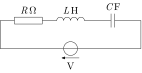

## Introduktion{-}
Et serielt RLC-kredsløb består af en modstand med værdi $R$ (målt i Ohm), en spole med selvinduktion $L$ (målt i Henry) og en kondensator med kapacitet $C$ (målt i Farad), som er serieforbundet og drives af en tidsafhængig ekstern spændingskilde $V_{\mathrm{e}}(t)$. Et eksempel ses på @fig-rlc.

{width=50% #fig-rlc}

De fysiske størrelser $R$, $L$ og $C$ er alle positive. Betegnes ladningen på kondensatoren til tiden $t$ med $Q(t)$, så er strømmen i kredsløbet givet som den afledede af $Q(t)$, dvs. $I(t)=Q'(t)$. Kirchhoffs spændingslov medfører, at følgende ligning gælder
$$LI'(t)+RI(t)+\frac{Q(t)}{C}=V_{\mathrm{e}}(t).$$

Differentieres begge sider af denne ligning opnås en differentialligning der ikke anvender $Q(t)$ men kun $I(t)$ og dens afledede. Resultatet er
$$LI''(t)+RI'(t)+\frac{I(t)}{C}=V_{\mathrm{e}}'(t).$${#eq-2}

Vi ser på et konkret valg af den eksterne spændingskilde, så $V_{\mathrm{e}}(t)=U\sin(\omega_{\mathrm{e}}t)$, hvor $U$ og 
$\omega_{\mathrm{e}}$ er konstanter. Med dette valg kan ligning @eq-2 omskrives til
$$I''(t)+\frac{R}{L}I'(t)+\frac{I(t)}{LC}=\frac{U\omega_{\mathrm{e}}}{L}
  \cos(\omega_{\mathrm{e}}t).$${#eq-3}
  
For at forenkle notationen definerer vi to konstanter
$$\lambda=\frac{R}{2L}\quad\text{og}\quad\omega_0=\frac{1}{\sqrt{LC}}.$$

Med disse definitioner kan ligning @eq-3 skrives som
$$I''(t)+2\lambda I'(t)+\omega_0^2 I(t)=\frac{U\omega_{\mathrm{e}}}{L}
  \cos(\omega_{\mathrm{e}}t).$${#eq-4}
  
Vi antager at energitabet i modstanden $R$ er lille i det betragtede system. Matematisk kan det formuleres ved at indføre følgende betingelse
$$\omega_0^2>\lambda^2.$${#eq-5}

Denne workshop består af tre delopgaver. I @sec-opg1 ser vi på den homogene ligning (tilfældet $U=0$), mens vi i @sec-opg2 ser på hvordan vi kan bestemme den fuldstændige løsning til den inhomogene ligning. I @sec-opg3 skal I se, hvordan kredsløbet kan modelleres i Python.

## Delopgave 1{#sec-opg1}
Betragt den homogene ligning
$$y''(t)+2\lambda y'(t)+\omega_0^2y(t)=0.$${#eq-6}


1. Gør rede for, at ligningens karakteristiske polynomium er $r^2+2\lambda r+\omega_0^2$. Har polynomiet reelle rødder?

1. Lad $y_1(t)=e^{-\lambda t}\cos\left(\sqrt{\omega_0^2-\lambda^2}\,t\right)$ og $y_2(t)=e^{-\lambda t}\sin\left(\sqrt{\omega_0^2-\lambda^2}\,t\right)$.

   Vis at både $y_1(t)$ og $y_2(t)$ er løsninger til den homogene ligning @eq-6.

1. Antag nu, at $I_{\mathrm{p}}(t)$ er en givet *partikulær løsning* til @eq-4. Gør rede for at hvis $I(t)$ er en vilkårlig løsning til @eq-4, så er $I(t)-I_{\mathrm{p}}(t)$ en løsning til den homogene ligning @eq-6.


## Delopgave 2{#sec-opg2}
Vi skal nu bestemme en partikulær løsning til den inhomogene ligning @eq-4. Da højresiden er en cosinus-funktion gætter vi på en partikulær løsning på formen
$$I_{\mathrm{p}}(t)=A\cos(\omega_{\mathrm{e}}t)+B\sin(\omega_{\mathrm{e}}t),$$

hvor $A$ og $B$ er konstanter, som skal bestemmes i denne delopgave.

1. Indsæt $I_{\mathrm{p}}(t)$ i @eq-4, og udled, at ligningen bliver
$$\begin{align*}
\bigl[(\omega_0^2-\omega_{\mathrm{e}}^2)A+2\omega_{\mathrm{e}}\lambda B\bigr]
    \cos(\omega_{\mathrm{e}}t)
    +\bigl[
    (\omega_0^2&-\omega_{\mathrm{e}}^2)B -2\omega_{\mathrm{e}}\lambda A
                 \bigr]\sin(\omega_{\mathrm{e}}t)\\
               &=\frac{U\omega_{\mathrm{e}}}{L}\cos(\omega_{\mathrm{e}}t).
\end{align*}$${#eq-guess}
  
1. Vis, at en tilstrækkelig betingelse for at @eq-guess er opfyldt er
$$\left.\begin{array}{r@{}c@{}l}
(\omega_0^2-\omega_{\mathrm{e}}^2)A+2\omega_{\mathrm{e}}\lambda B &=& \frac{U\omega_{\mathrm{e}}}{L}\\
-2\omega_{\mathrm{e}}\lambda A + (\omega_0^2-\omega_{\mathrm{e}}^2)B&=&0
\end{array}\right\}$${#eq-sufficient}
  
1. Løs @eq-sufficient, og vis, at
$$A=\frac{U\omega_{\mathrm{e}}}{L}
    \frac{\omega_0^2-\omega_{\mathrm{e}}^2}{(\omega_0^2-\omega_{\mathrm{e}}^2)^2
        +4\omega_{\mathrm{e}}^2\lambda^2},
    \quad
    B=\frac{U\omega_{\mathrm{e}}}{L}
    \frac{2\omega_{\mathrm{e}}\lambda}{(\omega_0^2-\omega_{\mathrm{e}}^2)^2
        +4\omega_{\mathrm{e}}^2\lambda^2}$$

1. Definér nu $a$ og $b$ ved
$$a=\frac{\omega_0^2-\omega_{\mathrm{e}}^2}{\sqrt{(\omega_0^2-\omega_{\mathrm{e}}^2)^2
            +4\omega_{\mathrm{e}}^2\lambda^2}},
    \quad
    b=\frac{2\omega_{\mathrm{e}}\lambda}{\sqrt{(\omega_0^2-\omega_{\mathrm{e}}^2)^2
            +4\omega_{\mathrm{e}}^2\lambda^2}}.$$

   Vis, at punktet med kartesiske koordinater $(a, b)$ ligger på enhedscirklen.
   
   Konkludér derfor, at der findes en vinkel $\varphi\in[0,2\pi)$ således at $a=\cos(\varphi)$ og $b=\sin(\varphi)$.
   
1. Brug additionsformlen
$$\cos(\omega_{\mathrm{e}}t-\varphi)=
  \cos(\omega_{\mathrm{e}}t)\cos(\varphi)+
  \sin(\omega_{\mathrm{e}}t)\sin(\varphi)$$
til at vise, at
$$I_{\mathrm{p}}(t)=\frac{U\omega_{\mathrm{e}}}{L}
    \frac{1}{\sqrt{(\omega_0^2-\omega_{\mathrm{e}}^2)^2
            +4\omega_{\mathrm{e}}^2\lambda^2}}\cos(\omega_{\mathrm{e}}t-\varphi).$${#eq-7}

1. Brug @eq-7 sammen med de to sidste opgaver fra @sec-opg1 til at konkludere, at den fuldstændige løsning til @eq-4 kan skrives som
$$I(t)=C_1y_1(t)+C_2y_2(t)+
    \frac{U\omega_{\mathrm{e}}}{L}
    \frac{1}{\sqrt{(\omega_0^2-\omega_{\mathrm{e}}^2)^2
            +4\omega_{\mathrm{e}}^2\lambda^2}}\cos(\omega_{\mathrm{e}}t-\varphi),$$
   hvor $C_1$ og $C_2$ er arbitrære konstanter.

1. Betragt til sidst et konkret kredsløb, hvor $\omega_{\mathrm{e}}=\omega_0=2$, $\lambda=1$ og $U\omega_{\mathrm{e}}/L=1$. Vis, at @eq-5 er opfyldt og at $\varphi=\pi/2$.
  
   Vis, at så, at løsningen er givet ved
$$I(t)=C_1e^{-t}\cos(\sqrt{3}t)+C_2e^{-t}\sin(\sqrt{3}t)
    +\frac14\sin(2t),$${#eq-8}
hvor
$$I(0)=C_1,\quad I'(0)=-C_1+\sqrt{3}C_2+\frac{1}{2}.$${#eq-initialCond}

1. Antag, at vores løsning skal tilfredsstille begyndelsesværdierne $I(0)=0$ og $I'(0)=0$. Brug @eq-initialCond til at vise, at vi i dette tilfælde har
   $$I(t)=\frac14\sin(2t)-\frac{\sqrt{3}}{6}e^{-t}\sin(\sqrt{3}t).$$
   
## Delopgave 3{#sec-opg3}
I denne delopgave bruger vi de konkrete værdier for de fysiske
konstanter som er valgt i sidste del af @sec-opg2. Nedenstående Python-script løser differetialligningen @eq-4 for forskellige begyndelsesværdibetingelser.
Jeres opgave er at bruge scriptet til at undersøge generelle egenskaber for disse løsninger.

1. Argumenter ud fra @eq-8 for, at løsningen vil nærme sig funktionen $\frac{1}{4}\sin(2t)$, når $t$ bliver tilstrækkeligt stor.

   :::{.callout-tip title="Vink" collapse=true}
   Overvej, hvad der sker med faktorerne $e^{-t}$ i de første to led.
   :::

1. Brug Python-scriptet herunder til at efterprøve ovenstående hypotese for forskellige begyndelsesværdibetingelser.

```{pyodide-python}
## Indlæs nødvendige biblioteker
import numpy
import matplotlib.pyplot as plt
from scipy.integrate import solve_ivp

## Opgave vedrørende RCL kredsløb
## I(t) er strømmen til tiden t. Begyndelsesværdierne
## betegnes med I(0) = I0 og I'(0) = D0
## Resultat plottes fra tiden tmin til tiden tmax

## Fastlæggelse af parametre
I0 = -1 
D0 = 5
tmin = 0
tmax = 20

## Definer differentialligningen på den form, som solve_ivp forventer
## y er her en vektor, der indeholder I(t) og I'(t). Disse hedder derfor
## y[0] og y[1] i funktionen. Outputtet skal være de afledede af disse.
def diffEq(t, y):
	return [y[1], numpy.cos(2*t) - 4*y[0] - 2*y[1]]

## Generer 100 ligeligt fordelte tidspunkter mellem tmin og tmax, løs
## differentialligningen, og evaluer i de givne punkter
ts = numpy.linspace(tmin, tmax, 100)
solution = solve_ivp(diffEq, t_span=[tmin, tmax], y0=[I0, D0], t_eval=ts)

## Definer også grænsen som funktion, hvilket gør plottet lettere
def f(t):
	return numpy.sin(2*t)/4


fig, (ax1, ax2) = plt.subplots(2,1) # Hav to koordinatsystemer over hinanden

## Plot I(t) og f(t) i det øverste koordinatsystem
ax1.plot(solution.t, solution.y[0])
ax1.plot(ts, f(ts))
ax1.set_ylabel("$I(t)$")
ax1.legend(["$I(t)$", "$\\frac{1}{4}\\sin(2t)$"])

## Plot den absolutte differens i det nederste koordinatsystem
ax2.plot(ts, numpy.abs(solution.y[0]-f(ts)))
ax2.set_xlabel("$t$")
ax2.set_ylabel("Absolut differens")
plt.show()
```

<!-- Local Variables: -->
<!-- ispell-local-dictionary: "da_DK" -->
<!-- End: -->
