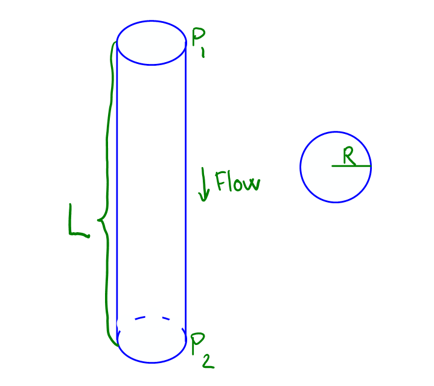
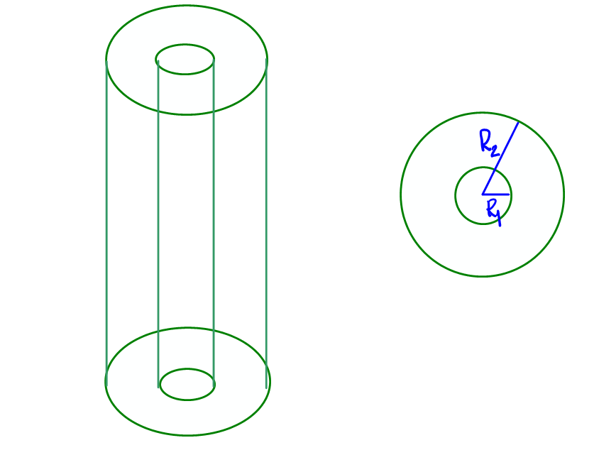
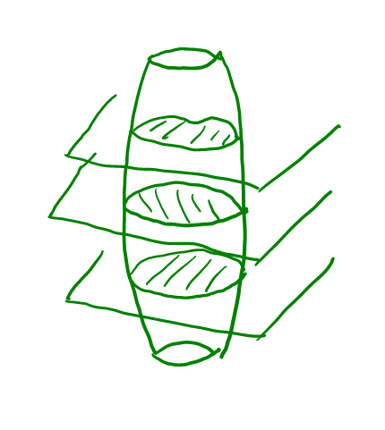
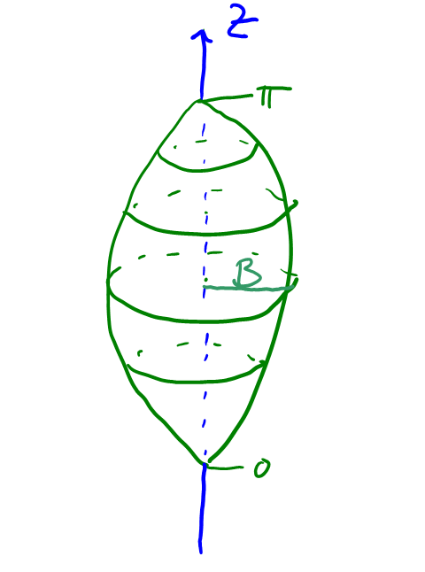

## Introduktion{-}
I denne workshop skal I se på to problemer, hvor integraler spiller en vigtig rolle. Den første del omhandler Poiseuilles lov,^[Denne kaldes også nogle gange Hagen-Poiseuille-ligningen] der beskriver væskers opførsel i et rør, mens den anden omhandler estimation af muskelvolumen fra endeligt mange scanningsbilleder.

Der findes flere processer i menneskekroppen, der kan modelleres ved hjælp af &lsquo;væskers&rsquo; flow gennem et rør. I denne sammenhæng dækker væsker også over gasser, så vi kan f.eks. modellere luften i lunger og luftveje eller blod i blodårerne.
Flowet gennem et rør afhænger af rørets længde $L$, radius $R$, trykforskellen over røret $\Delta P$ og viskositeten $\mu$ af væsken, der flyder gennem røret. Poiseuilles lov siger, at flowet $Q$ er givet ved
$$
Q=\frac{\pi}{8}\cdot\frac{\Delta P R^4}{\mu L}.
$$
Altså er flowet omvendt proportionalt med viskositeten og rørets længde, så eksempelvis en høj viskositet (en &lsquo;tyktflydende&rsquo; væske) giver et lavere flow. Til gengæld er flowet proportionalt med radius i fjerde! Det betyder altså, at hvis radius fordobles, bliver flowet 16 gange større under antagelse af, at de andre parametre holdes konstant. Samtidig betyder dette også, at halvering af radius &ndash; tænk eksempelvis på forkalkning af en blodåre &ndash; kræver 16 gange højere tryk for at sende samme mængde blod igennem.

{width=50% #fig-roer}

Helt generelt beskrives væsker af de partielle differentialligninger, der kaldes *Navier-Stokes*-ligningerne. Det er ganske komplicerede ligninger, som vi ikke berører direkte her.
Vi har i stedet en antagelse, der gør modellen lettere, nemlig at flowet er *laminært*. Det betyder blandt andet, at der ikke er turbulens.
Derudover antager vi, at flowet er konstant, hvilket matematisk betyder, at flowhastigheden $v(p)$ i et givet punkt $p$ i røret ikke afhænger af tiden. Bemærk dog, afhænger af $p$, så flowet et ikke nødvendigvis ens i hele røret.
Vores sidste antagelse er, at trykforskellen mellem indgang og udgang er jævn. Altså, at
$$
\frac{\mathrm{d}P}{\mathrm{d}z} = \frac{P_2-P_1}{L},
$$
hvor variablene er som på @fig-roer.

:::{.callout-tip title="Bemærk"}
Vores antagelser gør, at beregningerne i denne workshop ikke gælder alle typer af flow. For et specifikt problem må man derfor undersøge, om antagelserne er opfyldt.
:::


## Delopgave 1{#sec-opg1}
Vi ser på et tværsnit af røret. Det viser sig, at flowhastigheden i tværsnittet kun afhænger af afstanden fra centrum, så det er oplagt at omskrive til polære koordinater. Navier-Stokes-ligningerne giver da
$$
\frac{1}{r}\frac{\mathrm{d}}{\mathrm{d}r}\left(r\frac{\mathrm{d}v}{\mathrm{d}r}\right) = \frac{P_2-P_1}{\mu L}
$$
sålænge $r<R$. Det kan vises, at denne differentialligning har generel løsning
$$v(r)=\frac{P_2-P_1}{4\mu L}r^2 + c_1\ln(r) + c_2,$${#eq-generalSolution}
hvor $c_1$ og $c_2$ er arbitrære konstanter.

1. Flowet i røret er endeligt, og der er intet flow på selve rørets væg. Argumenter for, at disse kan udtrykkes matematisk som $v(0)<\infty$ og $v(R)=0$.

   Brug denne observation til at bestemme konstanterne $c_1$ og $c_2$ i @eq-generalSolution.
   
1. Skitser grafen for funktionen $v(r)$.

1. Det samlede flow gennem tværsnittet er givet ved $\iint_D \tilde{v}(x,y)\,\mathrm{d}A$, hvor $\tilde{v}$ er flowet i rektangulære koordinater.

   Udnyt at $\tilde{v}(x,y)=v\big(\sqrt{x^2+y^2}\big)=v(r)$ til at opstille og beregne et polært integrale, der giver flowet.
   
1. Hvis røret i stedet er ringformet som på @fig-ring, beskrives flowet ved samme differentialligning som før, og løsningen er stadig givet ved @eq-generalSolution.

   a. Brug at $v(R_1)=0$ og $v(R_2)=0$ til at finde konstanterne $c_1$ og $c_2$ og dermed løsningen for denne type rør.
   
   ::: {.callout-tip title="Vink" collapse=true}
   Brug først $v(R_1)=v(R_2)$ til at bestemme $c_1$. Derefter kan $v(R_1)=0$ bruges til at bestemme $c_2$.
   :::
   
   a. Skitser $v(r)$ i dette tilfælde.
   
   a. Udregn det totale flow for et ringformet rør.

{width=50% #fig-ring}

## Delopgave 2{#sec-opg2}
Vi skifter nu fokus og ser på muskelvolumen.
For estimere et sådan volumen, vil man typisk lave et antal scanninger som illustreret på @fig-scanning. På hvert scanningsbillede kan man beregne arealet af præcist dét tværsnit, men spørgsmålet er, hvordan disse kan kombineres til information omkring det samlede volumen.

{width=50% #fig-scanning}

Specifikt vil fokusere på volumenet mellem to tværsnit, og vi antager, at det ene tværsnit er i højde $z=0$ og har areal $A_1$, mens det andet er højde $z=h$ og har areal $A_2$.
Dette i sig selv er ikke nok til at bestemme volumen, så man må gøre sig nogle antagelser omkring, hvordan musklen ser ud. Vi antager her, at

* Arealerne af tværsnit mellem scanningsbillederne afhænger kvadratisk af en parameter $s$. Altså, at $A(z)=cs(z)^2$, hvor $c$ er en konstant.

  For cirkulære tværsnit med radius $s$ får vi f.eks $c=\pi$. For regulære $n$-sidede polygoner med sidelængde $s$ får vi i stedet $c=\frac{n}{4\tan(\pi/n)}$.
  
* Parameteren $s$ er en affin funktion af $z$. Det vil sige $s(z)=a+bz$ for konstanter $a$ og $b$.


1. Se først på en keglestub, hvor nederste tværsnit er en cirkelskive med radius $r_1$ og øverste tværsnit er en cirkelskive med radius $r_2$.

   a. Udnyt, at $s(z)$ er affin sammen med $s(0)=r_1$ og $s(h)=r_2$ til at vise
   $$s(z)=r_1 + \frac{r_2-r_1}{h}z. $$
   
   a. Opstil et integrale til beregning af volumenet, og vis, at dette er
   $$\pi\frac{h}{3}(r_1^2 + r_2^2 + r_1r_2).$${#eq-volCircular}
   
   a. Vis, at @eq-volCircular kan omskrives til
   $$\frac{h}{3}\big(A_1+A_2+\sqrt{A_1A_2}\big).$$
   
1. Se nu i stedet på en figur med højde $h$ placeret mellem højderne $z=0$ og $z=h$. Tværsnittet af figuren i højde $z$ er et rektangel givet ved
$$-a\leq x\leq a, \quad -b-2z\leq y\leq b+2z,$$
hvor $a$ og $b$ er konstanter.

   a. Tegn figuren.
   a. Opstil et tripelintegrale til beregning af figurens volumen.
   a. Bestem volumenet for $a=4$, $b=3$ og $h=1$.
   a. Udregn $\frac{h}{3}\big(A_1+A_2+\sqrt{A_1A_2}\big)$. Hvorfor giver det ikke det samme som volumenet ovenfor?
   
   :::{.callout-tip title="Vink" collapse=true}
   Prøv at opskrive forskriften for $A(z)$. Er vores antagelser opfyldt?
   :::

   
## Delopgave 3{#sec-opg3}
I skal nu bruge Python-koden nedenfor til at sammenligne forskellige metoder til at estimere muskelvolumen.

En model der nogle gange ses i litteraturen er, at musklen har cirkulære tværsnit og radius givet ved $r(z)=B\sin(z)$ for $0\leq z\leq \pi$ som på @fig-muskel. Det er denne model, vi bruger her.

{width=50% #fig-muskel}

Koden herunder definerer tre funktioner, der estimerer volumenet på hver sin måde:

* Volumenet som $\int_0^\pi \big(B\sin(z)\big)^2 \,\mathrm{d}{z}$, der kan betragtes som det &lsquo;sande&rsquo; volumen.
* Volumenet via keglestubmetoden med tværsnit i punkterne $z_i=i\frac{\pi}{k}$ for $i=0,1,\ldots,k$.
* Volumenet, der bruger gennemsnittet af de to tværsnits radier for at estimere volumenet mellem dem. Det vil sige, at formelen er
$$\frac{\pi}{k}\sum_{i=0}^{k-1} \pi\left(\frac{r(z_i)+r(z_{i+1})}{2}\right)^2,$$
hvor $z_i$ er som ovenfor.

(@) Skitser de figurer, som hver af de tre metoder udregner volumenet af for et passende valg af $k$.

```{pyodide-python}
#| read-only: true
## Hent de nødvendige programbiblioteker
import numpy
import matplotlib.pyplot as plt
from scipy.integrate import quad

## Model for musklen
def r(B, z):
	return B*numpy.sin(z)

## Volumen ved integrale
## Vi benytter her quad-funktionen fra SciPy, der beregner
## bestemte integraler. Notationen 'lambda t' er en kort måde
## at definere en funktion uden at skulle give den et navn.
def vInt(B):
	return quad(lambda t : numpy.pi*r(B, t)**2, 0, numpy.pi)[0]

## Volumen ved keglestubmetoden
## Vi benytter resultater fra første del af Delopgave 2, hvor
## vi bemærker, at h=pi/k.
def vKegle(B, k):
	vol = 0
	A1, A2 = 0, 0
	for i in range(k+1):
		zi = i * numpy.pi/k
		## Opdater arealerne. Det, der før var øverste
		## tværsnit er nu det nederste. Det øverste tværsnit
		## er en ny værdi, og skal beregnes.
		A1 = A2
		A2 = r(B, zi)**2 * numpy.pi
		vol += numpy.pi/(3*k) * (A1 + A2 + numpy.sqrt(A1*A2))
	return vol

## Volumen via gennemsnit
def vGnms(B, k):
	vol = 0
	step = numpy.pi/k
	for i in range(k):
		vol += numpy.pi * ( r(B, i*step)/2 + r(B, (i+1)*step)/2 )**2
	return vol * step
```

(@) Kør kodeblokken ovenfor, så de tre funktioner defineres. Brug derefter nedenstående kodeblok til at undersøge estimaterne for $B=2$ og forskellige valg af $k$.

    Hvad forventer I, når $k$ bliver stor?

```{pyodide-python}
B = 2
k = 3

print("Integrale:\t{}".format(vInt(B)))
print("Keglestub:\t{}".format(vKegle(B, k)))
print("Gennemsnit:\t{}".format(vGnms(B, k)))
```

(@) Brug til sidst nedenstående kode til at plotte de tre estimater som funktion af Python. Understøtter plottet jeres forventning?

```{pyodide-python}
B = 2

ks = numpy.arange(2, 20)
fig, ax = plt.subplots()
ax.plot(ks, [ vInt(B) for k in ks])
ax.plot(ks, [ vKegle(B, k) for k in ks ])
ax.plot(ks, [ vGnms(B, k) for k in ks])

ax.legend(["Integrale", "Keglestub", "Gennemsnit"])
ax.set_xlabel("$k$")
ax.set_ylabel("Muskelvolumen")

## Tving mærkater på førsteaksen til at være heltal
ax.xaxis.set_major_locator(plt.MaxNLocator(integer=True))

plt.show()
```


<!-- Local Variables: -->
<!-- ispell-local-dictionary: "da_DK" -->
<!-- End: -->
