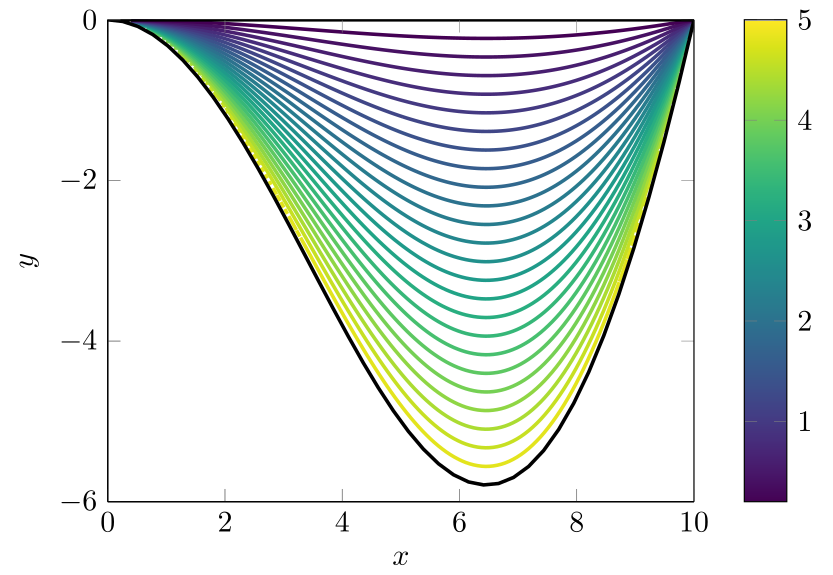

## Introduction{-}
In this workshop, you will consider three different ways to use integrals within chemistry and biology.


## Exercise 1: Partial integration{#sec-opg1}
We first consider the problem of determining the reaction rate $v(t)$ of a given chemical reaction. We focus on a specific chemical compound, and we wish to determine the change in concentration over time. Therefore, $v(t)$ is measured in $\frac{\mathrm{mol}}{Ls}$.
Here, we will analyse a process, whose reaction rate is given by
$$v(t)=\left(1+\frac{7}{2}t \right) e^{-\frac{3}{2}t}.$$

1. Determine the maximal reaction rate.

1. Argue that the reaction rate approaches zero, as time tends towards infinity.

1. The concentration of our compound $c(t)$ at time $t$ is given by the integral
$$c(t)=\int_0^t v(s)\,\mathrm{d}s.$$
Determine an explicit expression for $c(t)$ by computing the integral.

   :::{.callout-tip title="Hint" collapse="true"}
   Use partial integration, which states
   $$\int_a^b f(x)G(x)\,\mathrm{d}x = [F(x)G(x)]_{x=a}^b - \int_a^b F(x)g(x)\,\mathrm{d}x$$
   where $F$ and $G$ denote antiderivatives of $f$ and $g$. You can also read more in Section&nbsp;6.1 of the calculus book (Adams &amp; Essex).
   :::
   
1. Determine the concentration once the reaction has finished.

## Exercise 2: Volumes and speeds{#sec-opg2}
In this exercise, you will see, how integrals can be used to determine the flow of a liquid. In particular, we analyse the volume of water flowing through a river, but similar computations could for instance be performed on a vat in a chemical production.

We consider a cross-section of the river at a given position, where the river is $10\mathrm{m}$ wide. We assume that the riverbed in the cross-section can be modelled by
$$p(x)=-\sin\left(\frac{\pi}{10}x\right)x,$$
where $x=0$ and $x=10$ correspond to a bank on each side of the river. The riverbed $p(x)$ is illustrated by the black curve in the plots on @fig-hastigheder.

1. Determine the area of the cross-section of the river.

   :::{.callout-tip title="Hint" collapse="true"}
   Use partial integration.
   :::
   
1. We have measured the water speed at the surface to be $2\frac{\mathrm{m}}{\mathrm{s}}$. Compute the volume of water passing through the cross-section, assuming that the speed is constant across the entire cross-section.

1. In practice, the speed will vary dependent on the position $(x,y)$ within the cross-section. Hence, we introduce a map $f(x,y)$, describing the water speed at the point $(x,y)$. The choice of $f$ depends on the properties of the river (and you will see specific examples in the next exercise).

   Argue that the water volume flowing through the cross-section is given by a double-integral of $f(x,y)$ over the cross-section. Write out this integral.
   
   :::{.callout-tip title="Hint" collapse="true"}
   Use that the cross-section is $y$-simple.
   :::

1. We now consider two different choices of $f$, which can both be reasonable models depending on the river and the season.

    a. In some cases, it makes sense to assume that the water flows faster towards the middle of the river, and that the flow speed does not depend on the depth. As a specific example, we use $f_{\mathrm{middle}}(x,y)=5 e^{\frac{1}{5}(6-x)^2}$.
	
	b. In the winter when the surface is frozen, a simple model for water speed is that it decreases the closer we are to the surface. As an example, we use $f_{\mathrm{winter}}(x,y)=-y$.

   Consider the figures in @fig-hastigheder and determine which plots correspond to he two choices of $f$ above.

   ::: {#fig-hastigheder layout-ncol=2 layout-nrow=2}

   {width=100%}

   {width=100%}

   {width=100%}

   {width=100%}

   Examples of level curves for different choices of $f(x,y)$.
   :::

1. Write out the double-integral from item&nbsp;3 using $f_{\mathrm{middle}}$ and $f_{\mathrm{winter}}$, and rewrite both of them to a single integral by computing the inner integral in each case.

1. Use the script below to compute the water flow for $f_{\mathrm{middle}}$ and $f_{\mathrm{winter}}$ as well as using a constant speed of $2\frac{\mathrm{m}}{\mathrm{s}}$. Use the reformulation in terms of a single integral as above.

```{pyodide-python}
## Import the necessary program libraries
import numpy
from numpy import exp, sin, pi
from scipy.integrate import quad

## Define the three function to be integrated
## Note that x^2 is written x**2
def fConstant(x):
	return ## Write your function expression here

def fMiddle(x):
	return 5*exp(-(1/5)*(6-x)**2)*sin(pi/10*x)*x
	
def fWinter(x):
	return ## Write your function expression here
	
## The function 'quad' from numpy computes integrals.
## First input is the function, and the following are
## the lower and upper bounds, respectively.
flowConstant = quad(fConstant, 0, 10)[0]
flowMiddle = quad(fMiddle, 0, 10)[0]
flowWinter = quad(fWinter, 0, 10)[0]

print("Flow in the river:")
print("Constant:\t{:.2f}".format(flowConstant))
print("Middle:\t\t{:.2f}".format(flowMiddle))
print("Winter:\t\t{:.2f}".format(flowWinter))
```


   
## Exercise 3: The normal distribution{#sec-opg3}
Many phenomena in nature follow a normal distribution, which is described by a function of the form
$$g(x)=Ne^{-\frac{(x-\mu)^2}{2\sigma^2}}.$$
Here, $\mu$ and $\sigma$ are two parameters describing the shape of the curve, while $N$ is a normalizing constant. It must be chosen to a very specific value in order to use $g$ to describe probabilities.
Part of this workshop is to determine this value of $N$.

(@) Use the script below to explore the effect of $\mu$ and $\sigma$.

```{pyodide-python}
import numpy
import matplotlib.pyplot as plt

N = 1
mu = 0
sigma = 1

def normalDistribution(x):
	return N*numpy.exp(-(x-mu)**2/(2*sigma**2))

x = numpy.linspace(-5,5, num=100)

plt.close('all') # 'Close' old plots, when re-running the script
fig, ax = plt.subplots()
ax.plot(x, normalDistribution(x))
plt.show()
```

Once $N$ is chosen correctly, the integral
$$\int_a^b g(x)\,\mathrm{d}x$$
will describe the probability that a randomly chosen normally distributed number (with parameters $\mu$ and $\sigma$) is within the interval $(a,b)$.

(@) Argue that with parameters as above, $g$ must satisfy
$$\int_{-\infty}^{\infty} g(x)\,\mathrm{d}x = 1.$${#eq-intNormal}

    :::{.callout-tip title="Hint" collapse="true"}
	What is the probability that a randomly chosen number is within the interval $(-\infty,\infty)$?
	:::
	
The values of $\mu$ and $\sigma$ can often be estimated by collecting data in an experiment, so we assume that these are known. To simplify our calculation, we furthermore assume $\mu=0$.
We then wish to determine _the_ $N$, that turns $g$ into a probability distribution.

(@) Use @eq-intNormal to show that
$$N^{-1} = \int_{-\infty}^{\infty} e^{-\frac{x^2}{2\sigma^2}}\,\mathrm{d}x,$$
and perform a suitable substitution to obtain
$$\big(\sqrt{2}\sigma N\big)^{-1} = \int_{-\infty}^{\infty} e^{-x^2}\,\mathrm{d}x.$$

    :::{.callout-tip title="Hint" collapse="true"}
	Try $u=\frac{x}{\sqrt{2}\sigma}$.
	:::
	
(@) Attempt making the substitution $u=x^2$ in the integral
$$\int_{-\infty}^{\infty} e^{-x^2}\,\mathrm{d}x,$$
and explain why this does not seem to make the integral easier to compute.

We now attempt a different strategy, where we utilize polar coordinates.

(@) Show that
$$\left(\int_{-\infty}^\infty e^{-x^2}\,\mathrm{d}x\right)^2 = \int_{-\infty}^\infty \int_{-\infty}^\infty e^{-(x^2+y^2)}\,\mathrm{d}x\mathrm{d}y.$${#eq-omskriv}

(@) Rewrite @eq-omskriv to polar coordinates, and use the substitution $u=r^2$ as in item&nbsp;4 to compute the integral.

    Why does the substitution work in this case?
	
(@) Combine your observations to determine the value of $N$, such that $g$ satisfies @eq-intNormal.

<!-- Local Variables: -->
<!-- ispell-local-dictionary: "en_GB" -->
<!-- End: -->
