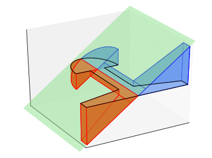
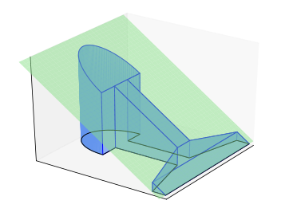

## Introduktion{-}
Bygnings- og maskinelementer, som bjælker, aksler og søjler, kan beskrives ved deres *tværsnit* (profil) og længde. På @fig-tvaersnit er der givet eksempler på forskellige bygnings- og maskinelementer, og der er indtegnet både tværsnit (farvet med rød) og længde (farvet med blå) for det først element (cylinderen).

{width=80% #fig-tvaersnit}

Denne workshop drejer sig om bestemmelse af *tværsnitskonstanter*, der er tal eller vektorer, der udregnes udfra geometrien af et tværsnit. Vi skal se på tre tværsnitskonstanter: *Arealet*, *det elastiske center* og *bøjningsinertimomentet*. Det elastiske center er det punkt i tværsnittet, hvor man ved påvirkning med en normalkraft (vinkelret på tværsnittet) kan få hele bygningselementet til at strækkes eller skubbes sammen, men ikke bøje. Man kan altså tænke på det elastiske center som en slags ligevægtspunkt (se @fig-elastisk).

{width=60% #fig-elastisk}

Bøjningsinertimomentet mht. en akse er &lsquo;modstanden mod bøjning&rsquo; om den valgte akse. Jo større bøjningsinertimoment,  jo mere belastning skal der til, før elementet bøjer om denne akse. 

Workshoppen består af 5 delopgaver. I delopgave 1 undersøger vi geometrien af et givent tværsnit (vist på @fig-jernbane). I delopgave 2 bestemmer vi tværsnittets areal, i delopgave 3 tværsnittets elastiske center og i delopgave 4 tværsnittets bøjningsinertimoment. I delopgave 5 beregner vi de tre tværsnitskonstanter i Matlab for nogle givne parametre.

## Matematisk opstilling af problemet{-}
Vi skal arbejde med en jernbaneskinne som vist på @fig-tvaersnit (tredje element fra venstre). Vi indsætter jernbaneskinnen i et koordinatsystem, sådan at længden er ud af $x$-aksen og tværsnittet er parallelt med $yz$-planen. Tværsnittet kaldes $J$ og er vist på @fig-jernbane.

{#fig-jernbane}

Vi kan se, at mængden $J$ er symmetrisk med hensyn til $z$-aksen; det betyder, at hvis punktet $P=\langle y,z\rangle $ tilhører $J$, så gør $\tilde{P}:=\langle -y,z\rangle$ også. Symmetrien giver os muligheden for kun at arbejde med den højre side af $J$ (der hvor $y\geq 0$). Vi noterer denne højreside med $J_+$. Den venstre side noteres tilsvarende med $J_-$. Mængden $J_+$ består af et trapez $DEFG$, et rektangel $ABCE$, og en kvartcirkel $\mathcal{C}$ med centrum i $B$ og radius $R$. 

## Delopgave 1{#sec-opg1}
1. Brug @fig-jernbane til at argumentere for, at
$$\begin{align}
A&=\langle 0,0\rangle,\quad B=\langle 0, h-R\rangle,\quad C=\langle R-d,h-R\rangle,\\
D&=\langle R-d, h-R-c\rangle,\quad E=\langle R-d, 0\rangle,\quad F=\langle \tfrac{a}{2},0\rangle,\quad G=\langle \tfrac{a}{2},b\rangle.
\end{align}$${#eq-delopg11}

1. Vi indfører nu notationen $D=\langle y_D,z_D\rangle$ og tilsvarende for de andre punkter i @eq-delopg11. Vis at den rette linje fra $D$ til $G$ kan skrives som
$$Z(y):=z_D+\frac{z_G-z_D}{y_G-y_D}(y-y_D)=z_D-\frac{z_D-z_G}{y_F-y_E}(y-y_E),\quad \text{når} \quad y_E\leq y\leq y_F.$$
Ved at indføre $\Delta y:=y_{F}-y_{E}$ og $\Delta z:=z_{D}-z_{G}$ kan dette skrives som
$$Z(y)=z_D-\frac{\Delta z}{\Delta y}(y-y_E),\quad \text{når} \quad y_E\leq y\leq y_F.$${#eq-delopg12}

1. Vis, at et punkt $\langle y,z\rangle$ tilhører trapezet $DEFG$, hvis 
$$0\leq z\leq Z(y),\quad \text{når} \quad y_E\leq y\leq y_F.$$

1. Vis, at et punkt $\langle y,z\rangle$ tilhører kvartcirklen $\mathcal{C}$ med centrum i $B$ og radius $R$, hvis 
$$y=r\cos(\theta),\quad z=z_B+r\sin(\theta),\quad \text{når}\quad 0\leq r\leq R,\quad 0\leq \theta\leq \tfrac{\pi}{2}.$$

## Delopgave 2 (areal)
1. Gør rede for, at symmetrien medfører $\text{areal}(J_+)=\text{areal}(J_-)$ og $\text{areal}(J)=2\; \text{areal}(J_+)$. 

1. Gør rede for, at $\text{areal}(J_+)=\text{areal}(DEFG)+\text{areal}(ABCE)+\text{areal}(\mathcal{C})$. 

1. Vis, at $\text{areal}(ABCE)=y_E z_B$ og $\text{areal}(\mathcal{C})=\tfrac{\pi R^2}{4}$.

1. Lad $Z(y)$ være givet som i @eq-delopg12. Vis, at for $n\geq 1$, så er funktionen 
$$G_n(y):=-\frac{\Delta y}{\Delta z} \frac{(Z(y))^{n+1}}{n+1}$$
en stamfunktion til $(Z(y))^n$; det vil sige $G_n'(y)=(Z(y))^n$. Vis herefter, at
$$\begin{align}
\text{areal}(DEFG)&=\int_{y_{E}}^{y_{F}} Z(y)dy=G_1(y_{F})-G_1(y_{E})=-\frac{\Delta y}{2\Delta z}\left((Z(y_{F}))^2-(Z(y_{E}))^2\right) \\
&=-\frac{\Delta y}{2\Delta z}\left(z_G^2-z_D^2\right)=\frac{y_F-y_E}{2}\frac{z_D^2-z_G^2}{z_D-z_G}=\frac{y_F-y_E}{2}(z_D+z_G).
\end{align}$${#eq-delopg21}
Er dette resultat overraskende?

## Delopgave 3 (elastisk center)
I denne delopgave opstiller vi et udtryk for det elastiske center $(y_c,z_c)$ for tværsnittet $J$. Det elastiske center er defineret som
$$y_c:=\frac{\int_{J} y ~dA}{\text{areal}(J)},\qquad z_c:=\frac{\int_{J} z~dA}{\text{areal}(J)}.$$
@fig-volumen viser det volumen man finder når man udregner $\int_J f(y,z) \, dA$ og $\int_J g(y,z) \, dA$, hvor $f(y,z)=y$ og $g(y,z)=z$.

::: {#fig-volumen layout-ncol=2}
{#fig-yVolume}

{#fig-zVolume}

På @fig-yVolume ses volumenet mellem planen givet ved $f(y,z)=y$ og $yz$-planen. Volumnet over $yz$-planen er blå, mens volumnet under $yz$-planen er rødt. På @fig-zVolume ses volumnet mellem planen givet ved $g(y,z)=z$. Volumnet over $yz$-planen er angivet med blå.
:::

1. Argumenter for at 
$$\int_{J_+} y dA= -\int_{J_-} y dA.$$
Vis herefter, at $y_c=0$.

1. Argumenter for at $\int_{J_+} z dA= \int_{J_-} z dA$. Vis herefter, at
$$z_c=\frac{\int_{J_+} z dA}{\text{areal}(J_+)}=\frac{\int_{DEFG}zdA+\int_{ABCE}zdA+\int_{\mathcal{C}}zdA}{\text{areal}(J_+)}.$$

1. Vis, at $\int_{ABCE}zdA=\frac{y_E z_B^2}{2}$.

1. Vis, at 
$$\int_{\mathcal{C}} (z-z_B) dA =\int_{0}^{\pi/2}\left (  \int_0^R r^2 \sin(\theta) dr \right )d\theta=\frac{R^3}{3}.$${#eq-delopg31}
Brug herefter dette resultatet til at konkludere, at
$$\int_{\mathcal{C}} z dA =\frac{R^3}{3}+\text{areal}(\mathcal{C}) z_B.$$

1. Vis, at 
$$\int_{DEFG} zdA =\frac{1}{2}\int_{y_{E}}^{y_{F}} Z^2(y)dy=\frac{y_F-y_E}{6} \frac{z_{D}^3-z_{G}^3}{z_D-z_G}.$$

   ::: {.callout-tip title="Vink" collapse="true"}
   Ved det sidste lighedstegn kan I bruge fremgangsmåde i @eq-delopg21.
   :::

## Delopgave 4 (bøjningsinertimoment)
Vi skal nu bestemme bøjningsinertimomentet mht. $y$-aksen, der er defineret som
$$I_y:=\int_{J}z^2 dA.$$

Vi undlader, at beregne bøjningsintertimomentet mht. $z$-aksen.

1. Gør rede for, at
$$I_y=2\int_{J_+}z^2 dA=2\left(\int_{DEFG}z^2dA+\int_{ABCE}z^2dA+\int_{\mathcal{C}}z^2dA\right).$$

1. Vis, at 
$$\int_{ABCE}z^2dA=\frac{y_E z_B^3}{3}.$$

1. Vis, at 
$$\int_{\mathcal{C}} (z-z_B)^2 dA =\int_{0}^{\pi/2}\left (  \int_0^R r^3 \frac{1-\cos(2\theta)}{2} dr \right )d\theta=\frac{\pi R^4}{16}.$$
Brug herefter dette resultatet sammen med identiteten
$$z^2=(z-z_B+z_B)^2=(z-z_B)^2+2z_B(z-z_B)+z_B^2$$
og @eq-delopg31 til at vise, at
$$\int_{\mathcal{C}} z^2 dA =\frac{\pi R^4}{16} + \frac{2z_BR^3}{3}+ \text{areal}(\mathcal{C}) z_B^2.$$

1. Vis, at 
$$\int_{DEFG} z^2 dA =\frac{1}{3}\int_{y_{E}}^{y_{F}} Z^3(y)dy=\frac{y_{F}-y_{E}}{12} \frac{z_{D}^4-z_{G}^4}{z_{D}-z_{G}}.$$

   ::: {.callout-tip title="Vink" collapse="true"}
   Ved det sidste lighedstegn kan I bruge fremgangsmåde i @eq-delopg21.
   :::

1. Tilsvarende kan man vise (det skal I ikke gøre), at bøjningsinertimomentet mht. $z$-aksen er givet
$$\begin{align}
&I_z:=\int_{J}y^2 dA=2\int_{J^+}y^2 dA=2\left(\int_{DEFG}y^2dA+\int_{ABCE}y^2dA+\int_{\mathcal{C}}y^2dA\right), \\
&\text{hvor}\qquad \int_{ABCE}y^2dA=\frac{z_By_E^3}{3},\qquad \int_{\mathcal{C}}y^2dA = \frac{\pi R^4}{16}\qquad \text{og} \\
&\int_{DEFG}y^2dA=\frac{z_D+3z_G}{12}\left(y_F-y_E\right)^3+2y_E\frac{z_D+2z_G}{6}(y_F-y_E)^2+y_E^2\text{areal}(DEFG).
\end{align}$$
Disse formler bruges i @sec-python nedenfor.

## Delopgave 5{#sec-python}
Python-koden herunder definerer funktioner, der kan beregne areal, elastisk center og bøjningsinertimomentet om både $y$- og $z$-aksen.

```{pyodide-python}
#| read-only:true
from numpy import pi  # Indlæs værdien af pi fra Numpy

## Areal (Delopgave 2)
def udregn_areal(R, y_E, y_F, z_B, z_D, z_G) : 
    areal_ABCE = y_E * z_B;
    areal_C = (pi * R**2) / 4.0;
    areal_DEFG = ((y_F - y_E) / 2.0) * (z_D + z_G);
    
    return 2.0 * (areal_ABCE + areal_C + areal_DEFG);


## Elastiske center (Delopgave 3)
def udregn_centre(R, y_E, y_F, z_B, z_D, z_G) : 
    y_cent = 0;
    int_ABCE = (y_E * z_B ** 2) / 2.0;
   
    areal_C = (pi * R**2) / 4.0;
    int_C_ec = R**3 / 3.0 + areal_C * z_B;
    
    int_DEFG = ((y_F - y_E) / 6.0) * (z_D**3 - z_G**3) / (z_D - z_G);
    
    areal_J = udregn_areal(R, y_E, y_F, z_B, z_D, z_G) / 2.0
    z_cent = (int_ABCE + int_C_ec + int_DEFG) / areal_J;

    return y_cent, z_cent


## Bøjningsinertimoment om y-aksen (Delopgave 4)
def udregn_intertimoment_y(R, y_E, y_F, z_B, z_D, z_G) : 
    int_ABCE = (y_E * z_B**3) / 3.0;
    
    areal_C = (pi * R**2) / 4.0;
    
    int_C_y = (pi * R**4) / 16.0 + (2.0 * z_B * R**3) / 3.0 + areal_C * z_B**2;
    int_DEFG_y = ((y_F - y_E) / 12.0) * (z_D**4 - z_G**4) / (z_D - z_G);
    
    return 2.0 * (int_ABCE + int_C_y + int_DEFG_y);


## Bøjningsinertimoment om z-aksen
def udregn_intertimoment_z(R, y_E, y_F, z_B, z_D, z_G) : 
    int_ABCE_z = (z_B * y_E**3) / 3.0;
    int_C_z = (pi * R**4) / 16.0;
    
    areal_DEFG = ((y_F - y_E) / 2.0) * (z_D + z_G);
    int_DEFG_z = ((z_D + 3 * z_G) / 12.0) * (y_F - y_E)**3 + (2.0 * y_E * (z_D + 2.0 * z_G) / 6.0) * (y_F - y_E)**2 + y_E**2 * areal_DEFG;
    
    return 2.0 * (int_ABCE_z + int_C_z + int_DEFG_z);
```

Når vi har defineret funktionerne ovenfor (og kørt koden), kan vi bruge dem til at beregne resultaterne for forskellige inputs. Prøv at køre koden for forskellige værdier af parametrene.
Hvad sker der f.eks., hvis vi sætter $d=2?$

```{pyodide-python}
## Parametre
a = 8 
b = 1
c = 5
d = 1

R = 3
h = 10

## Koordinator (Delopgave 1)
y_A = 0
z_A = 0

y_B = 0
z_B = h - R

y_C = R - d
z_C = h - R

y_D = R - d
z_D = h - R - c

y_E = R - d
z_E = 0

y_F = a / 2
z_F = 0

y_G = a / 2
z_G = b


areal = udregn_areal(R, y_E, y_F, z_B, z_D, z_G);        # Delopgave 2
y_c, z_c = udregn_centre(R, y_E, y_F, z_B, z_D, z_G);    # Delopgave 3
I_y = udregn_intertimoment_y(R, y_E, y_F, z_B, z_D, z_G) # Delopgave 4
I_z = udregn_intertimoment_z(R, y_E, y_F, z_B, z_D, z_G) # Deloptave 4

## Print resultaterne. Her betyder {:.2f} at variablen
## skal printes som decimaltal med 2 decimaler
print("Areal: {:.2f}".format(areal))
print("Elastisk center: ({:.2f}, {:.2f})".format(y_c, z_c))
print("Bøjningsinertimoment om y-aksen: {:.2f}".format(I_y))
print("Bøjningsinertimoment om z-aksen: {:.2f}".format(I_z))
```
