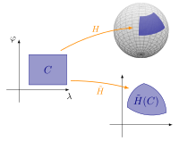

## Introduktion{-}
Landinspektører ønsker sædvanligvis _konforme_ kort, altså kort, der bevarer vinkler. Det vil sige, at vinkler beregnet i kortet er de samme som de tilsvarende vinkler målt i naturen.
I nogle tilfælde ønsker man dog i stedet et _arealtro_ kort, som bevarer forholdet mellem arealer. Med andre ord vil f.eks. en fordobling i areal på kortet svare præcist til en fordobling i areal ude i naturen.
Denne type kort er eksempelvis gode, hvis man vil sammenligne udbredelsen af et bestemt fænomen såsom tørke, oversvømmelse eller lignende.

Arealer udregnes ved integration. I denne workshop ser vi på, hvordan kvadratiske former er centrale i sammenligning mellem arealer i naturen og i kort. Vi betragter en situation som på @fig-skitse, og skal bruge følgende resultat omkring arealer, hvor både $H$ og $\tilde{H}$ kan spille rollen af $F$.

:::{.callout-note title="Arealer og afbildninger"}
Lad $C$ være et område i $U\subseteq\mathbb{R}^2$, og lad $k$ være enten 2 eller 3. Hvis $F\colon U\rightarrow\mathbb{R}^k$ er

 - differentiabel
 - injektiv &ndash; altså, $F(\lambda_1,\varphi_1)=F(\lambda_2,\varphi_2)$ medfører $(\lambda_1,\varphi_1)=(\lambda_2,\varphi_2)$
 
så er arealet af $F(C)$ givet ved
$$\mathrm{Areal}\big(F(C)\big) = \iint_C \sqrt{\det\big(Q_{DF}(\lambda, \varphi))}\,\mathrm{d}A.$${#eq-area}
:::

{width=70% #fig-skitse}

I boksen ovenfor er $Q_{DF}(\lambda,\varphi)$ en $2\times 2$-matrix, som afhænger af $\lambda$ og $\varphi$. Den tilhørende kvadratiske form kaldes _første fundamentalform_, som I eksempelvis også ser i Kortprojektioner og Fejlteori.^[For en afbildning $F$ er $\det\big(Q_{DF}(\lambda,\varphi)\big) = \big\lvert \frac{\partial H}{\partial \lambda}(\lambda, \varphi) \times \frac{\partial H}{\partial \varphi}(\lambda, \varphi)\big\rvert$, hvor $\times$ betegner krydsproduktet af vektorer. Længden af krydsproduktet giver arealet af parallelogrammet udspændt af de to vektorer. Dette forklarer, hvorfor @eq-area er relateret til et areal.]

Vi beskriver nu eksplicit de to tilfælde $k=2$ og $k=3$.
Søjlerne i matricen $DF$ er gradientvektorerne for afbildningen $F$, som vi vil kalde $H\colon U\rightarrow\mathbb{R}^3$ og $\tilde{H}\colon U\rightarrow\mathbb{R}^2$ ligesom på @fig-skitse. I hele workshoppen er $U\subseteq\mathbb{R}^2$ rektanglet med $-\pi\leq \lambda\leq\pi$ og $-\pi/2\leq\varphi\leq\pi/2$.
Det vil sige, at vi har
$$DH(\lambda, \varphi) = \left[
\begin{array}{cc}
\frac{\partial H_1}{\partial \lambda}(\lambda, \varphi) & \frac{\partial H_1}{\partial \varphi}(\lambda, \varphi)\\
\frac{\partial H_2}{\partial \lambda}(\lambda, \varphi) & \frac{\partial H_2}{\partial \varphi}(\lambda, \varphi)\\
\frac{\partial H_3}{\partial \lambda}(\lambda, \varphi) & \frac{\partial H_3}{\partial \varphi}(\lambda, \varphi)
\end{array}
\right]$$
og
$$D\tilde{H}(\lambda, \varphi) = \left[
\begin{array}{cc}
\frac{\partial \tilde{H}_1}{\partial \lambda}(\lambda, \varphi) & \frac{\partial \tilde{H}_1}{\partial \varphi}(\lambda, \varphi)\\
\frac{\partial \tilde{H}_2}{\partial \lambda}(\lambda, \varphi) & \frac{\partial \tilde{H}_2}{\partial \varphi}(\lambda, \varphi)
\end{array}
\right],$$
hvor $H_i$ og $\tilde{H}_i$ er den $i$'te koordinatfunktion for henholdsvist $H$ og $\tilde{H}$.
Den tilhørende kvadratiske form har matrix $Q_{A}= A^\top\! A$, hvor $A$ er enten $DH$ eller $D\tilde{H}$.

## Delopgave 1{#sec-opg1}
Vi ser først på tilfældet
$$H(\lambda,\varphi) = \left[
\begin{array}{c}
R\cos(\varphi)\cos(\lambda)\\
R\cos(\varphi)\sin(\lambda)\\
R\sin(\varphi)
\end{array}
\right],$$
som afbilder fra geografiske koordinater til kartesiske koordinater på kuglefladen.

1. Vis, at
$$DH(\lambda, \varphi) = \left[
\begin{array}{cc}
-R\cos(\varphi)\sin(\lambda) & -R\sin(\varphi)\cos(\lambda)\\
R\cos(\varphi)\cos(\lambda) & -R\sin(\varphi)\sin(\lambda)\\
0 & R\cos(\varphi)
\end{array}
\right]$$
og
$$Q_{DH}(\lambda, \varphi) = \left[
\begin{array}{cc}
R^2\cos^2(\varphi) & 0\\
0 & R^2
\end{array}
\right].$$

1. Lad tre rektangler være givet ved
    - $C_1 = [0,\pi/2]\times [0,\pi/4]$
	- $C_2 = [-\pi/2, \pi/2]\times [-\pi/4, \pi/3]$
	- $C_3 = [-\pi/2, \pi/2]\times [0,\pi/2]$
	
   Beregn arealerne af $H(C_1)$, $H(C_2)$ og $H(C_3)$.
   
   :::{.callout-tip title="Facit" collapse=true}
   $\frac{\sqrt{2}\pi R^2}{4}$, $\sqrt{2}\pi R^2$ og $\pi R^2$.
   :::
   
1. Hvad er forholdet $\mathrm{Areal}\big(H(C_i)\big)/\mathrm{Areal}(C_i)$ i de tre tilfælde?

   :::{.callout-tip title="Facit" collapse=true}
   $\frac{2\sqrt{2} R^2}{\pi}$, $\frac{2\sqrt{2}R^2}{\pi}$ og $\frac{2R^2}{\pi}$.
   :::

1. Skitser arealerne på hhv. kuglefladen og i $(\lambda, \varphi)$-planet.

   Kan I se, hvorfor de to første arealforhold er ens, og det sidste er mindre?

## Delopgave 2{#sec-opg2}
Vi ser nu på et kort, som i geografiske koordinater er beskrevet ved
$$\tilde{H}(\lambda,\varphi) = \big(\lambda, \sin(\varphi)\big)$${#eq-archimedes}
Kortet i @eq-archimedes kaldes Archimedes&apos; arealtro projektion^[Eller alternativt Archimedes-Lambert-projektionen] &ndash; navnet giver et klart vink om, hvilken egenskab projektionen har.

1. Vis, at $Q_{D\tilde{H}}(\lambda,\varphi) = \left[
\begin{array}{cc}
1 & 0\\
0 & \cos^2(\varphi)
\end{array}
\right].$

1. Brug samme områder $C_i$ som i @sec-opg1, og beregn arealerne af $\tilde{H}(C_i)$ samt forholdene $\mathrm{Areal}\big(\tilde{H}(C_i)\big)/\mathrm{Areal}(C_i)$.

1. Argumenter for følgende ligninger, som gælder uanset valg af området $C$ og dermed uanset området på kuglefladen, som betragtes:
$$\mathrm{Areal}\big(H(C)\big) = \iint_C R^2\cos(\varphi)\,\mathrm{d}A$$
$$\mathrm{Areal}\big(\tilde{H}(C)\big) = \iint_C \cos(\varphi)\,\mathrm{d}A.$$

   Brug dette til at vise, at Archimedes&apos; projektion opfylder
   $$\frac{\mathrm{Areal}\big(\tilde{H}(C)\big)}{\mathrm{Areal}\big(H(C)\big)} = \frac{1}{R^2}$$
   og derfor er arealtro.
   
## Delopgave 3{#sec-opg3}
Til sidst kigger vi på generelle arealtro projektioner. Eftersom afbildningen $H$ er den samme i hele workshoppen &ndash; så de geografiske koordinater på kuglefladen ikke ændrer sig &ndash; gælder
$$\mathrm{Areal}\big(H(C)\big) = \iint_C R^2\cos(\varphi)\,\mathrm{d}A$$
altid. Desuden har vi
$$\mathrm{Areal}\big(\tilde{H}(C)\big) = \iint_C \sqrt{\det\big(Q_{D\tilde{H}}(\lambda, \varphi)\big)}\,\mathrm{d}A.$$

Man kan derfor afgøre, om en projektion $\tilde{H}$ er arealtro ved at se på $\det\big(Q_{D\tilde{H}}(\lambda,\varphi)\big)$, hvilket I skal gøre herunder.

1. En projektion $\tilde{H}(\lambda,\varphi)$ opfylder $\det\big(Q_{D\tilde{H}}(\lambda,\varphi)\big)=3\cos^2(\varphi)$. Gør rede for, at denne projektion er arealtro.

1. Vis, at en projektion, der opfylder $\det\big(Q_{D\tilde{H}}(\lambda,\varphi)\big)=k\cos^2(\varphi)$ er arealtro.^[Man kan vise, at dette er et &ldquo;hvis og kun hvis&rdquo;, men det skal I ikke i denne workshop.]

1. Planprojektioner med Nordpolen i centrum er givet ved $\tilde{H}(\lambda,\varphi)= \big(r(\varphi)\cos(\lambda),r(\varphi)\sin(\lambda)\big)$, hvor $r(\pi/2)=0$.

   1. Vis, at $D\tilde{H}(\lambda,\varphi) = \left[
   \begin{array}{cc}
   -r(\varphi)\sin(\lambda) & r'(\varphi)\cos(\lambda)\\
   r(\varphi)\cos(\lambda) & r'(\varphi)\sin(\lambda)
   \end{array}
   \right].$
   
   1. Man kan udregne, at
   $$Q_{D\tilde{H}}(\lambda,\varphi) = \left[
   \begin{array}{cc}
   \big(r(\varphi)\big)^2 & 0\\
   0 & \big(r'(\varphi)\big)^2
   \end{array}
   \right].$$

      Gør rede for, at en planprojektion af denne type er arealtro, hvis $\lvert r(\varphi)r'(\varphi)\rvert = c\cos(\varphi)$, hvor $c$ er en positiv konstant.

   1. Vis til sidst, at $r(\varphi) = \sqrt{2-2\sin(\varphi)}$ giver en arealtro projektion.

<!-- Local Variables: -->
<!-- ispell-local-dictionary: "da_DK" -->
<!-- End: -->
