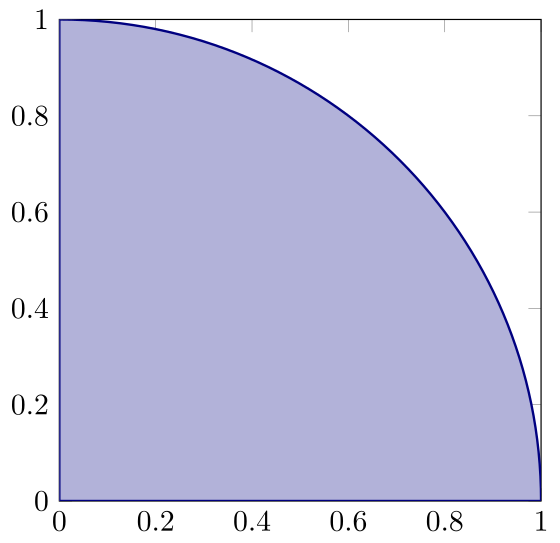

# Introduction{-}
This workshop concerns integration of multivariate functions in connection to one of the Maxwell equations: the Ampère law. This law describes the relation between a given _stationary_ &ndash; that is, time-independent &ndash; electric current of charged particles and the _static_ magnetic field generated by this current.

We will assume that both the magnetic flux density $\mathbf{B}(\mathbf{r},t)$ and the electric current density $\mathbf{J}(\mathbf{r},t)$ are independent of the time variable $t$ and thus only depend on the spatial variable $\mathbf{r}=[x,y,z]^\top=x\mathbf{i} +y \mathbf{j} +z\mathbf{k}$.
The &lsquo;microscopic&rsquo; version of the Ampère law states
$$\mathrm{curl}(\mathbf{B})(\mathbf{r})=\mu_0 \mathbf{J}(\mathbf{r}),$${#eq-juli12}
where  $\mu_0$ denotes the magnetic permeability of free space.

The second important equation, which the magnetic flux density must satisfy, is Gauss&apos;s law:
$$\mathrm{div}(\mathbf{B})(\mathbf{r})=0.$${#eq-juli15}

In the static case, it is possible to show that the Ampère and Gauss laws are sufficient to determine $\mathbf{B}$  _up to a constant vector_.
Thus, if we introduce the extra condition that the length of $\mathbf{B}$ decreases as we move further away from the domain where the current density $\mathbf{J}$ is concentrated, then $\mathbf{B}$ is uniquely determined by the two equations.
This also implies that we can guess (by exploiting symmetries) a vector field that solves the two equations and &ldquo;tends to zero at infinity&rdquo;, then it must be the correct, unique solution.

In this workshop, we assume that the current density $\mathbf{J}(\mathbf{r})$ is parallel to the $z$-axis and can be written as $J(x,y) \mathbf{k}$, where the scalar function $J$ is independent of the $z$-variable.
This models an electric current in an infinitely long wire, which is parallel to to $z$-axis.
Thus, it is natural to expect that $\mathbf{B}$ will also only depend on $x$ and $y$ and may be written as
$$\mathbf{B}(\mathbf{r}) =B_1(x,y)\mathbf{i} +B_2(x,y)\mathbf{j},\quad \text{where}\quad \mathrm{curl}(\mathbf{B})(\mathbf{r})=\left (\frac{\partial B_2}{\partial x}-\frac{\partial B_1}{\partial y}\right )\mathbf{k}.$${#eq-juli14}

In this case, we have reduced the problem to determining two scalar functions $B_1$ and $B_2$, which satisfy the equations
$$\frac{\partial B_2}{\partial x}-\frac{\partial B_1}{\partial y}=\mu_0 J,\quad \mathrm{div}(\mathbf{B})=\frac{\partial B_1}{\partial x}+\frac{\partial B_2}{\partial y}=0.$${#eq-juli13}

If $\Omega$ denotes a &lsquo;nice&rsquo; domain in the $xy$-plane, then the electric current flowing through the cross section $\Omega$ is given by
$$I_\Omega=\int_\Omega J(x,y)dA.$${#eq-juli16}

Now, denote the boundary of $\Omega$ by $\partial\Omega$.
We assume that it consists of a &lsquo;nice&rsquo; closed curve, which can be parametrized by a (piecewise continuously differentiable) function $\gamma\colon [0,1]\rightarrow \mathbb{R}^3$, where $\gamma(t)=\gamma_1(t)\mathbf{i} +\gamma_2(t)\mathbf{j}$ and $\gamma(0)=\gamma(1)$. In addition, we assume that $\gamma$ transverses the curve exactly once in counter-clockwise direction as $t$ varies from $0$ to $1$.

A classical mathematical result, which we will apply in @sec-opg2, is Stokes&apos; formula. Under our assumptions, this formula can be stated as
$$\int_\Omega \mathrm{curl}(\mathbf{B})(\mathbf{r})\cdot \mathbf{k}\;  dA= \int_{\partial \Omega} \mathbf{B}\cdot d\gamma =\int_0^1 \mathbf{B}(\gamma(t))\cdot \gamma'(t)\; dt.$$

For $\gamma(t)=\gamma_1(t)\mathbf{i} +\gamma_2(t)\mathbf{j}$ and $\gamma'(t)=\gamma_1'(t)\mathbf{i} +\gamma_2'(t)\mathbf{j}$ this may be rewritten as
$$\mu_0 \int_\Omega J(x,y)\; dA= \mu_0I_\Omega=\int_0^1 \Big ( B_1(\gamma(t))\gamma_1'(t)+ B_2(\gamma(t))\gamma_2'(t)\Big )dt.$${#eq-juli18}

# Exercise 1{#sec-opg1}
We first consider the computation of electrical current when the current density and cross section of the wire are known.

1. Let $\Omega$ be a quarter of a circle as in @fig-plot and let $J(x,y)=xy$. Show that $I_\Omega=1/8$.

   {#fig-plot width=50%}
   
   :::{.callout-tip title="Hint" collapse=true}
   Use polar coordinates and the formula $\sin(2\theta)=2\sin(\theta)\cos(\theta)$. 
   :::
   
1. Let $\Omega_R$ be a disk of radius $R$ centered at the origin. Assume that $$J(x,y)=\frac{1}{1+x^2+y^2},\quad x^2+y^2\leq R^2.$$

   Show that $I_{\Omega_R}= \pi \ln (1+R^2)$. 


1. Let $\Omega$ be a triangle with vertices $A=\mathbf{0}$, $B=\mathbf{i}$ and $C=3\mathbf{j}$. Let $J(x,y)=e^{3x+y}$. Show that
$$I_\Omega=\int_0^1 \int_0^{3-3x} e^{3x} e^y dy\; dx= \int_0^3 \int_0^{1-y/3} e^y e^{3x} dx\; dy=\frac{2e^3+1}{3}.$$

# Exercise 2{#sec-opg2}
We will now determine the magnetic flux density by applying Stoke&apos;s formula in a cylindrical symmetry.
As in item&nbsp;2 above, we will consider a wire with a disk-shaped cross section of radius $R$, and we reuse the notation from the previous exercise. The current density $J$ is taken to be zero outside $\Omega_R$.

1. Let $\rho(x,y)=\sqrt{x^2+y^2}$. Show that every point $(x,y)$ except the origin satisfies
$$\frac{\partial \rho}{\partial x}=\frac{x}{\rho},\quad \frac{\partial \rho}{\partial y}=\frac{y}{\rho}.$$

1. Assume that $F\colon\mathbb{R}\to \mathbb{R}$ is an arbitrary differentiable function. Show that the vector field
$$\mathbf{B}(x,y)= -F(\rho(x,y))\; y\; \mathbf{i} +F(\rho(x,y))\; x\; \mathbf{j}$$
satisfies Gauss&apos; equation @eq-juli15.

   :::{.callout-tip title="Hint" collapse=true}
   Apply the chain rule for multivariate functions and show that
   $$\frac{\partial B_1}{\partial x}(x,y)=-F'(\rho(x,y)) xy/\rho(x,y),\quad \frac{\partial B_2}{\partial y}(x,y)=F'(\rho(x,y)) xy/\rho(x,y). $$
   :::

1. Let $\Omega_\rho$ be a disk of radius $\rho>0$ centered at the origin.
Show that the boundary $\partial\Omega_\rho$ may be parametrized as
$$\gamma_\rho(t)= \rho \cos(2\pi t)\; \mathbf{i} + \rho \sin(2\pi t)\; \mathbf{j},\quad 0\leq t\leq 1,$$
and that
$$\mathbf{B}(\gamma_\rho(t))= -F(\rho) \rho \sin(2\pi t)\mathbf{i} + F(\rho) \rho \cos(2\pi t)\mathbf{j}. $$

1. Show that $\mathbf{B}(\gamma_\rho(t))\cdot \gamma_\rho(t)=0$ and
$$\mathbf{B}(\gamma_\rho(t))\cdot \gamma_\rho'(t)=2\pi F(\rho) \rho^2.$$

   Afterwards, use the formula @eq-juli18 with $\Omega$ replaced by $\Omega_\rho$ along with item&nbsp;2 from the previous exercise to show that
$$F(\rho)=\frac{\mu_0\ln(1+\rho^2)}{2\rho^2},\quad 0<\rho<R$$
and
$$\mathbf{B}(x,y)= -\frac{\mu_0y\ln(1+x^2+y^2)}{2(x^2+y^2)} \mathbf{i} +\frac{\mu_0x\ln(1+x^2+y^2)}{2(x^2+y^2)} \mathbf{j}\;\; \text{when} \;\; x^2+y^2<R^2.$$

1. Repeat the same argument for $\rho> R$, but recall that the current density $J$ equals zero outside $\Omega_R$. Show that
$$\mathbf{B}(x,y)= -\frac{\mu_0y\ln(1+R^2)}{2(x^2+y^2)} \mathbf{i} +\frac{\mu_0x\ln(1+R^2)}{2(x^2+y^2)} \mathbf{j}$$
and
$$\Vert\mathbf{B}(x,y)\Vert=\frac{\mu_0\ln(1+R^2)}{2\sqrt{x^2+y^2}}=\frac{\mu_0\; I_{\Omega_R}}{2\pi \sqrt{x^2+y^2}}\;\; \text{when} \;\; x^2+y^2>R^2.$$

# Exercise 3{#sec-opg3}
In the final exercise, we will use Python to perform numerical integration of bivariate functions.
We consider a case similar to @fig-plot, but with the modification that the boundary depends on a parameter $a>0$.
More precisely, we let the angle $\theta$ vary between $0$ and $\theta_{\mathrm{max}}\leq\pi/2$, while the radius varies between $r_{\mathrm{min}}=0$ (corresponding to the origin) and $r_{\mathrm{max}}(\theta)=a\sin^2(\theta) + \cos^2(\theta)$.

1. Explain that the the assignments $a=1$ and $\theta_{\mathrm{max}}=\pi/2$ yields the same domain as in @sec-opg1, item&nbsp;1.

   Use the script to check that the value of the integral is the same as before.

1. Try different values of $a>1$, and form a hypothesis about what happens to the value of the integral when $a$ grows. Can you argue why your hypothesis is true?

```{pyodide-python}
import numpy
import matplotlib.pyplot as plt
from scipy.integrate import nquad

## Define parameters as well as rMax as a function of theta
thetaMax = numpy.pi/2
a = 1

def rMax(theta):
	return a * numpy.sin(theta)**2 + numpy.cos(theta)**2

## Evaluate rMax for 100 equally spaced values of theta
thetas = numpy.linspace(0, thetaMax, num=100)
rs = [ rMax(theta) for theta in thetas ]

## Plot the integration domain
plt.close('all')
fig, ax = plt.subplots(subplot_kw=dict(projection="polar"))
ax.set_thetamax(max(90, thetaMax*180/numpy.pi))
ax.plot(thetas, rs)
plt.show()

## Define the current density in rectangular and polar
## coordinates (incl. the integration factor r)
def J(x, y):
	return x*y

def JPolar(r, theta):
	return r*J(r*numpy.cos(theta), r*numpy.sin(theta))

## Define the inner integration limits as a function of theta
def innerLimits(theta):
	return [0, rMax(theta)]

## nquad computes iterated integrals numerically.
## The integration order corresponds to the order of
## the parameters in JPolar, such that r is the inner
## integral, while theta is the outer.
integral = nquad(JPolar, [innerLimits, [0, thetaMax]])[0]
print("Value of integral: {:.4f}".format(integral))
```


<!-- Local Variables: -->
<!-- ispell-local-dictionary: "en_GB" -->
<!-- End: -->
