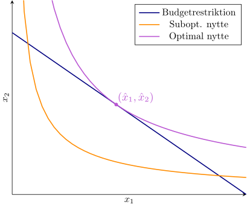

## Introduktion{-}
I denne workshop skal I se på en mikroøkonomisk model, der f.eks. kan benyttes til at modellere forbrugeradfærd.
Mere præcist ser vi på det simpleste tilfælde, hvor forbrugeren har mulighed for at købe to forskellige varer indenfor et givet budget.
Selvom det ikke altid er realistisk, antages det som regel, at forbrugeren handler rationelt og vil forsøge at maksimere sin &lsquo;nytte&rsquo;.

Nytten er et lidt abstrakt begreb som dækker over den værdi eller de fordele, varerne repræsenterer for forbrugeren. Som eksempel kan I forestille jer, at de to varer er hhv. vand og mad. Hvis hele budgettet bruges på én af varerne, får vi ingen værdi af det (da man ikke kan overleve på vand eller mad alene). Det optimale er i stedet en eller anden balance mellem de to produkter.

Matematisk vil vi i denne workshop modellere nytten via en såkaldt *Cobb-Douglas*-funktion
$$N(x_1,x_2) = x_1^a x_2^b,\quad a>0,b>0$${#eq-cb}
hvor $a$ og $b$ er faste parametre, og $x_i$ betegner den købte mængde af $i$'te vare. Her kræves naturligvis $x_i\geq 0$. Målet er at maksimere $N$ under hensyntagen til budgetrestriktionen
$$p_1x_1 + p_2x_2 \leq B,$${#eq-budget}
hvor $p_i>0$ betegner prisen for $i$'te vare, og $B>0$ er det samlede rådighedsbeløb.

Grafisk kan optimeringsproblemet skitseres som på @fig-plot. Det brugbare område er afgrænset mellem de to akser og den blå linje, som repræsenterer budgetrestriktionen.
De to andre kurver er niveaukurver for to forskellige nytteværdier.

{#fig-plot width=75%}

## Delopgave 1{#sec-opg1}
Vi starter med at gøre os et par overvejelser omkring problemet, så vi kan omskrive det til en form, der er lettere at løse.

1. Vis, at $(x_1,x_2)=\left(\frac{B}{2p_1}, \frac{B}{2p_2}\right)$ opfylder @eq-budget, og at dette punkt giver en positiv værdi i @eq-cb.

   Konkluder derfor, at optimum for $N$ må opfylde $x_1\neq 0$ og $x_2\neq 0$.

1. Antag nu, at $(x_1,x_2)$ opfylder $p_1x_1 + p_2x_2<B$, og at $\delta>0$ er en konstant, så $(x_1+\delta, x_2)$ opfylder @eq-budget med lighed. Vis så, at $N(x_1+\delta, x_2)\geq N(x_1,x_2)$.

   Konkluder, at vi kan antage, at @eq-budget er en lighed.
   
   :::{.callout-tip title="Vink" collapse="true"}
   En mulighed er at kigge på fortegnet for $\frac{\partial N}{\partial x_1}$.
   :::

1. Forklar, at hvis $\hat{\mathbf{x}}=(\hat{x}_1, \hat{x}_2)$ er en optimal løsning (altså, at $\hat{\mathbf{x}}$ maksimerer $N$), så vil $\hat{\mathbf{x}}$ også maksimere $U(x_1,x_2)$, hvor $U=\ln(N)$.

1. Konkluder fra ovenstående, at vi kan nøjes med at betragte problemet
$$\begin{align*}
\text{Maksimer}&& U(x_1,x_2)&= a\ln(x_1) + b\ln(x_2)\\
\text{under bibetingelsen}&& B&= p_1x_1 + p_2x_2.
\end{align*}$${#eq-omskrevet}

## Delopgave 2{#sec-opg2}
Vi ønsker nu at løse problemet i @eq-omskrevet ved hjælp af Lagrangemultiplikatorer.

1. Opstil Lagrangefunktionen $L$ for @eq-omskrevet med $\lambda$ som Lagrangemultiplikator.

1. Vis, at ethvert kritisk punkt for $L$ skal opfylde
   * $p_1x_1 = -a/\lambda$
   * $p_2x_2 = -b/\lambda$
   * $\lambda = -(a+b)/B$
   
1. Brug ovenstående til at vise, at $L$ har et entydigt kritisk punkt
$$(\hat{x}_1, \hat{x}_2) = \left(
\frac{Ba}{(a+b)p_1},
\frac{Bb}{(a+b)p_2}
\right).$${#eq-optimum}

1. Brug ABC-kriteriet (eller Hessematricen) for $U$ til at afgøre, om @eq-optimum er et ekstremum som ønsket.

1. Fyld dit fundne optimum ind i koden herunder, hvor der står `???` og brug det til at plotte log-nytten $U$, budgetrestriktionen og optimum.

   Prøv også at ændre på variablene for problemet.


```{pyodide-python}
import numpy
import matplotlib.pyplot as plt
from numpy import log

## Definer parametrene for problemet
a = 1.7
b = 2
p1 = 5
p2 = 7
B = 25

## Definer optimum
x1Hat = ???
x2Hat = ???

## Definer log-nyttefunktionen
def U(x1, x2):
	return a*log(x1) + b*log(x2)
	
## Lav et gitter af funktionsværdier af U
## (Dette bruges til plottet)
xs = numpy.linspace(0, B/p1, num=50)
ys = numpy.linspace(0, B/p2, num=50)
x, y = numpy.meshgrid(xs, ys)
zNytte = U(x, y)

## Udregn punkter, der ligger på budgetrestriktionen
yBudget = [ (B-p1*x1)/p2 for x1 in xs ]
zBudget = U(xs, yBudget)

## Lav plottet
fig, ax = plt.subplots(subplot_kw={"projection": "3d"})
ax.plot_surface(x, y, zNytte) # Log-nytte
ax.plot(xs, yBudget, zBudget, zorder=5) # Budget

ax.plot(x1Hat, x2Hat, U(x1Hat,x2Hat), marker="o", color="tab:orange", zorder=6) # Optimum

ax.view_init(elev=15, azim=200) # Juster synsvinkel
ax.set_xlabel("$x_1$")
ax.set_ylabel("$x_2$")

plt.show()
print("Optimum er ({:.3f}, {:.3f}) med værdi {:.3f}".format(x1Hat, x2Hat, U(x1Hat, x2Hat)))
```

::: {.callout-warning}
Husk at gemme jeres ændrede Python-kode i en anden fil. Hvis I lukker denne HTML-fil og åbner den igen, vil den vise den oprindelige kode med <code>???</code>.
:::

## Delopgave 3{#sec-opg3}
En model som i @eq-omskrevet kan også benyttes ifm. produktionsplanlægning, hvor to forskellige produkter bruger den samme råvare. Da vil nytten beskrive profitten, mens $x_1$ og $x_2$ antallet af producerede varer af hver type. $B$ vil i dette tilfælde være den samlede mængde råvarer tilgængelig, og $p_1$ og $p_2$ er ressourceforbruget ved at producere hvert af de to produkter.

Vi kigger nu på denne type produktionsplanlægning og ser på, hvordan problemets optimum ændrer sig, hvis rådighedsbeløbet $B$ justeres. Definer derfor funktionerne

* $\hat{x}_1(B) = \frac{Ba}{(a+b)p_1}$
* $\hat{x}_2(B) = \frac{Bb}{(a+b)p_2}$
* $f(B) = U(\hat{x}_1(B), \hat{x}_2(B))$

1. Forklar på baggrund af @sec-opg2, at $f(B)$ beskriver den maksimale nytte med $B$ ressourcer til rådighed.

1. Vis, at $f'(B)=-\lambda$.

   Forklar, at en fortolkning af dette er: &ldquo;Hvis de tilgængelige ressourcer øges med én enhed, kan jeg forvente, at logaritmen af nytten stiger med $-\lambda$.
   
   Værdien $-\lambda$ kaldes ofte &lsquo;skyggeprisen&rsquo; indenfor økonomisk teori.
   
   ::: {.callout-tip title="Vink" collapse="true"}
   Husk her, at $\lambda=-(a+b)/B$ er negativ.
   :::

1. Benyt ovenstående observationer til at argumentere for eller imod følgende udsagn:
&ldquo;Det er dumt at have en skyggepris, som er højere end markedsprisen på råvaren&rdquo;

   ::: {.callout-tip title="Vink" collapse="true"}
   Antag, at én enhed af råvaren koster $r$ kr.
   
   Hvad koster det så, at udvide ressourcebudgettet til $B+1$ enheder? Hvor meget siger skyggeprisen, at vi skal forvente at tjene ved den ændring?
   :::

<!-- Local Variables: -->
<!-- ispell-local-dictionary: "da_DK" -->
<!-- End: -->
