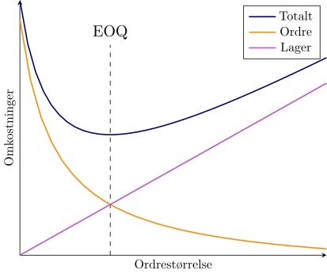
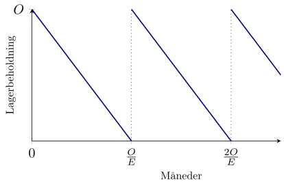

## Introduktion{-}
I denne workshop skal I se på en simplificeret form for lagerstyring.
Vi betragter en bestemt varetype hos en virksomhed og ønsker at bestemme, hvor store ordrer, virksomheden bør lave, hvis de samlede omkostninger skal minimeres. En simpel måde at modellere de samlede omkostninger er ved at betragte to forskellige bidrag: ordreomkostningerne og lageromkostningerne.
Antagelsen er her, at hver enkelt ordre har en fast omkostning $k$ uanset ordrens størrelse. Når varen ankommer til lageret, er der en månedlig omkostning $h$ per vareenhed.

Vi har altså to omkostningskomponenter, der trækker i hver sin retning: Hvis virksomheden laver store ordrer, betales ikke meget i ordreomkostninger, men til gengæld kræves et stort lager, som giver højere lageromkostninger. Omvendt kan virksomheden forsøge at minimere lageromkostningerne ved at lave mange små ordrer. Se @fig-eoq for en illustration af sammenhængen.

I denne simple model vil optimum være en balance mellem ordre- og lagerstørrelse. I skal udlede dette minimum, som på engelsk kaldes *Economic Order Quantity* (EOQ) og første gang blev formuleret af Ford W. Harris i 1913.

{width=80% #fig-eoq fig-alt="Skitse af interaktionen mellem ordre- og lageromkostninger"}

I løbet af workshoppen bruger vi følgende notationer:

* $E$ er efterspørgslen per måned målt i antal vareenheder. Vi antager, at denne er en kendt og positiv konstant.
* $O$ er ordrestørrelsen målt i vareenheder per ordre. Det er denne variabel, vi kan kontrollere.
* $k$ er ordreomkostningerne målt i kr. Bemærk, at denne pris er uafhængig af, hvor mange vareenheder, der bestilles.
* $h$ er de månedlige lageromkostninger per vareenhed målt i kr./enhed.

Alle disse variable antages at være positive.

## Delopgave 1{#sec-opg1}
Vi ser først på situationen, hvor $h$ og $k$ er faste -- altså, at vi ikke selv kan påvirke de faste omkostninger ved ordrer og lager. Vi kan til gengæld justere vores ordrestørrelse $O$, så vi minimerer de samlede omkostninger.

{width=80% #fig-lagerbeholdning fig-alt="Skitse over lagerbeholdning"}

1. Forklar, at lagerbeholdningen over tid må se ud som på @fig-lagerbeholdning, når vi antager, at efterspørgslen $E$ er konstant.

1. Brug @fig-lagerbeholdning til at vise, at den gennemsnitlige lagerbeholdning er $\frac{O}{2}$ enheder.

   ::: {.callout-tip title="Vink" collapse="true"}
   En måde at definere gennemsnittet af en funktion $f(t)$ i perioden fra $t_0$ til $t_1$ er $$\frac{1}{t_1-t_0}\int_{t_0}^{t_1} f(t)\,\mathrm{d}t$$
   :::
   
1. Forklar ud fra ovenstående observationer, at vi per måned har ordreomkostninger på $k\frac{E}{O}\,\mathrm{kr.}$ og lageromkostninger på $h\frac{O}{2}\mathrm{kr.}$

   Konkluder, at de totale omkostninger for en given ordrestørrelse $O>0$ er givet ved
   $$T(O) = k\frac{E}{O} + h\frac{O}{2}$${#eq-total}
   
1. Vis at $T(O)$ i @eq-total har et entydigt minimum i
$$O=\sqrt{\frac{2kE}{h}}.$${#eq-eoq}

Minimummet i @eq-eoq er netop det, der på engelsk kaldes *Economic Order Quantity*.

## Delopgave 2{#sec-opg2}
I denne delopgave udnytter vi nu, at vi kender den optimale ordrestørrelse.

1. Indsæt minimummet fra @eq-eoq i @eq-total, og forklar, at dette kan betragtes som en funktion
$$T_{\mathrm{opt}}(h,k) = \sqrt{2hkE}$$
af $h$ og $k$.

1. Brug kædereglen til at finde gradientvektoren for $T_{\mathrm{opt}}$, og vis, at begge indgange altid er positive. Forklar, at dette intuitivt er rigtigt.

1. Brug gradientvektoren til at bestemme den retning $\mathbf{v}=[v_1,v_2]^\top$, hvor $T_{\mathrm{opt}}$ aftager hurtigst. Altså, i en vis forstand til at afgøre om det er $h$ eller $k$, der skal prioriteres for at opnå den største besparelse i totalomkostninger.

   Beregn derefter retningen i to tilfælde: $h=k$ og $h=2k$. Giver resultaterne mening intuitivt?
   
1. Betegn vores nuværende omkostningskomponenter med hhv. $h_0$ og $k_0$. Vi forestiller os, at en analyse af prisudviklingen for vores omkostninger viser, at $(h,k)$ i fremtiden vil bevæge sig i retningen $\mathbf{u}=\frac{1}{\sqrt{5}}[-1,2]^\top$.

   Bestem den retningsafledede $D_{\mathbf{u}} T_{\mathrm{opt}}(h_0,k_0)$. Brug derefter koden nedenfor til at plotte niveaukurverne for $D_{\mathbf{u}}T_{\mathrm{opt}}(h_0,k_0)$, og afgør, hvornår prisudviklingen er en fordel.
   
```{pyodide-python}
import numpy
from numpy import sqrt
import matplotlib.pyplot as plt

E = 100

hmin = 1
hmax = 10
kmin = 1
kmax = 10

nPoints = 100 # Antal evalueringspunkter i h- og k-retningen

## Lav et gitter med hver kombination af h- og k-værdier
hs = numpy.linspace(hmin, hmax, num=nPoints)
ks = numpy.linspace(kmin, kmax, num=nPoints)
H, K = numpy.meshgrid(hs, ks)

## Evaluer funktionen på gitret
Z = sqrt(E/2)*(-sqrt(K/H) + 2*sqrt(H/K))

## Lav plottet
fig, ax = plt.subplots()
levels = ax.contour(H, K, Z)

ax.clabel(levels) # Sæt labels på hver niveaukurve

# Juster gitterlinjer og akselabels
ax.grid(which='major', color="lightgrey")
ax.set_xlabel("$h_0$")
ax.set_ylabel("$k_0$")
ax.set_title("Niveaukurver for $D_{\\mathbf{u}}T_{\\mathrm{opt}}(h_0,k_0)$")

plt.show()
```

Kunne vi også have løst dette algebraisk i stedet for at kigge på niveaukurverne?


## Delopgave 3{#sec-opg3}
Til sidst undersøger vi tilfældet, hvor virksomheden tillader, at varen går i restordre (*backorder* på engelsk). Det vil sige, at vi i nogle tilfælde vil have et tomt lager, men stadig får ordrer, som så skal opfyldes gennem en underleverandør eller et fjernlager.
Modellen fra tidligere kan udvides til dette tilfælde ved at indføre en ekstra variabel $b$, som beskriver de månedlige omkostninger per vareenhed bestilt i restordre (målt i kr./enhed).

Det kan vises,^[Se f.eks. [disse noter](https://www.columbia.edu/~gmg2/4000/pdf/lect_02.pdf) fra Guillermo Gallego.] at den optimale ordrestørrelse da bliver
$$O=\sqrt{\frac{2kE}{h}}\sqrt{\frac{h+b}{b}},$$
og den minimale omkostning er
$$\sqrt{2hkE}\sqrt{\frac{b}{h+b}}=\sqrt{2hkE}\sqrt{\frac{\alpha}{\alpha+1}},$${#eq-optimalRestordre}
hvor $b=\alpha h$. Altså, er $\alpha$ en parameter, der beskriver, hvor mange gange dyrere det er at have varer i restordre sammenlignet med at have dem på lager.
Bemærk, at vi i begge tilfælde bare har ganget en faktor på optimaene fra tidligere, og at vi for $b\rightarrow\infty$ (altså $\alpha\rightarrow\infty$) genfinder de tidligere optima.

Vi forestiller os, at analyseenheden har estimeret $\alpha$ til at være $5$, og vi noterer dette estimat med $\hat{\alpha}$. Dog er deres analyse noget usikker, så vi ønsker derfor at estimere betydningen af den usikkerhed på den endelige omkostning. Kald estimationsfejlen $\varepsilon$, så analyseenheden har estimatet $\hat{\alpha}=5$, men den sande værdi er $\alpha=\hat{\alpha}+\varepsilon$. Definer så funktionen
$$f(\varepsilon)=\sqrt{\frac{\hat{\alpha}+\varepsilon}{\hat{\alpha}+1+\varepsilon}}.$${#eq-eps}
Vi estimerer nu fejlen på to forskellige måder.

1. Argumenter for, at estimatet $\hat{\alpha}$ højst giver en afvigelse på
$$\sqrt{2hkE}\big(f(\varepsilon)-f(0)\big)$$
fra den optimale omkostning.

   ::: {.callout-tip title="Vink" collapse="true"}
   Beregn @eq-optimalRestordre for hhv. den sande værdi $\alpha=\hat{\alpha}+\varepsilon$ og den estimerede værdi $\hat{\alpha}$.
   :::
   
1. Vis, at Taylorpolynomiet $P_0$ for $f$ af orden $0$ og udviklingspunkt $0$ er givet ved
$$P_0(\varepsilon) = \sqrt{\frac{\hat{\alpha}}{\hat{\alpha}+1}}.$$

1. Det bliver oplyst, at
$$f'(\varepsilon) = \frac{1}{2\sqrt{\frac{\hat{\alpha}+\varepsilon}{\hat{\alpha}+1+\varepsilon}}(\hat{\alpha}+1+\varepsilon)^2}.$$

   Brug dette samt Taylors sætning til at vise, at restleddet for $P_0$ er
   $$R_0(\varepsilon) = \frac{1}{2\sqrt{\frac{\hat{\alpha}+s}{\hat{\alpha}+1+s}}(\hat{\alpha}+1+s)^2} \varepsilon,$${#eq-restled}
   hvor $s$ ligger mellem $0$ og $\varepsilon$.
   
1. Forklar, at så længe $\lvert s\rvert < \hat{\alpha}$, så maksimeres brøken i @eq-restled ved at vælge $s$ mindst mulig.

   ::: {.callout-tip title="Vink" collapse="true"}
   Alle faktorerne er positive, så brøken maksimeres, hvis nævneren minimeres.
   :::
   
   Forklar, at dette betyder at restleddet kan begrænses ved
   $$\frac{\varepsilon}{2\sqrt{\frac{\hat{\alpha}+\varepsilon}{\hat{\alpha}+1+\varepsilon}}(\hat{\alpha}+1+\varepsilon)^2}
   \leq R_0(\varepsilon) \leq 0,\quad \varepsilon <0$$
   og
   $$0 \leq R_0(\varepsilon) \leq
   \frac{\varepsilon}{2\sqrt{\frac{\hat{\alpha}}{\hat{\alpha}+1}}(\hat{\alpha}+1)^2}, \quad \varepsilon\geq 0.$$
   
1. Brug koden herunder til at plotte disse grænser for $R_0(\varepsilon)$ og $f(\varepsilon)-f(0)$, og sammenlign resultaterne. Forsøg evt. også at ændre værdien af $\hat{\alpha}$.

   Hvorfor er fejlene forskellige, selvom Taylors formel garanterer, at $f(\varepsilon) = P_0(0) + R_0(s) = f(0) + R_0(s)$?

```{pyodide-python}
import numpy
from numpy import sqrt
import matplotlib.pyplot as plt


aHat = 5

## Definer den sande og den estimerede fejl
## Bemærk, at opløftning skrives ** i stedet for ^
def f(e):
	return sqrt((aHat+e)/(aHat+1+e))

def R(e):
	if e<0:
		return e/(2*sqrt((aHat+e)/(aHat+1+e))*(aHat+1+e)**2)
	else:
		return e/(2*sqrt((aHat)/(aHat+1))*(aHat+1)**2)

## Evaluer funktionerne i et givet antal punkter
nPoints = 100
es = numpy.linspace(-aHat, aHat, num = nPoints)
estimeretFejl = [ R(e) for e in es ]
sandFejl = [ f(e)-f(0) for e in es ]

## Plot de beregnede værdier
fig, ax = plt.subplots()
ax.plot(es, estimeretFejl, label="$R_0(\\varepsilon)$")
ax.plot(es,sandFejl, label="$f(\\varepsilon)-f(0)$")

ax.grid(which='major', color="lightgrey")
ax.set_ylim(bottom = -0.2, top = max(estimeretFejl))
ax.set_xlabel("$\\varepsilon$")
ax.set_ylabel("Fejl")
plt.legend()

plt.show()
```

<!-- Local Variables: -->
<!-- ispell-local-dictionary: "da_DK" -->
<!-- End: -->
