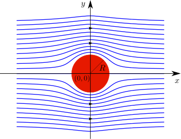

## Introduktion{-}
I denne workshop skal vi arbejde med væskers bevægelser i planen. Man kan tænke på det som en model for vand, der strømmer. Vi forestiller os, at vi måler på væskens retning og fart  og på den måde får information om væskens hastighedsvektor. Vi beskriver væskens hastighedsvektor i punktet $(x,y)\in \mathbb{R}^2$ ved
$$\mathbf{v}(x,y) = v_1(x,y)\mathbf{i}+ v_2(x,y)\mathbf{j}.$${#eq-vectorfield}

Man kalder også @eq-vectorfield for et *vektorfelt*, da man til hvert punkt $(x,y)\in \mathbb{R}^2$ kan tegne en vektor, der viser væsken bevæger sig. I delopgave 1 ser vi på et praktisk eksempel, og i delopgave 2 ser vi på noget af den generelle matematik, som eksemplet er baseret på.

## Delopgave 1{#sec-opg1}
I denne delopgave ser vi på en væske, der strømmer omkring en cylinder med radius $R$ og centrum i $(0,0)$, som vist på @fig-PotentialFlowCylinder.

{width=80% #fig-PotentialFlowCylinder fig-alt="Væske, der strømmer omkring en cylinder"}

Lad $\mathbf{v}=v_1(x,y)\mathbf{i} + v_2(x,y)\mathbf{j}$ beskrive væskens hastighedsvektor. Vi antager, at strømmer er *rotationsfri*, hvilket i matematisk notation betyder, at
$$\frac{\partial v_1}{\partial y}(x,y)=\frac{\partial v_2}{\partial x}(x,y).$${#eq-rotationsfri}

Vi antager også, at strømmen er *inkompressibel*, hvilket betyder, at 
$$\frac{\partial v_1}{\partial x}(x,y)+\frac{\partial v_2}{\partial y}(x,y)=0.$${#eq-inkompressibel}

Til sidst antager vi, at når væsken er meget langt væk fra cylinderen, så er hastighedsvektoren næsten konstant og givet ved
$${\bf v}_\infty =U\mathbf{i},$${#eq-megetlangtvaek}
hvor $U>0$ er en konstant. Vi skal nu løse de følgende delopgaver:

1. Argumenter for, at hvis man skriver $(x,y)$ som  $x=r\cos(\theta)$ og $y=r\sin(\theta)$, hvor $r$ er et positivt tal, som man kan tænke på som afstand til Origo, mens $\theta$ er en vinkel^[Det kaldes *polære koordinater* - se mere på s. 487, 488 i Adams & Essex], så er cylinderens rand beskrevet af en cirkel, hvor $r=R$ er konstant, og $\theta$ varierer mellem $0$ og $2\pi$.

1. Argumenter for, at normalvektoren til randen kun afhænger af $\theta$ og er givet ved
$${\bf n}(\theta):=\cos(\theta)\mathbf{i}+\sin(\theta)\mathbf{j}.$$

1. Da væsken hverken kan komme ind i eller ud af cylinderen, så indfører vi en *randbetingelse*, der kræver, at hastighedsvektoren $\mathbf{v}$ altid skal være tangent til randen. Mere konkret betyder det, at når $r=R$, så står $\mathbf{v}$ vinkelret på $\mathbf{n}$. Argumenter for, at dette kan udtrykkes ved hjælp af ligningen 
$${\bf v}(r\cos(\theta),r\sin(\theta))\cdot {\bf n}(\theta)=0\quad \text{når}\quad r=R.$${#eq-rand}

1. Definer funktionen 
$$\varphi(x,y)= Ux\left (1+\frac{R^2}{x^2+y^2}\right ),\quad \sqrt{x^2+y^2}\geq R,$$
Vi skal nu vise, at hastighedsvektoren $\mathbf{v}(x,y)=\nabla \varphi(x,y)$ beskriver væskens bevægelse; altså at $\mathbf{v}(x,y)$ opfylder randbetingelserne @eq-megetlangtvaek og @eq-rand samt antagelserne @eq-rotationsfri og @eq-inkompressibel. Vis at hastighedsvektoren er givet ved
$$\mathbf{v}(x,y)=\left(U\left(1+\frac{R^2}{x^2+y^2}\right)-\frac{2Ux^2R^2}{(x^2+y^2)^2}\right)\mathbf{i}-\frac{2UxR^2y}{(x^2+y^2)^2}\mathbf{j}.$$
Argumenter herefter for, at @eq-megetlangtvaek er opfyldt. 

1. Vis, at der i polære koordinater gælder
$$\Phi(r,\theta):=\varphi(r\cos(\theta),r\sin(\theta))=U r \cos(\theta)\left ( 1+\frac{R^2}{r^2}\right),\quad r\geq R.$${#eq-polaerekoordinater}
Vis herefter ved at bruge kædereglen for funktioner af flere variable, at 
$$\frac{\partial \Phi}{\partial r}=\frac{\partial \varphi}{\partial x}\frac{\partial x}{\partial r}+\frac{\partial \varphi}{\partial y}\frac{\partial y}{\partial r}=v_1 \cos(\theta)+ v_2 \sin(\theta) =\mathbf{v}\cdot \mathbf{n}.$$
Beregn nu $\tfrac{\partial \Phi}{\partial r}$ ud fra @eq-polaerekoordinater og vis, at @eq-rand er opfyldt.

1. Argumenter for, at
$$\frac{\partial^2 \varphi}{\partial y \partial x}=\frac{\partial^2 \varphi}{\partial x \partial y}.$$
Vis herefter, at @eq-rotationsfri er opfyldt.

1. Brug Maple (eller regn det i hånden) til at eftervise, at
$$\begin{align}
\frac{\partial v_1}{\partial x}&=-\frac{6UR^2x}{(x^2+y^2)^2}+\frac{8UR^2x^3}{(x^2+y^2)^3},\notag\\
\frac{\partial v_2}{\partial y}&=-\frac{2UR^2x}{(x^2+y^2)^2}+\frac{8UR^2xy^2}{(x^2+y^2)^3}.
\end{align}$$
Vis herefter, at @eq-inkompressibel er opfyldt.

1. Gennemgå nu nedenstående Python-kode, der definerer problemet og plotter vektorfeltet. Prøv derefter at ændre på f.eks. $U$ og $R$.
```{pyodide-python}
#| editor-font-scale: 0.2
## Indlæs programbiblioteker
import numpy as np
import matplotlib.pyplot as plt

## Definer et gitter af planet med størrelsen N x N
x_start = -2
x_end = 2

y_start = -2
y_end = 2

N = 25

x, y = np.meshgrid(np.linspace(x_start, x_end, N), np.linspace(y_start, y_end, N), indexing='ij')

## Definer U, R, og potentialet phi
U = 1
R = 1

phi = U * x * (1 + R**2 / (x**2 + y**2))

## Udregn den numeriske gradient af phi
v, w = np.gradient(phi)
fart = np.sqrt(v**2 + w**2)

## Fjern vektorer som ligger indenfor cylinderen
## NB: Vi sætter punkter inden for cylinderen til float('nan'), altså 'not a number', 
## i stedet for 0, da det ellers giver små prikker når de indsættes i quiver-funktionen.
for i in range(N) :
    for j in range(N) :
        if np.sqrt(x[i,j]**2 + y[i,j]**2) <= R :
            v[i, j] = float('nan')
            w[i, j] = float('nan')
            

## Plot af vektorfeltet med farve givet ved farten.
fig, ax = plt.subplots()
ax.set_aspect("equal")
q = ax.quiver(x, y, v, w, fart, angles='xy', scale_units='xy', scale=1)
fig.colorbar(q)
ax.set_xlabel("x")
ax.set_ylabel("y")
ax.set_title("U=${:.2f}, R=${:.2f}".format(U,R))
plt.show()
```

## Delopgave 2
I @sec-opg1 så vi et vektorfelt på formen
$$\mathbf{v}(x,y)=\nabla \varphi(x,y)=\frac{\partial \varphi}{\partial x}(x,y)\mathbf{i}+\frac{\partial \varphi}{\partial y}(x,y)\mathbf{j}.$$
Et sådan vektorfelt kaldes *konservativt*, og funktionen $\varphi$ kaldes *potentialet* for $\mathbf{v}$. 

(@) Vis at et konservativt vektorfelt altid er rotationsfrit; dvs. at @eq-rotationsfri er opfyldt.

I denne delopgave skal vi vise, at det modsatte faktisk også gælder, hvis definitionsområdet er passende. Nemlig, at ethvert rotationsfrit vektorfelt nødvendigvis er konservativt, hvis definitionsområdet ikke har &lsquo;huller&rsquo;. Vi antager, at $\mathbf{v}(x,y)$ er et rotationsfrit vektorfelt, og definerer funktionen 
$$\varphi(x,y):=\int_0^x v_1(t,y)\mathrm{d}t +\int_0^y v_2(0,s)\mathrm{d}s.$$
Vi skal nu vise, at $\mathbf{v}(x,y)=\nabla \varphi(x,y)$.

(@) Vis at $\frac{\partial \varphi}{\partial x}(x,y)=v_1(x,y).$

(@) Under milde antagelser gælder der, at
$$\frac{\partial \varphi}{\partial y}(x,y)=\int_0^x \frac{\partial v_1}{\partial y}(t,y)\mathrm{d}t +\frac{\partial }{\partial y}\int_0^y v_2(0,s)\mathrm{d}s.$$
Brug nu antagelsen @eq-rotationsfri samt ovenstående til at vise, at $\frac{\partial \varphi}{\partial y}(x,y)=v_2(x,y).$

(@) Lad os nu betragte en væske, hvis hastighedsvektor er givet ved
$$\mathbf{v}(x,y)=-\sin(x)(e^y+e^{-y})\mathbf{i}+\cos(x)(e^y-e^{-y})\mathbf{j}.$$
Vis at væsken er rotationsfri og bestem herefter potentiale $\varphi$ for $\mathbf{v}$. Findes der andre mulige potentialer for $\mathbf{v}$?
