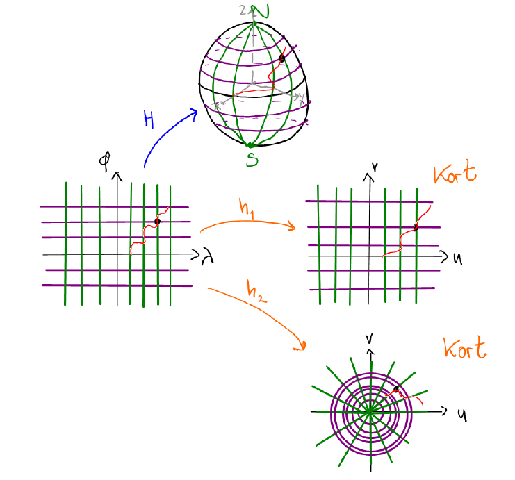

# Introduktion{-}
Vinkler, afstande og arealer er helt centrale for landinspektører. Målforholdet  er forholdet mellem længder  i naturen og i kort og kan bestemmes, når kortet er givet som funktion af geografiske koordinater, $(\lambda,\varphi)$, længde og bredde.

På @fig-coordinates ses et eksempel, hvor $H(\lambda,\varphi)$ er de kartesiske koordinater &ndash; altså $(x,y,z)$-koordinater &ndash; der hører til et punkt på sfæren med længde og bredde givet ved $(\lambda,\varphi)$.
Omvendt vil der til enhvert punkt $(x,y,z)$ på sfæren være et tilhørende længde/bredde-par, som netop er givet ved $H^{-1}(\lambda,\varphi)$. Fra længden og bredden kan vi også danne forskellige kort som illustreret ved $h_1$ og $h_2$ på figuren. Til sidst vises en orange sti i de forskellige koordinater.

{#fig-coordinates width=70% fig-alt="Skitse over afbildning mellem kort"}

Målforholdet er ikke nødvendigvis konstant, men vil i det generelle tilfælde afhænge af, hvilket punkt man står i og hvilken retning man kigger.
For eksempel er Mercatorprojektionen på @fig-mercator givet med $h(\lambda,\varphi)=\big(\lambda, \ln(\tan(\frac{\pi}{4}+\frac{\varphi}{2}))\big)$, og I skal senere i jeres studie se, at målforholdet er $1/\cos(\varphi)$. Altså afhænger målforholdet af breddegraden.
Et andet eksempel er projektionen på @fig-archimedesLambert, hvor $g(\lambda,\varphi) = \big(\lambda,\sin(\varphi)\big)$. Her afhænger målforholdet både af bredden og retningen, man kigger i. Man kan altså sige, at kortet &ldquo;strækker forskelligt i forskellige retninger&rdquo;.

::: {#fig-projections layout-ncol=2 layout-valign="center"}

](Mercator_projection_SW.jpg){#fig-mercator fig-alt="Mercatorprojektionen"}

](Lambert_cylindrical_equal-area_projection_SW.jpg){#fig-archimedesLambert fig-alt="Archimedes-Lambert-projektionen"}

To forskellige cylinderprojektioner. Begge er lavet af [Strebe](https://commons.wikimedia.org/wiki/User:Strebe) og udgivet under [CC-BY-SA 3.0](https://creativecommons.org/licenses/by-sa/3.0/deed.en).
:::

I denne workshop skal se på, hvad lineære afbildninger gør ved afstande og arealer.
I får behov for følgende definitioner og formler for vektorer $\mathbf{x},\mathbf{y}\in\mathbb{R}^n$.

1. Skalarproduktet mellem $\mathbf{x}$ og $\mathbf{y}$ er $\mathbf{x}\cdot\mathbf{y}=\mathbf{x}^\top\mathbf{y}$, hvor højresiden er et matrixprodukt.

1. Længden af en vektor er $\lvert\mathbf{x}\rvert = \sqrt{\mathbf{x}\cdot\mathbf{x}}$.

1. Afstanden mellem $\mathbf{x}$ og $\mathbf{y}$ er $\lvert\mathbf{y}-\mathbf{x}\rvert$.

1. Hvis $\alpha$ er vinklen mellem $\mathbf{x}$ og $\mathbf{y}$, så gælder $\cos(\alpha)=\frac{\mathbf{x}\cdot\mathbf{y}}{\lvert\mathbf{x}\rvert\,\lvert\mathbf{y}\rvert}$.

1. Målforholdet for en lineær afbildning $\mathbf{x}\mapsto A\mathbf{x}$ i retningen af $\mathbf{x}$ er $m(A,\mathbf{x})= \frac{\lvert A\mathbf{x}\rvert}{\lvert\mathbf{x}\rvert}$.

1. I både planet og rummet vil parallelogrammet udspændt af $\mathbf{x}$ og $\mathbf{y}$ have areal $\sqrt{\lvert\mathbf{x}\rvert^2\lvert\mathbf{y}\rvert^2 - (\mathbf{x}\cdot\mathbf{y})^2}.$


# Delopgave 1{#sec-opg1}
1. Hvis $A$ er en $m\times n$-matrix, så er
$$A\mathbf{x}\cdot A\mathbf{y}= (A\mathbf{x})^\top A\mathbf{y} = \mathbf{x}^\top A^\top A\mathbf{y}= \mathbf{x}\cdot A^\top A\mathbf{y},$$
hvor $\cdot$ betegner skalarprodukter, og de resterende produkter er matrixprodukter.

   Forklar hvert lighedstegn i denne udledning, og bestem størrelsen af $A^\top A$.
   
   Vis, at målforholdet for den lineære afbildning $\mathbf{x}\mapsto A\mathbf{x}$ i retning af en vektor $\mathbf{v}$ er givet ved
   $$m(A,\mathbf{v}) = \sqrt{\frac{\mathbf{v}A^\top A\mathbf{v}}{\mathbf{v}\cdot\mathbf{v}}}.$$

1. Vi betragter nu den lineære transformation $\mathbf{x}\mapsto B\mathbf{x}$, hvor
$$B = \left[\begin{array}{rr}
1 & -2\\
3 & 2
\end{array}
\right].$$

   (a) Udregn $B^\top B$.
   
   (a) Lad $\mathbf{e}_1$ og $\mathbf{e}_2$ betegne standardbasisvektorerne i $\mathbf{R}^2$. Brug $B^\top B$ og resultaterne fra første spørgsmål til at beregne
   $$\lvert B\mathbf{e}_1\rvert\quad \lvert B\mathbf{e}_2\rvert\quad \lvert B(\mathbf{e}_1+\mathbf{e}_2)\rvert\quad\text{og}\quad B\mathbf{e}_1\cdot B\mathbf{e}_2.$$
   
       Hvad er målforholdet i retning $\mathbf{e}_1$ og $\mathbf{e}_2$?
	   
   (a) Vis, at målforholdet for en generel vektor $\mathbf{x}=[x_1\: x_2]^\top$ er
   $$m(B,\mathbf{x}) = \sqrt{\frac{10x_1^2 + 8x_1x_2 + 8x_2^2}{x_1^2 + x_2^2}}.$$
   
   (a) Vis, at afstanden fra $B\mathbf{x}$ til $B\mathbf{y}$ er $\lvert B(\mathbf{y}-\mathbf{x})\rvert$, og at
   $$\lvert B\mathbf{y}-B\mathbf{x}\rvert = m(B,\mathbf{y}-\mathbf{x}) \lvert\mathbf{y}-\mathbf{x}\rvert,$$
   altså at afstanden fra $B\mathbf{x}$ til $B\mathbf{y}$ fås ved at multiplicere afstanden fra $\mathbf{x}$ til $\mathbf{y}$ med målforholdet i retningen $\mathbf{y}-\mathbf{x}$.
   
   (a) Det viser sig, at arealer også er forbundet med $B^\top B$: For en $2\times 2$- eller $3\times 2$-matrix $A$ gælder, at arealet af parallelogrammet udspændt af $A\mathbf{x}$ og $A\mathbf{y}$ er givet ved
   $$\sqrt{\det(A^\top A)} \sqrt{\lvert\mathbf{x}\rvert^2 \lvert\mathbf{y}\rvert^2 - (\mathbf{x}\cdot\mathbf{y})^2}.$$
   Brug dette til at afgøre, om den lineære afbildning $\mathbf{x}\mapsto B\mathbf{x}$ er arealtro &ndash; altså om den bevarer arealer.
   
1. Lad $A$ være en $2\times 2$- eller $3\times 2$-matrix. Formuler en generel betingelse for, at afbildningen $\mathbf{x}\mapsto A\mathbf{x}$ er arealtro.


# Delopgave 2{#sec-opg2}
Senere i kurset skal I se, at hvis en $n\times n$-matrix $X$ er symmetrisk &ndash; altså at $X^\top = X$ &ndash; så kan den altid diagonaliseres på formen $X=PDP^\top$, hvor bassisskiftmatricen $P$ opfylder $P^\top=P^{-1}$.
Da vil søjlerne i $P$ udgøre en basis for $\mathbb{R}^n$, de vil være enhedsvektorer, de vil egenvektorer for $X$ og de vil være parvist vinkelrette.

1. Find matricer $P$ og $D$ som ovenfor, når $X=A^\top A$ for hver af de to matricer
$$A=\left[
\begin{array}{rr}
1 & -1\\
0 & 2\\
2 & 0
\end{array}
\right]
\quad\text{og}\quad
\left[
\begin{array}{rrr}
1 & -1 & 0\\
0 & 1 & 1\\
\end{array}
\right].$$

:::{.callout-tip title="Vink" collapse=true}
I skal bestemme egenværdier og egenvektorer for $A^\top A$.

For den sidste matrix har $A^\top A$ egenvektorer
$$\left[
\begin{array}{r}
1\\ 0\\ 1
\end{array}
\right],
\left[
\begin{array}{r}
-1\\ 2\\ 1
\end{array}
\right],
\left[
\begin{array}{r}
1\\ 1\\ -1
\end{array}
\right].$$
:::

1. Vis, at $A^\top A$ altid er en symmetrisk matrix uanset valget af $A$. Vis derefter, at $\lvert P\mathbf{x}\rvert = \lvert\mathbf{x}\rvert$, når $P^\top = P^{-1}$.

1. Forklar hvert af lighedstegnene i følgende udledning.
$$A\mathbf{x}\cdot A\mathbf{y}= \mathbf{x}\cdot A^\top A\mathbf{y} = \mathbf{x}\cdot PDP^\top \mathbf{y} =  (P^\top \mathbf{x})\cdot D (P^\top \mathbf{y})$${#eq-omskrivAxAy}

1. Brug @eq-omskrivAxAy til at vise, at $m(A,\mathbf{x}) = m(\sqrt{D}, P^\top\mathbf{x})$, hvor $\sqrt{D}$ er den diagonalmatrix, hvis diagonalindgange er kvadratroden af diagonalindgangene i $D$.

1. Lad $\mathbf{x}$ og $\mathbf{y}$ være egenvektorer for $A^\top A$ med længde 1 og tilhørende egenværdier $\lambda$ og $\mu$.
Udregn målforholdene $m(A,\mathbf{x})$, $m(A,\mathbf{y})$ og $m(A,\mathbf{z})$, hvor $\mathbf{z}=a\mathbf{x} + b\mathbf{y}$.

:::{.callout-note title="Løsning til den sidste del" collapse=true}
$$m(A,\mathbf{z}) = \sqrt{\frac{\lambda a^2 +\mu b^2}{a^2 + b^2}}$$
:::

1. Vis, at målforholdet for en lineær afbildning $\mathbf{x}\mapsto A\mathbf{x}$ er konstant, hvis og kun hvis alle egenværdierne for $A^\top A$ er ens.

:::{.callout-tip title="Vink" collapse=true}
Egenvektorerne for $A^\top A$ danner en basis for $\mathbb{R}^n$, så $\mathbf{x}$ kan skrives som en linearkombination af disse egenvektorer. Brug dette sammen med resultatet fra spørgsmålet ovenfor.
:::

# Delopgave 3{#sec-opg3}
Når vi laver kort, involverer det mere end én afbildning. For eksempel
$$H(\lambda,\varphi) = \left[
\begin{array}{c}
R\cos(\varphi)\cos(\lambda)\\
R\cos(\varphi)\sin(\lambda)\\
R\sin(\varphi)
\end{array}
\right]
\quad\text{og}\quad
\left[
\begin{array}{c}
\lambda\\
\ln\big(\tan(\frac{\pi}{4} + \frac{\varphi}{2})\big)
\end{array}
\right],$$
hvor $R$ betegner Jordens radius.^[Her er Jorden modelleret ved en sfære, og dens radius er da omkring 6370km.]

Målforholdet sammenligner afstande i naturen med afstande på kortet. Så hvis den orange kurve i @fig-coordinates f.eks. har længde $L$ i $(\lambda,\varphi)$-planet, længde $10L$ på sfæren og længde $\frac{L}{2}$ på kortet, så er målforholdet for kurven $\frac{L/2}{10L} = 1/20$. Det beskriver altså skaleringen fra sfæren til kortet.

Hvis vi har lineære afbildninger $\mathbf{x}\mapsto A\mathbf{x}$ og $\mathbf{x}\mapsto B\mathbf{x}$, hvor $A$ er $3\times 2$ og $B$ er $2\times 2$, så er målforholdet fra $A\mathbf{y}$ til $B\mathbf{y}$ netop
$$\frac{m(B,\mathbf{y})}{m(A,\mathbf{y})}.$$
Her kan I tænke på $A$ som afbildningen fra geografiske koordinater til sfæren og på $B$ som afbildningen fra geografiske koordinater til kortet.

Vi vil her se på matricer på formen
$$A_{(\lambda,\varphi)} = \left[
\begin{array}{cc}
-\cos(\varphi)\sin(\lambda) & -\sin(\varphi)\cos(\lambda)\\
\cos(\varphi)\cos(\lambda) & -\sin(\varphi)\sin(\lambda)\\
0 & \cos(\varphi)
\end{array}
\right]$$
samt
$$B_{(\lambda,\varphi)}^{\mathrm{M}} = \left[
\begin{array}{cc}
1 & 0\\
0 & \frac{1}{\cos(\varphi)}
\end{array}
\right]
\quad\text{og}\quad
B_{(\lambda,\varphi)}^{\mathrm{AL}} =\left[
\begin{array}{cc}
1 & 0\\
0 & \cos(\varphi)
\end{array}
\right].$$
Her er $A_{(\lambda,\varphi)}$ afbildningen mellem plan og sfære, mens $B_{(\lambda,\varphi)}^{\mathrm{M}}$ og $B_{(\lambda,\varphi)}^{\mathrm{AL}}$ svarer til to forskellige kortprojektioner. Matricen $B_{(\lambda,\varphi)}^{\mathrm{M}}$ er Mercatorprojektionen og $B_{(\lambda,\varphi)}^{\mathrm{AL}}$ er Archimedes-Lambert-projektionen.
I nedenstående kodeblok er de to forskellige projektioner skrevet ind i Python, og der er lavet funktioner, der beregner målforholdet. Kør denne kode, inden I går videre til de næste opgaver.

```{pyodide-python}
import numpy
from numpy import cos, sin
from numpy.linalg import norm

def mercatorMF(l, phi, v, w):
    """
    Udregn målforholdet for Mercatorprojektionen givet l (=lambda) og
    phi samt en retning (v,w).
    """
    # Definer matricen A fra Delopgave 3. Bemærk, at denne afhænger af
    # l og phi
    A = numpy.array([
        [-cos(phi)*sin(l), -sin(phi)*cos(l)],
        [cos(phi)*cos(l), -sin(phi)*sin(l)],
        [0, cos(phi)]
    ])

    # Definer matricen B fra Delopgave 3. Denne stammer fra Mercator-
    # projektion og afhænger kun af phi.
    B = numpy.array([
        [1, 0],
        [0, 1/cos(phi)]
    ])

    x = numpy.array([v, w])

    # Beregn m(C,x)/m(A,x)
    m1 = norm(B*x)/norm(x)
    m2 = norm(A*x)/norm(x)

    return m1/m2

def mercatorPrintMF(l, phi, v, w):
    """
    Udregn og print målforholdet for Mercatorprojektionen givet l
    (=lambda) og phi samt en retning (v,w).
    """
    print("Målforhold for Mercatorprojektion med lambda={}, phi={}, v={}, w={}:\n{}".format(
        l, phi,
        v, w,
        mercatorMF(l, phi, v, w))
    )


def archimedesMF(l, phi, v, w):
    """
    Udregn målforholdet for Archimedes' projektion givet l (=lambda) og
    phi samt en retning (v,w).
    """
    # Definer matricen A fra Delopgave 3. Bemærk, at denne afhænger af
    # l og phi
    A = numpy.array([
        [-cos(phi)*sin(l), -sin(phi)*cos(l)],
        [cos(phi)*cos(l), -sin(phi)*sin(l)],
        [0, cos(phi)]
    ])

    # Definer matricen C fra Delopgave 3. Denne stammer fra Archimedes'
    # projektion og afhænger kun af phi.
    C = numpy.array([
        [1, 0],
        [0, cos(phi)]
    ])

    x = numpy.array([v, w])

    # Beregn m(C,x)/m(A,x)
    m1 = norm(C*x)/norm(x)
    m2 = norm(A*x)/norm(x)

    return m1/m2


def archimedesPrintMF(l, phi, v, w):
    """
    Udregn og print målforholdet for Archimedes' projektion givet l
    (=lambda) og phi samt en retning (v,w).
    """
    print("Målforhold for Mercatorprojektion med lambda={}, phi={}, v={}, w={}:\n{}".format(
        l, phi,
        v, w,
        archimedesMF(l, phi, v, w))
    )
```

1. Udregn ved hjælp af nedenstående kodeblok målforhold for de to projektioner i de følgende geografiske koordinater. I alle tilfælde skal I bestemme målforholdet i retningerne $(1,0)$, $(1,1)$ og $(0,1)$.

   a. $(\lambda,\varphi)=(0,0)$.
   
   a. $(\lambda,\varphi)=(0,\frac{\pi}{8})$.
      For hvilken projektion er målforholdet uafhængigt af retningen, man kigger i?
	  
   a. $(\lambda,\varphi)=(0,\frac{\pi}{4})$.

      ```{pyodide-python}
      from numpy import pi
      
      mercatorPrintMF(0,0,1,0)
      mercatorPrintMF(0,0,1,1)
      mercatorPrintMF(0,0,0,1)
      
	  print("\n")
      archimedesPrintMF(0,0,1,0)
      archimedesPrintMF(0,0,1,1)
      archimedesPrintMF(0,0,0,1)
      
      ## Fortsæt selv scriptet...
      ```

1. Brug nedenstående kode til at plotte de to projektioner som funktion af $\varphi$.

   Forklar, hvad I ser. Hvorfor behøver man f.eks. ikke kende retningen, når man plotter Mercator-projektionen? Og hvordan skal man fortolke forskellen mellem de to plots af Archimedes-Lambert-projektionen?

   ```{pyodide-python}
   import matplotlib.pyplot as plt
   
   ## Opret en figur med tre plots under hinanden
   fig, axs = plt.subplots(3,1)
   
   ## Generer 100 ligeligt fordelte phi-værdier i [-pi/2,pi/2]
   phis = numpy.linspace(-numpy.pi/2, numpy.pi/2, num=100)
   
   ## Udfyld de enkelte plots
   axs[0].plot(phis, [mercatorMF(0, phi, 1, 0) for phi in phis])
   axs[0].set_title("Mercatorprojektion\nfor $(v,w)=(1,0)$")
   
   axs[1].plot(phis, [archimedesMF(0, phi, 1, 0) for phi in phis])
   axs[1].set_title("Archimedes' projektion\nfor $(v,w)=(1,0)$")
   
   axs[2].plot(phis, [archimedesMF(0, phi, 0, 1) for phi in phis])
   axs[2].set_title("Archimedes' projektion\nfor $(v,w)=(0,1)$")
   
   ## Sæt samme grænser for andenaksen i alle plots
   for i in range(3):
       axs[i].set_ylim(0, 10)
       axs[i].set_xlabel("$\\varphi$")
   	
   ## Juster størrelse og mellemrum og vis figuren
   fig.set_figheight(8)
   fig.subplots_adjust(hspace=.7)
   plt.show()
   ```

<!-- Local Variables: -->
<!-- ispell-local-dictionary: "da_DK" -->
<!-- End: -->
