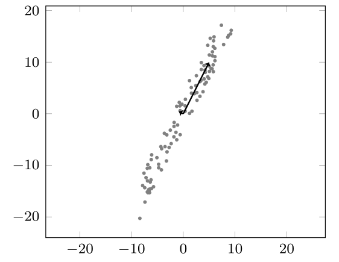
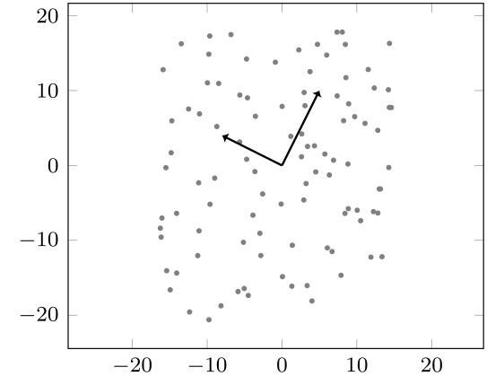

# Introduktion{-}
I skal i denne workshop arbejde med hovedkomponentanalyse (på engelsk *principal component analysis*), som kan bruges til at bestemme retninger med mest variation i et indsamlet datasæt. Dette bruges ofte til at reducere dimensionen i datasættet ved at se bort fra dimensioner med forholdsvist lav variation. Formålet i denne workshop er lidt anderledes, da vi udelukkende bruger hovedkomponentanalysen til at estimere variationen i forskellige retninger. To eksempler ses på @fig-examples.

Motivationen for vores undersøgelse er, at viden om disse variationer kan bruges til at opdage problemer med vindmøller.^[Se f.eks. [https://orbit.dtu.dk/files/101029855/Eigen_PHM2014.pdf](https://orbit.dtu.dk/files/101029855/Eigen_PHM2014.pdf)]
Idéen er, at vindmølleproducenten har opgivet en forventet effekt under bestemte forhold, som afhænger af variable såsom vindhastighed, temperatur, luftdensitet osv. Vi indsamler så data omkring (nogle af) disse variable sammen med den egentlige effekt, hvorefter vi sammenligner alt dette med den forventede, teoretiske effekt under de givne forhold.
Hvis vindmøllen fungerer optimalt, forventer vi, at dataene ligger tæt på den teoretiske effekt, og at variationen omkring denne vil være forholdsvist lille. Er der problemer med møllen (defekte dele, is på vingerne eller lignende), vil vi derimod forvente en større variation i det indsamlede data.

::: {#fig-examples layout-ncol=2}

{width=100% fig-alt="Plot med lav variation"}

{width=100% fig-alt="Plot med stor variation"}

To sæt datapunkter med 2 variable og 100 observationer hver. Derudover er hovedkomponenterne (egenvektorerne) indtegnet. Komponenternes længder er fastlagt på baggrund af egenværdiernes størrelse. Datasættet til venstre viser næsten alt variation langs én af komponenterne, mens datasættet til højre viser en mere lige variation i begge retninger.
:::

Hvis vi har indsamlet $n$ datapunkter i (søjle)vektorerne $\mathbf{x}_1,\mathbf{x}_2,\ldots,\mathbf{x}_n$ med $m$ variable, repræsenterer vi disse ved en $n\times m$-matrix
$$X=\left[
    \begin{array}{rcl}
      -&\mathbf{x}_1^T&-\\
      -& \mathbf{x}_2^T &-\\
       &\vdots\\
      - & \mathbf{x}_n^T & -
    \end{array}
  \right]$$
så $i$'te række indeholder værdierne for $i$'te datapunkt. Vi vil i denne workshop antage, at dataene har *middelværdi* $\mathbf{0}$, hvor middelværdien er defineret som $\boldsymbol\mu=\frac{1}{n}(\mathbf{x}_1+\mathbf{x}_2+\cdots+\mathbf{x}_n)$.^[Er dette ikke tilfældet, kan vi i stedet bruge $\hat{\mathbf{x}}_i=\mathbf{x}_i-\boldsymbol\mu$ som *har* middelværdi $\mathbf{0}$]
Den såkaldte *kovariansmatrix* $S$ for en datamatrix $X$ med middelværdi $\mathbf{0}$ er givet ved
$$S=\frac{1}{n-1}X^TX.$$
Det viser sig, at hver hovedkomponent er en egenvektor for $S$, og at jo større den tilhørende egenværdi er, jo større er variationen i den retning.

# Delopgave 1{#sec-opg1}
Antag, at vi har indsamlet datapunkterne
$$\mathbf{x}_1=\left[
    \begin{array}{r}
      -3 \\ 0\\ 2
    \end{array}
  \right],\quad
  \mathbf{x}_2=\left[
    \begin{array}{r}
      -2\\ 3\\ 2
    \end{array}
  \right],\quad
  \mathbf{x}_3=\left[
    \begin{array}{r}
      1\\ -1\\ -2
    \end{array}
  \right],\quad
  \mathbf{x}_4=\left[
    \begin{array}{r}
      4\\ -2\\ -2
    \end{array}
  \right].$$

1. Tjek, at dataene har middelværdi $\mathbf{0}$.

1. Opskriv matricen $X$ for de givne datapunkter. Hvad er dens rang, og hvad er dimensionen af dens nulrum?

1. Vis, at kovariansmatricen for $X$ er
$$\frac{1}{3}\left[
      \begin{array}{rrr}
        30 & -15 & -20\\
        -15 & 14 & 12\\
        -20 & 12 & 16
      \end{array}
      \right].$$

# Delopgave 2{#sec-opg2}
Vi ser i denne opgave på en anden kovariansmatrix
$$S=\left[
    \begin{array}{rrr}
      5 & 1 & 4\\
      1 & 5 & 4\\
      4 & 4 & 10
    \end{array}
  \right],$$
som har &lsquo;pænere&rsquo; egenværdier og egenvektorer end den i @sec-opg1.
I @sec-opg4 får I en datamatrix $X$, der netop har $S$ som kovariansmatrix.


1. Tjek, at $\mathbf{v}_1=[1,1,2]^T$ er en egenvektor for $S$. Hvad er den tilhørende egenværdi?

1. Vis, at det karakteristiske polynomium for $S$ er
$$-\lambda^3 + 20 \lambda^2 - 92 \lambda + 112.$${#eq-charPoly}

1. Det kan vises, at polynomiet i @eq-charPoly kan omskrives til $(\lambda-14)(-\lambda^2+6\lambda-8)$. Brug dette til at bestemme de resterende egenværdier for $S$.

1. Bestem baser for egenrummene hørende til egenværdierne fra spørgsmål 3.

1. Brug de ovenstående opgaver til at bestemme en diagonalisering af $S$.

# Delopgave 3{#sec-opg3}
I denne delopgave ser vi lidt nærmere på baggrunden for, hvorfor egenvektoren med den største egenværdi beskriver retningen med størst variation.


(@) En $m\times m$-matrix $A$ kaldes symmetrisk, hvis $A^T=A$. Vis, at en kovariansmatrix altid er symmetrisk.

I skal senere i kurset se^[Det er det resultat, der kaldes *spektralsætningen*], at vi for en sådan symmetrisk matrix $A$ kan finde en basis for $\mathbb{R}^m$ bestående af egenvektorer $\mathbf{v}_1,\mathbf{v}_2,\ldots,\mathbf{v}_m$ for $A$, sådan at
$$\left\{
    \begin{array}{l@{\hspace{1cm}}l}
      \mathbf{v}_i^T\mathbf{v}_i=1 & \text{for alle } i\\
      \mathbf{v}_i^T\mathbf{v}_j=\mathbf{v}_j^T\mathbf{v}_i=0 & \text{for alle par $(i,j)$, hvor $i\neq j$}
    \end{array}
  \right.$${#eq-basisProperties}

Antag i opgaverne herunder, at vi har fundet en sådan basis ud fra kovariansmatricen $S$.


(@) Lad $\mathbf{w}$ være en vektor i $\mathbb{R}^m$, og lad $X$ være en datamatrix med kovariansmatrix $S$ som ovenfor. Definer en ny matrix $\tilde{X}=X\mathbf{w}$, og forklar, at $\tilde{X}$ ligger i $\mathrm{Col}(X)$.

(@) \label{item:transformedCovariance}
  Vis, at kovariansmatricen for $\tilde{X}$ er givet ved $\mathbf{w}^TS\mathbf{w}$. Hvad er størrelsen på denne kovariansmatrix?
  
(@) \label{item:linearComb}
  Forklar, hvorfor der eksisterer entydige $c_1,c_2,\ldots,c_m$, sådan at
$$\mathbf{w}=c_1\mathbf{v}_1+c_2\mathbf{v}_2+\cdots+c_m\mathbf{v}_m.$$

(@) Kombiner 3. og 4. med egenskaberne i @eq-basisProperties for at vise, at kovariansen for $\tilde{X}$ er
$$c_1^2\lambda_1+c_2^2\lambda_2+\cdots+c_m^2\lambda_m.$${#eq-expandedCovariance}

(@) Antag, at $\lambda_1$ er den største egenværdi. Vis, at hvis vi kræver $c_1^2+c_2^2+\ldots+c_m^2=1$, så maksimeres @eq-expandedCovariance ved at sætte $c_1=1$ og $c_i=0$ for $i\neq 1$.


# Delopgave 4{#sec-opg4}
Til denne opgave hører desuden en Python-fil og to CSV-filer: `plotPca.py`, `data1.csv` og `data2.csv`. Filen `plotPca.py` indeholder en funktion, der tager en datamatrix som input og herefter udregner hovedkomponenterne og plotter dem sammen med datapunkterne.
Filerne `data1.csv` og `data2.csv` indeholder datamatricer, som I skal lave hovedkomponentanalyse på.

::: {.callout-note}
Python-koden til denne workshop fungerer bedst, hvis den køres lokalt. Da vil plottene være interaktive, så I kan rotere dem, og se dataene fra flere vinkler.

I kan også køre det direkte fra denne fil, men så er plots bare figurer.
:::

Hvis I kører Python-scriptet lokalt, kan I indlæse de to csv-filer direkte. For at køre det gennem browseren, kan vi &lsquo;snyde&rsquo; ved at gemme dem som `StringIO`-objekter. De opfører sig dermed ligesom filer, selvom de ikke ligger selvstændigt på computeren.

```{pyodide-python}
#| read-only: true
import numpy
import numpy.linalg as la
import matplotlib.pyplot as plt

def plotPca(X):
    """
    Plot data points along with their principal components.

    Args:
    	X: Matrix (nx2 or nx3) with one observation per row

    Returns:
    	D: List of eigenvalues
    	V: Corresponding eigenvectors with length equal to the square
    	   root of its eigenvalue.
    """
    D, V = la.eig(numpy.cov(X, rowvar=False))

    # Scale eigenvectors to have length equal to the square of the
    # corresponding eigenvalue
    for i in range(V.shape[1]):
        V[:,i] = V[:,i]/la.norm(V[:,i])*numpy.sqrt(D[i])

    # Plot data depending on the dimension
    fig = plt.figure()
    if X.shape[1]==2:
        ax=fig.add_subplot()
        ax.scatter(X[:,0], X[:, 1])
        ax.quiver(
            [0,0], [0,0],       # Startin points
            V[0,:], V[1,:])     # End points
    elif X.shape[1]==3:
        ax = fig.add_subplot(projection="3d")
        ax.scatter(X[:,0], X[:,1], X[:,2])
        ax.quiver(
            [0,0,0], [0,0,0], [0,0,0], # Starting points
            V[0,:], V[1,:], V[2,:],    # End points
            colors = (0,0,0,1)
        )
    else:
        raise ValueError("Input matrix must have 2 or 3 columns!")

    fig.gca().set_aspect("equal")
    plt.show()

    return D, V
```

```{pyodide-python}
#| read-only: true
import io
data1Fil = io.StringIO(r"""1.72715079127906,-0.205910009842201,0.125480623613966
0.0866643151079341,-1.40576094643402,1.7000397885791
-0.140468739500909,-2.73008294812612,0.533991629794871
-3.32113552162903,-3.04588854692552,-6.36327607023238
1.48966478478177,-0.260772577722846,1.54131068441937
-3.45399698814626,-3.78701725014041,-4.33058974999143
-3.22971571128141,0.551309096766601,-1.4124988535048
0.250372328318418,-0.0311584209314817,3.01701285156472
-3.03426559289878,1.41159985958528,-2.91542952805389
2.54231276697007,2.25761350040721,1.60630118124575
2.53766345645478,1.73307075448419,-0.389416133814687
1.80248075166604,-3.53888161532129,2.03490166594628
-2.62352785417617,-3.88309894948201,-3.36672401840657
1.31677016336956,-1.16781268100491,-0.306975834774366
0.226757896042897,0.477168022432293,1.49303054872462
3.73912057351056,2.04397846953907,4.04188677343378
1.23472560376668,-0.428256645790551,1.53700141835875
2.40457946862437,3.26290321124106,4.07741445976068
-0.274125901132939,2.00502524892174,2.94176540550944
-0.43959625517626,4.11789339520499,2.74214085169838
2.59770021457986,0.826572545020027,6.10406316660329
-3.13676726480841,-1.76924531723687,-5.63831599294904
-2.7525761397514,-3.58750366575147,-7.62158196394791
-2.44169331673829,0.772276526158462,-4.26498653526442
-0.760034122377164,2.45030245914323,-2.3849261237258
2.64459009873559,-0.0876820154183261,0.688975692245856
2.42803092348628,-2.95921417388543,-1.15240620424295
-3.31454713751483,-2.29610288673592,-4.93183583184549
-0.695720615980982,-2.87780661526839,-0.48280854383711
0.290769311069587,-1.64679713151722,-0.0850881573184138
-0.560122976265454,-0.41253368348545,1.441079165301
1.29554846561906,0.601093211150469,4.63476463356956
1.07225504887648,-0.0266896931405133,4.36871879219095
-1.52494819829104,3.16337802481992,-1.3065273654777
-0.445319046882095,0.269870956162281,-3.14245964823003
-3.66227469054048,3.43474161085041,1.65210248795552
3.82484005658266,1.91356914900131,0.337315428984147
-2.48977560078461,3.72568986298215,1.20435218108611
-2.96093617313006,-2.46456576821513,-3.494959437872
-0.903256381126608,1.55275912584729,3.36279926104037
-2.25053159413451,-1.94819969480388,-3.05039567261379
0.0033039058666855,1.6479912802475,0.196227461760246
-1.15770018568764,1.67806910154563,1.75219407727665
3.57413036921852,-2.98717877827484,1.92321589478802
3.33219297444479,-1.42755199048149,1.09445452946544
-3.37479630236615,-2.66715871573449,-5.38303477317315
1.92166606180453,1.89351283319682,-0.40855207573918
-1.7016923867246,2.87312846393658,1.57726383920188
-0.513463449427516,-1.22216105990797,-3.25463135152228
0.453061589974399,2.6416874061154,-1.64576763817262
3.50538360298739,2.1882553087193,5.70802327469391
-0.552820919799777,-4.11157156235144,-5.5114807047421
3.81702301452768,1.60900253372841,2.94664713839623
-1.45173821037596,-0.997615919049758,-0.219817659207557
1.63751569714455,3.97089001981659,2.60629775393959
1.36882100376214,-3.87913751680369,-0.133903309154976
0.385466939119189,-0.0838382514005358,-0.798708545093326
1.61437793051408,-0.230110522678162,2.20970432394534
1.37028245505955,0.0465410542984354,2.42367441029934
-2.40502333724305,2.13687363228313,-0.559048536201654
-2.79243681262529,-1.74191331956826,-7.02182397099192
3.94091919210711,3.18581981049799,3.24980939528559
-2.45922149450748,-0.422191399399786,-2.57684867322924
-3.52998551734683,-4.29727366926593,-7.27989907202764
0.556094163963007,-2.50575015789508,-4.03775154669262
3.03485365450112,2.5160931491382,6.19251670953054
1.39074683672031,0.156841457493966,0.287836851302506
-2.30993783044537,-3.12095047341314,-0.65514468630916
-0.930258834296882,-1.31137720296657,-2.53018645074989
-0.220570568398429,1.06537009277256,2.69105773303747
3.80608878395971,-1.89679157119069,0.0515626899666786
-2.57297732472789,1.84147170359505,2.10015200532488
2.83121641545005,-1.60248162133738,2.56615402398273
1.20205115812846,3.91968803932693,2.44534477044984
-0.873399415960735,-1.91836643519514,-4.35414182421647
-2.30614681263856,2.11149328304196,2.31346873098525
-0.471587019058571,-2.54628111116841,1.40516705703216
-0.0559511438194668,-1.64187080129047,-2.73877171881053
-2.849660486488,-3.72558180157269,-3.18580108441702
0.774913138524157,0.944177775420229,0.539713747781751
-2.03355557013129,1.4499220262436,2.35876038706922
-0.808877618034127,0.460590815312302,1.88740120290419
0.724504901714475,-0.347965002396384,-2.62526286915674
-1.83552454136865,1.1464688403263,2.49591726520861
-1.53687882964134,1.21708182838033,3.77242428098383
0.98813332051483,1.853006328927,1.94131112260764
-1.73136418985749,1.08773740910725,2.69999741400065
2.59045310055332,4.35887499576054,5.33920783631321
3.81401552148104,-1.74887183492758,-1.80431633787086
1.86284600911295,2.2388344318558,0.207970270700517
-1.1238149495594,-2.23515695492275,-3.18621669363697
0.732876129039103,-2.96220616307036,0.22808346079295
-2.94893400331868,0.667178661656852,1.16091129927874
3.22378805564024,0.224528586473121,4.40673874980153
3.01774885595669,0.267835555521875,0.477841798289046
2.53931356250443,1.93321928012883,3.12682524191013
-1.76655827290376,2.23095810285101,-2.95652142166344
0.812394187767958,-0.979871162218511,-3.47562088294544
-3.60796770188348,1.03824739822395,-4.58587194810524""")

data2Fil = io.StringIO(r"""1.52448990591265,-0.556988704161744,5.88282286730827
-0.183675344224911,-1.3510863766342,4.54800341995223
-3.02758672720091,-2.27253749306601,3.44470441272346
-0.185269170938733,0.110015334494003,-5.00108885380106
-3.41956043338721,0.243157080469136,-5.04589233718529
-4.28198889290035,-5.4418193769915,-4.91489372149145
3.12638164271219,4.75106881553561,4.84956071429446
0.425039492506254,1.15987262127341,6.43985969849795
3.86090964096281,5.17274007043004,3.45740888631298
1.69220960066303,-0.0869573983489506,-3.78408408611016
0.632015431523258,0.287108241366139,3.6505692723454
2.79759269365203,-2.10728012852281,-3.94640290846747
3.38986769186231,-0.801929239280142,-3.80052715686276
4.41302157930235,3.7833402111071,2.96706532685764
-4.78893795477887,-3.05859659615945,-1.90425961965226
3.26348075732576,5.29046373665691,3.01626744338464
0.909227054699378,-2.38608776893947,4.02285483654735
4.4226909072827,6.56236809959954,2.22545447666149
0.118929885375548,0.864036641918892,3.8191569218075
-0.329411557839125,2.09112541961058,-2.67847595107298
2.66679007040869,5.89101267132487,3.99151764000378
-2.67257072675474,-2.50194578360142,6.49665975078992
-0.15651537650167,-0.325233725907769,5.41545397678807
3.59318613905927,1.73875885509897,-4.18688242910033
0.556327037667661,2.96346949513291,-0.913279170056092
3.07485523602572,4.52405158495748,-0.633693404958612
2.08298144746135,-2.02705827505024,3.31941187716738
0.661771029402604,-1.98301249756974,2.06704904770408
-2.49668895656946,-1.81349749643115,4.19828486206837
1.41057124187423,-2.69113290180698,-0.796913548588841
-4.01657159928493,-1.09361439730862,-3.40121829460142
1.03391957856196,-0.4765488206675,-4.42781202901764
1.35962978475177,-1.69954683372305,4.35647478595364
2.00022960105915,-1.13660166668136,-2.81108307010808
3.49915110458531,5.45005535789668,-0.350963585747063
4.35149706621652,3.86374213312647,1.82529682971388
2.36590282609183,1.23447710108729,-2.48464926250636
0.619498272085024,4.25375191529225,2.606469504999
3.84884562857532,-1.22469094330976,0.931244050230223
0.606872698748775,2.82861521856474,-3.647496398418
-4.63568918575917,0.463334745686777,3.88543323528136
-3.66859188054447,-0.601196300597693,-4.71414205936118
3.2380841123529,-0.807729058923471,-1.56126106795284
-0.284973485761072,1.17560128029567,-2.63891978839988
3.07185264530182,0.106127798453467,1.44287019921997
-2.84422816505071,-3.88684269052436,-4.73941321467795
0.348062216585606,-1.82594282770936,-0.423591143943415
1.0704485146878,4.30390702876972,-4.20599890933544
-4.49596313911478,-5.14120941311292,-4.63361968159379
0.929215276780222,-1.31783309441638,4.47234221959943
-1.41973016049644,-3.95053051057724,-2.04423481381329
-4.33265019638747,-1.91459738872346,1.64473900964371
-0.235877108705877,-3.77915949504591,6.66229601970285
-3.00151866208677,2.54734964603821,-0.420406819868287
-3.64788467247071,-3.70438768943867,2.88215650936758
-2.88063898654364,-4.25000852580491,3.76828178026888
-3.42973922378164,-2.66581010849656,-0.445563869983362
-3.03352869885355,-1.22590189638395,2.43451688572996
-4.39670494943404,-4.84042192630451,-4.65697156103351
1.11992710521622,5.18149113895132,6.37876736587647
-2.16960498528867,-1.90557123223693,-3.45339858463962
0.220564127667409,-1.15935307715785,-2.21443025892785
1.67820577595012,-2.52890973885071,4.72097190359586
-0.147003084435636,-1.31199861772113,0.576542469012358
0.194536726554418,-3.30965955943403,4.20804088595537
-0.649120940562338,0.234635251130696,-0.64695037199141
-3.63998480986456,1.11194509007032,-2.51618931462394
-0.228547261389146,1.4887476367678,-5.18934539128801
3.14765960010808,-1.65079695297767,3.27372177958667
3.34251210197396,-1.64277053557926,0.181337136897134
-2.27734583208669,1.84094389751723,-0.100987067750082
-2.85301430049669,2.67980307281911,1.85832570156155
0.46619034550666,0.962549964043031,-4.83615041209808
1.16753787972209,-2.35014738106381,-1.4837590703072
-0.911238256368815,2.85057847380021,4.12893226716387
-2.87615764096166,-2.16251615748356,2.97538914225243
4.03150948340327,0.473796932511867,-3.64075129554957
-4.02971373539986,0.813202965118883,-4.37674263392763
-3.80964057981753,-5.36273902775827,-4.81961987758793
-3.47139044881072,-4.89045745559462,-5.86675825715111
-3.24404521297047,0.487729038201509,-0.558081518762732
0.987358671801401,1.78376616874927,2.824036114937
0.54746894461577,0.932635932837455,3.64286722918852
-4.30895320526073,0.549933199322654,0.716584721568749
3.87573607191109,3.92779636868494,-3.87701004185347
1.99008002304128,3.73716053164734,2.61350713841625
2.07554608083062,-0.430269707237448,-3.8164862459455
-4.20350182403481,0.279096883198068,-4.33935766330653
3.21694883520506,2.35725112465907,-4.06806567075667
3.90556301929101,1.29277389265719,-3.44243601372142
4.37100246620718,-1.35849180764824,-3.05395001718606
3.20296749201154,4.25584484838666,-2.82824120446419
2.5197971632529,0.186206488210681,-1.33621245902979
-0.0142285991738719,1.38446635499702,-1.60349644136651
-3.14031238228615,1.15794319911706,-3.17390815088588
-1.08291062075136,-3.36853027933472,-2.53005632635554
-3.54689380408939,-4.24639567991994,5.4236745382213
-4.50621785912449,-1.07147437661597,2.8978409241783
3.94966091221089,2.06796937924921,1.84135726784782""")
```

1. Brug `numpy.loadtxt("data1.csv", delimiter=",")` til at indlæse den første datamatrix. Du kan bruge kodeblokken nederst i dette dokument. Hvor mange variable og observationer har datasættet?

1. Lav hovedkomponentanalysen på `data1` ved at bruge funktionen `plotPca`. Ser komponenterne ud til at beskrive variationen som forventet?

1. Udfør nu samme analyse på datasættet i `data2.csv`.

1. Hvis vi forstiller os, at det indsamlede data kom fra to vindmøller, og vi ligesom i indledningen forventer, at størstedelen af variationen bør findes i én retning, hvilken vindmølle ville I da først tjekke for problemer?

```{pyodide-python}
try: data1 # Indlæs kun data1Fil, hvis data1 ikke eksisterer
except: data1 = numpy.loadtxt(data1Fil, delimiter=",")
# Hvis koden køres lokalt, bruges i stedet
# numpy.loadtxt("data1.csv", delimiter=",")

plotPca(data1)
```

::: {.callout-warning}
Husk at gemme din Python-kode i en separat fil. Hvis du lukker dette vindue og åbner HTML-filen igen, vil den vise den oprindelige kode uden dine ændringer.
:::
