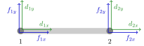
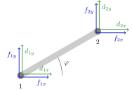
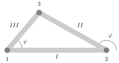
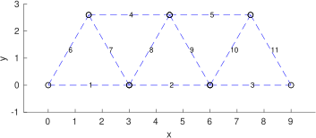
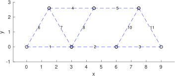

# Introduktion{-}
Stangsystemer og andre strukturer kan analyseres på flere måder. I workshop 1 var de indre kræfter de variable. Denne gang lader vi stængerne deformere og opstiller ligningssystemer med endepunkternes forskydninger som de variable. Der er en direkte sammenhæng mellem deformation af stænger og de indre kræfter. 

Man analyserer hvert element for sig -- her hver stang. Det er grundlaget for *Finite Element*-metoder, som I ser senere i studiet. 

Knuderne i den store konstruktion nummereres. Det giver en retning for hver stang: Fra knude med laveste nummer til knude med højeste nummer. Dette giver (lokale) koordinatsystemer for kræfter og forskydninger ($d$ for &lsquo;displacement&rsquo;) som i @fig-oneTruss, hvor retningen er fra 1 til 2. I @sec-opg3 samles stængerne  i et fælles koordinatsystem. 

For en enkelt stang placeret  langs $x$-aksen med længde $L$ gælder det, at størrelsen af den indre kraft er
$$F=\frac{EA}{L}(d_{2x}-d_{1x}),$$
hvor  $A$ er arealet af et tværsnit, $E$ er en materialeparameter, Youngs modul, og $d_{2x}-d_{1x}$ er forlængelsen/forkortelsen af stangen. For at lette notationen sættes $k= \frac{EA}{L}$. Man opstiller et fritlegemediagram og finder sammenhængen mellem de ydre og de indre kræfter:  $-f_{1x}=F=f_{2x}$.

{width=60% #fig-oneTruss fig-alt="En stang langs x-aksen"}

For en stang i planen er der flere mulige forskydninger af en knude/et endepunkt $d_x, d_y$. I opgaverne er $\left[d_{ix}, d_{iy}\right]$ forskydningsvektoren for knude $i$.
Den ydre last er tilsvarende $\left[f_{ix},f_{iy}\right]$.

Sammenhængen mellem eksterne kræfter og forskydninger $-f_{1x}=F=f_{2x}$ og $F=k(d_{2x}-d_{1x})$  udtrykkes i stivhedsmatricen $K$. $K\mathbf{d}=\mathbf{f}$, hvor $\mathbf{d}$  er forskydningsvektoren, $\mathbf{f}$ er de ydre kræfter, som kaldes lasten.
$K\mathbf{d}=\mathbf{f}$ bliver da

$$\begin{bmatrix} 
k & 0 &  - k & 0\\[10pt]
0&0&0&0 \\[10pt] 
-k & 0& k & 0\\[10pt]
0&0&0&0
\end{bmatrix} 
\begin{bmatrix} 
d_{1x} \\ 
d_{1y}\\
d_{2x} \\
d_{2y}
\end{bmatrix}
= \begin{bmatrix} 
f_{1x} \\
f_{1y} \\
f_{2x}\\
f_{2y} 
\end{bmatrix}$$

# Delopgave 1{#sec-opg1}
Vi ser på stivhedsmatricen $K$ ovenfor.

1. Vis, at det karakteristiske polynomium for $K$ er $\lambda^3 (\lambda-2k)$.
1. Find en egenvektor hørende til $\lambda=2k$ og indtegn den tilsvarende forskydningsvektor $R$ i en skitse som ovenfor. OBS: $R$ har 4 koordinater og svarer til \emph{to} vektorer i skitsen. \'En i knude 1 og \'en i knude 2.
1. Find tre lineært uafhængige egenvektorer hørende til $\lambda=0$, og indtegn  tilsvarende  forskydningsvektorer i en skitse som ovenfor.
1. Hvad er rangen af $K$ og dimensionen af nulrummet for $K$.

# Delopgave 2{#sec-opg2}
{width=60% #fig-angledTruss fig-alt="En vinklet stang"}

For en stang i planen -- i en vinkel $\varphi$ med $x$-aksen -- noterer vi kræfter og forskydninger i forhold til standardkoordinatsystemet. Vi bruger forkortelserne $c=\cos(\varphi)$ og $s=\sin(\varphi)$.
Den tilhørende stivhedsmatrix er nu $K_\varphi=T^TKT$, hvor
$$T=
\begin{bmatrix}
c& s& 0& 0\\-s&c&0&0\\
0&0&c&s\\0&0&-s&c
\end{bmatrix}.$$

$K_\varphi\mathbf{d}=\mathbf{f}$ er da
$$k \begin{bmatrix} 
c^2& cs &  - c^2 & -cs\\[10pt]
cs&s^2&-cs&-s^2 \\[10pt] 
-c^2& -cs& c^2 & cs\\[10pt]
-cs&-s^2&cs&s^2
\end{bmatrix} 
\begin{bmatrix} 
d_{1x} \\ 
d_{1y}\\
d_{2x} \\
d_{2y}
\end{bmatrix}
= \begin{bmatrix} 
f_{1x} \\
f_{1y} \\
f_{2x}\\
f_{2y} 
\end{bmatrix}.$$

1. Vis, at $T^TT=I_4$ og konkluder, at  $T^T=T^{-1}$ og at $K_\varphi$ og $K$ er similære.
1. Vis, at  $[\cos(\varphi),\sin(\varphi),\cos(\varphi),\sin(\varphi)]$ er en egenvektor hørende til egenværdien $0$. Tegn den ind på en skitse.
1. Lad $v$ være en egenvektor for $K$ med egenværdi $0$. Gør rede for, at vektoren $T^Tv$ er en egenvektor for $K_\varphi$ med egenværdi $0$.
1. Hvad er rangen af $K_\varphi$, og hvad er dimensionen af nulrummet for $K_\varphi$?

   ::: {.callout-tip title="Vink" collapse="true"}
   $K$ og $K_{\varphi}$ er similære.
   :::

1. Forklar, hvorfor der ikke kan være andre egenværdier for $K_\varphi$ end $0$ og $2k$.
1. $K_ {\varphi}$ er stivhedsmatricen i standardbasen for $\mathbb{R}^4$. Brug matricerne $T$ og $T^{T}$ til at afgøre, hvilken  basis for $\mathbb{R}^4$ matricen $K$ da svarer til. Tegn den ind på @fig-angledTruss.

# Delopgave 3{#sec-opg3}
{width=60% #fig-triangleTruss fig-alt="Et system med tre stænger"}

For et stangsystem som i @fig-triangleTruss med tre stænger og tre knuder kan de tre $4\times 4$ stivhedsmatricer kombineres til en $6\times 6$ matrix. $K_I$ er stivhedsmatrix for stang $I$, $K_{II}$ for stang $II$ og $K_{III}$ for stang $III$.

$$K_{I}=
 \begin{bmatrix} 
k_1 & 0 &  - k_1 & 0\\[10pt]
0&0&0&0 \\[10pt] 
-k_1 & 0& k_1 & 0\\[10pt]
0&0&0&0
\end{bmatrix}\quad K_{II}=
k_2 \begin{bmatrix} 
c_2^2& c_2s_2 &  - c_2^2 & -c_2s_2\\[8pt]
c_2s_2&s_2^2&-c_2s_2&-s_2^2 \\[8pt] 
-c_2^2& -c_2s_2& c_2^2 & c_2s_2\\[8pt]
-c_2s_2&-s_2^2&c_2s_2&s_2^2
\end{bmatrix}$$

$$K_{III}=
k_3 \begin{bmatrix} 
c_3^2& c_3s_3 &  - c_3^2 & -c_3s_3\\[8pt]
c_3s_3&s_3^2&-c_3s_3&-s_3^2 \\[8pt] 
-c_3^2& -c_3s_3& c_3^2 & c_3s_3\\[8pt]
-c_3s_3&-s_3^2&c_3s_3&s_3^2
\end{bmatrix}$$

Her er $c_2=\cos(\varphi)$, $s_2=\sin(\varphi)$, $c_3=\cos(\psi)$, $s_3=\sin(\psi)$. 

Nu lader vi vinklen $\varphi$ være $\pi/2$ og kombinerer de tre matricer til en $6\times 6$ stivhedsmatrix $K$, som udtrykker sammenhængen 


$$K\begin{bmatrix}d_{1x}\\d_{1y}\\d_{2x}\\d_{2y}\\d_{3x}\\d_{3y}\end{bmatrix}=\begin{bmatrix}f_{1x}\\f_{1y}\\f_{2x}\\f_{2y}\\f_{3x}\\f_{3y}\end{bmatrix}$$

$$K=\begin{bmatrix}k_1+k_3c^2&k_3cs&-k_1&0&-k_3c^2&-k_3cs\\k_3cs&k_3s^2&0&0&-k_3cs&-k_3s^2\\
-k_1&0&k_1&0&0&0\\
0 & 0 & 0 & k_2 & 0 & -k_2\\
-k_3c^2&-k_3cs&0&0&k_3c^2&k_3cs\\
-k_3cs&-k_3s^2& 0& -k_2 &k_3 cs & k_3s^2+k_2
\end{bmatrix}$$
Her er $c=c_3=\cos (\psi)$ og $s=s_3=\sin(\psi)$.

(@) Første række i $K$ udtrykker sammenhængen mellem de 6 forskydningskoordinater og $f_{1x}$, den ene komponent af den eksterne last i knude 1. Opskriv den ligning. 
(@) Første række i $K_I$ og i $K_{III}$ udtrykker også sammenhænge mellem forskydninger og $f_{1x}$. Opskriv disse og kombiner dem til ligningen fra $K$.

Stivhedsmatricerne for systemerne på @fig-complexTruss og @fig-complexTruss2 er opstillet og gemt i filerne `StivMat1.csv` og `StivMat2.csv`.

{width=75% #fig-complexTruss fig-alt="Eksempel på et større stangsystem"}

{width=75% #fig-complexTruss2 fig-alt="Eksempel på et større stangsystem med en manglende stang"}

Hvis I kører Python-scriptet `Stivhedsmatricer.py` lokalt, kan I indlæse de to filer direkte. For at køre det gennem browseren, kan vi &lsquo;snyde&rsquo; ved at gemme dem som `StringIO`-objekter. De opfører sig dermed ligesom filer, selvom de ikke ligger selvstændigt på computeren.

```{pyodide-python}
#| read-only:true
import io
stivMat1 = io.StringIO(r"""604800000,0,-241920000,0,0,-60480000,104754432.841766,-60480000,-104754432.841766,0,0
0,362880000,0,0,0,104754432.841766,-181440000,-104754432.841766,-181440000,0,0
-241920000,0,604800000,0,-241920000,0,0,-60480000,104754432.841766,-60480000,-104754432.841766
0,0,0,362880000,0,0,0,104754432.841766,-181440000,-104754432.841766,-181440000
0,0,-241920000,0,302400000,0,0,0,0,-60480000,104754432.841766
-60480000,104754432.841766,0,0,0,362880000,0,-241920000,0,0,0
104754432.841766,-181440000,0,0,0,0,362880000,0,0,0,0
-60480000,-104754432.841766,-60480000,104754432.841766,0,-241920000,0,604800000,0,-241920000,0
-104754432.841766,-181440000,104754432.841766,-181440000,0,0,0,0,362880000,0,0
0,0,-60480000,-104754432.841766,-60480000,0,0,-241920000,0,362880000,0
0,0,-104754432.841766,-181440000,104754432.841766,0,0,0,0,0,362880000""")

stivMat2 = io.StringIO(r"""604800000,0,-241920000,0,0,-60480000,104754432.841766,-60480000,-104754432.841766,0,0
0,362880000,0,0,0,104754432.841766,-181440000,-104754432.841766,-181440000,0,0
-241920000,0,544320000,104754432.841766,-241920000,0,0,0,0,-60480000,-104754432.841766
0,0,104754432.841766,181440000,0,0,0,0,0,-104754432.841766,-181440000
0,0,-241920000,0,302400000,0,0,0,0,-60480000,104754432.841766
-60480000,104754432.841766,0,0,0,362880000,0,-241920000,0,0,0
104754432.841766,-181440000,0,0,0,0,362880000,0,0,0,0
-60480000,-104754432.841766,0,0,0,-241920000,0,544320000,104754432.841766,-241920000,0
-104754432.841766,-181440000,0,0,0,0,0,104754432.841766,181440000,0,0
0,0,-60480000,-104754432.841766,-60480000,0,0,-241920000,0,362880000,0
0,0,-104754432.841766,-181440000,104754432.841766,0,0,0,0,0,362880000""")
```

(@) Brug `Stivhedsmatricer.py` eller koden nederst i dokumentet til at beregne egenværdierne i de to tilfælde og desuden rangen af stivhedsmatricerne. 
(@) Bestem for hver af de to stivhedsmatricer, om den er inverterbar.
(@) Forklar, hvorfor alle egenværdierne ifølge Python er forskellige fra $0$, selvom den ene matrix ikke er inverterbar.

    ::: {.callout-tip title="Vink" collapse="true"}
    I Python har vi numeriske fejl.
    :::

```{pyodide-python}
from numpy import loadtxt
from numpy.linalg import eigvals

## Figur 4
K1 = loadtxt(stivMat1, delimiter=",") # Indlæser matricen K1
# Hvis koden køres lokalt, skal I i stedet bruge:
# K1 = loadtxt("StivMat1.csv", delimiter=",")

# Egenværdierne for en matrix A kan i Numpy beregnes med kommandoen eigvals(A).
# Resultatet er en vektor, hvor antallet af gange, hver egenværdi optræder,
# svarer til dens multiplicitet.
eig1 = eigvals(K1)
print(eig1)

# Er nogen af egenværdierne 0 (eller tæt på 0)?

# Er K1 inverterbar?

## Figur 5
K2 = loadtxt(stivMat2, delimiter=",")

eig2 = eigvals(K2)
print(eig2)

# Er nogen af egenværdierne 0 (eller tæt på 0)?

# Betyder dette, at K2 er inverterbar? Sammenhold dette med rangen af K2.
```

::: {.callout-warning title="OBS"}
Husk at køre den øverste kodeblok, hvor matricerne defineres. Ellers giver den nederste kodeblok en fejl.
:::
