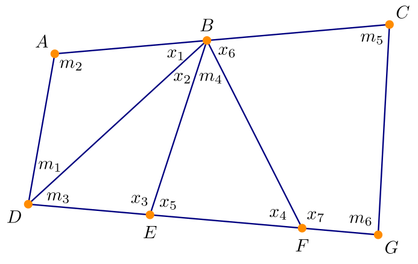

# Introduktion{-}
I denne workshop skal I se, hvordan lineære ligningssystemer kan bruges til at bestemme ukendte vinkler i forbindelse med landmåling. @fig-totalstation viser en såkaldt totalstation, der anvendes til at måle vinkler og afstande. Det er dog ikke altid muligt at måle alle de ønskede vinkler &ndash; et af punkterne i måleområdet kan f.eks. være svært at nå frem til. Derfor må vi beregne vinklerne ud fra de målinger, vi kan lave.

.](Leica_TCRP_1203.jpg){#fig-totalstation width=30% fig-alt="Foto af en totalstation"}

Vi forestiller os en måleplan som på @fig-maalinger. Punkterne $A$, $B$ og $C$ ligger på på en ret linje, og det samme gælder for punkterne $D$, $E$, $F$ og $G$.
Skitsen viser de vinkler $m_1,m_2,\ldots, m_6$, der skal måles, og de vinkler $x_1,x_2,\ldots,x_7$, der i stedet skal beregnes.
Ligesom det traditionelt gøres indenfor landmåling, måles vinkler i enheden $\mathrm{gon}$, hvor en ret vinkel er defineret til $100\mathrm{gon}$.

{#fig-maalinger width=70% fig-alt="Måleskitse"}


# Delopgave 1{#sec-opg1}

1. Argumenter for, at vinklerne på @fig-maalinger skal opfylde ligningssystemet
$$\left[\begin{array}{*{7}{c}}
        1 & 0 & 0 & 0 & 0 & 0 & 0 \\
        0 & 1 & 1 & 0 & 0 & 0 & 0 \\
        0 & 0 & 0 & 1 & 1 & 0 & 0 \\
		0 & 0 & 0 & 0 & 0 & 1 & 1 \\
		1 & 1 & 0 & 0 & 0 & 1 & 0 \\
        0 & 0 & 1 & 0 & 1 & 0 & 0 \\
        0 & 0 & 0 & 1 & 0 & 0 & 1
      \end{array}
    \right]
    \left[
      \begin{array}{c}
        x_1\\
        x_2\\
        x_3\\
        x_4\\
        x_5\\
        x_6\\
        x_7
      \end{array}
    \right]=
    \left[
      \begin{array}{c}
        200-m_1-m_2\\
        200-m_3\\
		200-m_4\\
		400-m_5-m_6\\
        200-m_4\\
        200\\
        200
      \end{array}
    \right].$${#eq-system}

1. Opstil totalmatricen for systemet og vis, at dens reducerede trappeform er
$$\left[
      \begin{array}{rrrrrrrc}
        1 & 0 & 0 & 0 & 0 & 0 & 0 & 200-m_1-m_2\\
        0 & 1 & 0 & 0 & 0 & 0 & -1 & -m_3-m_4\\
        0 & 0 & 1 & 0 & 0 & 0 & 1 & 200+m_4\\
        0 & 0 & 0 & 1 & 0 & 0 & 1 & 200\\
        0 & 0 & 0 & 0 & 1 & 0 & -1 & -m_4\\
        0 & 0 & 0 & 0 & 0 & 1 & 1 & 400-m_5-m_6\\
        0 & 0 & 0 & 0 & 0 & 0 & 0 & m_1+m_2+m_3+m_5+m_6-400
      \end{array}
\right].$$

1. Forklar på baggrund af trappeformen, at systemet i @eq-system enten har nul løsninger eller uendeligt mange.

1. Angiv en nødvendig og tilstrækkelig betingelse for, at systemet har uendeligt mange løsninger.

   Antag herefter, at denne betingelse er opfyldt, og angiv så en parameterfremstilling for løsningsrummet.

# Delopgave 2{#sec-opg2}
Eksemplet i @fig-maalinger viser et net, hvor alle vinkler i firkanten $ACGD$ er målt. Eftersom vinkelsummen i firkanten er $400\mathrm{gon}$ kunne vi nøjes med at måle tre af vinklerne og beregne den sidste. Systemet er derfor *overbestemt*.
I praksis kan overbestemmelse dog være en god ting, da det kan bruges til at korrigere evt. fejl på målingerne. Det kan f.eks. ske med mindste kvadraters metode, som I ser senere i kurset.

Da vi i @sec-opg1 ikke kunne finde en entydig løsning, laver vi nu en opdateret måleplan, hvor vi i stedet for $m_6$ måler vinklen $x_7$ &ndash; dette svarer til, at $m_6$ og $x_7$ bytter plads på @fig-maalinger.

1. Indse, at $m_6$ og $x_7$ kun indgår i række&nbsp;4 og 7 i @eq-system. Forklar, at række&nbsp;4 forbliver den samme under den nye måleplan, mens række&nbsp;7 ændres til $[0\, 0\, 0\, 1\, 0\, 0\, 0]\mathbf{x}=200-m_6$.

1. Totalmatricen for det modificerede system er
$$\left[
	\begin{array}{*{8}{c}}
      1 & 0 & 0 & 0 & 0 & 0 & 0 &            200 - m2 - m1\\
	  0 & 1 & 0 & 0 & 0 & 0 & 0 &             m6 - m4 - m3\\
	  0 & 0 & 1 & 0 & 0 & 0 & 0 &            m4 - m6 + 200\\
	  0 & 0 & 0 & 1 & 0 & 0 & 0 &                 200 - m6\\
	  0 & 0 & 0 & 0 & 1 & 0 & 0 &                  m6 - m4\\
	  0 & 0 & 0 & 0 & 0 & 1 & 0 &        m1 + m2 + m3 - m6\\
	  0 & 0 & 0 & 0 & 0 & 0 & 1 &  400 - m1 - m2 - m3 - m5
  \end{array}
    \right].$${#eq-modSystem}
	
   (I behøver ikke vise dette.)
   
   Afgør, om det nye system er konsistent og i givet fald hvor mange løsninger systemet har.
   
1. Bestem de ukendte vinkler, når vi har målt $(m_1,\ldots,m_6)=(20, 130, 40, 45, 110, 140)$.


# Delopgave 3{#sec-opg3}
Vi vil nu bruge Python til at undersøge, hvordan målefejl påvirker resultatet i @eq-modSystem.

(@) I koden nedenfor beregnes vinklerne både med og uden fejl. I linje&nbsp;41 kaldes funktionen ``bErr([e1,...,e6])``, som giver højresiden i @eq-modSystem, når vi måler $m_i+e_i$ i stedet for den sande værdi $m_i$.

	Tjek først, at løsningen stemmer overens med den, I fandt til sidst i @sec-opg2.
    Prøv derefter at køre koden for forskellige valg af målefejl og sammenlign resultaterne.

```{pyodide-python}
import numpy
from numpy.linalg import solve

A = numpy.array([
	[1, 0, 0, 0, 0, 0, 0],
	[0, 1, 0, 0, 0, 0, 0], 
	[0, 0, 1, 0, 0, 0, 0], 
	[0, 0, 0, 1, 0, 0, 0], 
	[0, 0, 0, 0, 1, 0, 0], 
	[0, 0, 0, 0, 0, 1, 0], 
	[0, 0, 0, 0, 0, 0, 1]
])

m = [20, 130, 40, 45, 110, 140]

## Definer b med og uden fejl
b = numpy.array([
	200 - m[1] - m[0],
	m[5] - m[3] - m[2],
	m[3] - m[5] + 200,
	200 - m[5],
	m[5] - m[3],
	m[0] + m[1] + m[2] - m[5],
	400  - m[0] - m[1] - m[2] - m[4]
])

def bErr(e):
	return b + numpy.array([
		-e[1] - e[0],
		e[5] - e[3] - e[2],
		e[3] - e[5],
		-e[5],
		e[5] - e[3],
		e[0] + e[1] + e[2] - e[5],
		-e[0] - e[1] - e[2] - e[4]
	])


## Bestem løsningen med og uden målefejl
x = solve(A, b)
xErr = solve(A, bErr([0, 0, 0, 0, 0, 0]))

print("Løsning uden fejl:\n{}".format(x))
print("Løsning med fejl:\n{}".format(xErr))
```

Vi undersøger nu en situation, hvor målingen af $m_4$ kan have fejl, men alle andre målinger er korrekte. Koden herunder plotter fejlen på hver $x_i$ for forskellige værdier af målefejlen $e_4$.

(@) Kør koden og forklar de plot, der genereres. Kan resultaterne forklares ud fra @fig-maalinger?


```{pyodide-python}
import matplotlib.pyplot as plt

resolution = 50
## Generer ligeligt fordelte værdier i [-10,10]
errs = numpy.linspace(-10, 10, num=resolution)

sols = numpy.empty([resolution, 7])
for i in range(resolution):
	sols[i] = solve(A, bErr([0, 0, 0, errs[i], 0, 0]))
	

fig, axs = plt.subplots(4,2)

for i in range(7):
	axs[i//2][i%2].plot(errs, sols[:,i]-x[i])
	axs[i//2][i%2].set_title("$x_{}$".format(i+1))
	
axs[3,1].remove()
plt.tight_layout()
plt.show()
```

(@) Betragt til sidst tilfældet, hvor der kan være fejl på flere målinger. Kan det lade sig gøre, at fejl på forskellige vinkler &lsquo;udligner&rsquo; hinanden &ndash; altså, at vektoren $\mathbf{x}$ både opfylder $A\mathbf{x}=\mathbf{b}$ og $A\mathbf{x}=\tilde{\mathbf{b}}$, hvor $\tilde{b}$ betegner højresiden i @eq-modSystem med målefejl.

:::{.callout-tip title="Vink" collapse=true}
Er $A$ inverterbar?
:::


<!-- Local Variables: -->
<!-- ispell-local-dictionary: "da_DK" -->
<!-- End: -->
