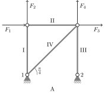
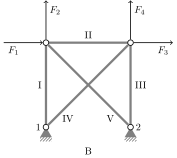
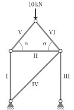

## Introduktion{-}
På @fig-stangsystemer ses  et eksempel på  et *stangsystem*. Stænger er forbundet med andre stænger i deres endepunkter og understøttet i nogen af disse endepunkter. Hvis systemet er *statisk bestemt* vil ydre kræfter resultere i interne kræfter i hver stang, men systemet vil ikke bevæge sig.  Ud fra geometrien og ydre kræfter på systemet ønsker man at regne på, om systemet er statisk bestemt -- om det kan forblive, hvor det er -- og at regne på de kræfter, der i så fald virker internt i hver stang, så man kan bestemme eksempelvis materiale og profil af stængerne. Om det lader sig gøre, afhænger af geometrien. I opgaven her skal I se på lineære ligningssystemer svarende til disse spørgsmål.

, og udgivet under en [CC BY-SA-licens](https://creativecommons.org/licenses/by-sa/4.0/deed.en).](Outbound_train_at_Airport_station,_December_2024.jpg){width=80% #fig-stangsystemer}

I det følgende ser vi på interne kræfter $N_k$ i stang $k$ og eksterne kræfter $F_i$ som de ses på figuren. Der er understøtninger, som giver anledning til reaktionskræfter $R_x$ og $R_y$ i hver understøtning.

## Delopgave 1{#sec-opg1}

::: {#fig-systemer layout-ncol=2}

{width=100% #fig-systemerA}

{width=100% #fig-systemerB}

:::

1. Forklar, hvorfor stangsystemet i @fig-systemerA giver anledning til ligningssystemet
$$\renewcommand{\arraystretch}{1.4}\left[
		\begin{array}{*{8}{c}}
			0 & -1 & 0 & 0 & 0 & 0 & 0 & 0\\ 
			1 & 0 & 0 & 0 & 0 & 0 & 0 & 0\\ 
			0 & 1 & 0 & \frac{1}{\sqrt{2}} & 0 & 0 & 0 & 0\\ 
			0 & 0 & 1 & \frac{1}{\sqrt{2}} & 0 & 0 & 0 & 0\\
			0 & 0 & 0 & \frac{1}{\sqrt{2}} & 1 & 0 & 0 & 0\\
			1 & 0 & 0 & \frac{1}{\sqrt{2}} & 0 & 1 & 0 & 0\\
			0 & 0 & 0 & 0 & 0 & 0 & 1 & 0\\
			0 & 0 & 1 & 0 & 0 & 0 & 0 & 1\\
		\end{array}
	\right]
	\left[
		\begin{array}{c}
			N_\mathrm{I}\\
			N_\mathrm{II}\\
			N_\mathrm{III}\\
			N_\mathrm{IV}\\
			R_{x,1}\\
			R_{y,1}\\
			R_{x,2}\\
			R_{y,2}
		\end{array}
	\right]=
	\left[
		\begin{array}{c}
			F_1\\
			F_2\\
			F_3\\
			F_4\\
			0\\
			0\\
			0\\
			0\\
		\end{array}
	\right].$${#eq-determSystem}
  
   ::: {.callout-tip title="Vink" collapse="true"}
   Vi skal bruge, at $\cos(\frac{\pi}{4})=\sin(\frac{\pi}{4})=\frac{1}{\sqrt{2}}$.
   :::

1. Opstil totalmatricen for @eq-determSystem, og vis, at dens reducerede trappeform er
   $$\left[
		   \begin{array}{*{9}{c}}
			   1 & 0 & 0 & 0 & 0 & 0 & 0 & 0 & F_2\\
			   0 & 1 & 0 & 0 & 0 & 0 & 0 & 0 & -F_1\\
			   0 & 0 & 1 & 0 & 0 & 0 & 0 & 0 & -F_1-F_3+F_4\\
			   0 & 0 & 0 & 1 & 0 & 0 & 0 & 0 & \sqrt{2}(F_1+F_3)\\
			   0 & 0 & 0 & 0 & 1 & 0 & 0 & 0 & -F_1-F_3\\
			   0 & 0 & 0 & 0 & 0 & 1 & 0 & 0 & -F_1-F_2-F_3\\
			   0 & 0 & 0 & 0 & 0 & 0 & 1 & 0 & 0\\
			   0 & 0 & 0 & 0 & 0 & 0 & 0 & 1 & F_1+F_3-F_4\\
		   \end{array}
	   \right].
   $${#eq-totalmatrix}

1. Er ligningssystemet konsistent?
  
1. Brug @eq-totalmatrix til at finde de fire interne kræfter $N_\mathrm{I},N_\mathrm{II},N_\mathrm{III}$ og $N_\mathrm{IV}$ samt de fire reaktionskræfter $R_{x,1},R_{y,1},R_{x,2}$ og $R_{y,2}$, når de eksterne kræfter er $F_1=0\mathrm{N}$, $F_2=-5\mathrm{N}$, $F_3=3\mathrm{N}$, og $F_4=2\mathrm{N}$. \label{pkt:bestemLøsning}


## Delopgave 2{#sec-opg2}
1. Hvis vi fjerner stang $\mathrm{IV}$ på @fig-systemerA, får vi et nyt stangsystem. Opskrives totalmatricen for det nye system, er den reducerede trappeform
  $$\left[
      \begin{array}{*{8}{c}}
        1 & 0 & 0 & 0 & 0 & 0 & 0 & F_2\\
        0 & 1 & 0 & 0 & 0 & 0 & 0 & -F_1\\
        0 & 0 & 1 & 0 & 0 & 0 & 0 & F_4\\
        0 & 0 & 0 & 1 & 0 & 0 & 0 & 0\\
        0 & 0 & 0 & 0 & 1 & 0 & 0 & -F_2\\
        0 & 0 & 0 & 0 & 0 & 1 & 0 & 0\\
        0 & 0 & 0 & 0 & 0 & 0 & 1 & -F_4\\
        0 & 0 & 0 & 0 & 0 & 0 & 0 & F_1+F_3
      \end{array}
    \right].$$
   For hvilke kræfter $F_1,F_2,F_3$, og $F_4$ er ligningssystemet konsistent?
  
1. Den reducerede trappeform af totalmatricen for @fig-systemerB er
   $$\renewcommand{\arraystretch}{1.4}
    \left[
      \begin{array}{*{10}{c}}
        1 & 0 & 0 & 0 & 0 & 0 & 0 &        1 & 0 &                F_2\\
        0 & 1 & 0 & 0 & 0 & 0 & 0 &        1 & 0 &               -F_1\\
        0 & 0 & 1 & 0 & 0 & 0 & 0 &        1 & 0 &      F_4 - F_1 - F_3\\
        0 & 0 & 0 & 1 & 0 & 0 & 0 & -\sqrt{2} & 0 & \sqrt{2}(F_1 + F_3)\\
        0 & 0 & 0 & 0 & 1 & 0 & 0 & -\sqrt{2} & 0 &                 0\\
        0 & 0 & 0 & 0 & 0 & 1 & 0 &        1 & 0 &         - F_1 - F_3\\
        0 & 0 & 0 & 0 & 0 & 0 & 1 &        0 & 0 &    - F_1 - F_2 - F_3\\
        0 & 0 & 0 & 0 & 0 & 0 & 0 &        0 & 1 &      F_1 + F_3 - F_4   
      \end{array}
    \right].$$
   Opskriv ud fra dette den generelle, parametriserede løsning til ligningssystemet.

1. Kan vi ligesom i sidste del af @sec-opg1 bestemme de interne kræfter for @fig-systemerB, når blot $F_1,F_2,F_3$, og $F_4$ er kendte?

## Delopgave 3{#sec-opg3}
Vi udvider nu stangsystemet fra @fig-systemerA, så vi får systemet i @fig-hus. Det nye system påvirkes af en enkelt ekstern kraft $F$ på $10\mathrm{kN}$, og vi ønsker at undersøge, hvordan de interne kræfter i systemet ændrer sig, når vinkelen $\alpha$ varieres. Vi forestiller os her, at $\alpha$ ligger i intervallet $(0,\frac{\pi}{2})$, og at stængerne $\mathrm{V}$ og $\mathrm{VI}$ gøres præcist så lange, at de mødes i stangsystemets øverste punkt.

{width=35% #fig-hus}

Nederst i dette dokument er et Python-script, hvor ligningssystemet hørende til @fig-hus opskrevet. For at løse systemet med Sympy-pakken i Python introducerer vi først $\alpha$ ved at definere en symbolsk variabel `a`.

1. Kør koden, der finder den reducerede trappeform af systemet, og aflæs værdierne af $N_\mathrm{II}$ og $N_\mathrm{V}$. Fyld så disse ind i variablene `n2` og `n5` (hvor der står `insertValue1` og `insertValue2`).

1. Kig på plottet, som Python-koden producerer. Hvad sker der med de to kræfter, når $\alpha$ går mod $\frac{\pi}{2}$? Kan dette forklares ud fra figuren?


```{pyodide-python}
import sympy
from sympy import pi, cos, sin, tan
from sympy.plotting import plot

a = sympy.Symbol('a', positive=True)

## Opstil totalmatricen
A = sympy.Matrix(
    [
        [0,  0,  0,           0, -cos(a),   cos(a), 0, 0, 0, 0], # Toppunkt, x-retning
        [0,  0,  0,           0, -sin(a),  -sin(a), 0, 0, 0, 0], # Toppunkt, y-retning
        [0,  1,  0,           0,  cos(a),        0, 0, 0, 0, 0], # Øvre venstre, x-retning
        [-1, 0,  0,           0,  sin(a),        0, 0, 0, 0, 0], # Øvre venstre, y-retning
        [0, -1,  0,  -cos(pi/4),       0,  -cos(a), 0, 0, 0, 0], # Øvre højre, x-retning
        [0,  0, -1,  -sin(pi/4),       0,   sin(a), 0, 0, 0, 0], # Øvre højre, y-retning
        [0,  0,  0,   cos(pi/4),       0,        0, 1, 0, 0, 0], # Venstre understøtning, x-retning
        [1,  0,  0,   sin(pi/4),       0,        0, 0, 1, 0, 0], # Venstre understøtning, y-retning
        [0,  0,  0,           0,       0,        0, 0, 0, 1, 0], # Højre understøtning, x-retning
        [0,  0,  1,           0,       0,        0, 0, 0, 0, 1]  # Højre understøtning, y-retning
    ]
)

b = sympy.Matrix([0, 10, 0, 0, 0, 0, 0, 0, 0, 0])

## Find løsningen til systemet
tot = sympy.Matrix.hstack(A, b)
red, _ = tot.rref()
red = red.applyfunc(sympy.simplify) # Reducer udtrykkene i matricen
sympy.pprint(red) # Lav 'pretty-print' af matricen
```

Aflæs løsningerne fra den ovenstående kode, og skriv dem ind herunder

```{pyodide-python}
## Aflæs løsningerne
n2 = insertValue1 # Indsæt denne værdi
n5 = insertValue2 # Indsæt denne værdi

## Plot kræfterne i de to bjælker
p = plot(
    n2, n5,
    (a, 0, pi/2),
    ylim = (-50,50),
    xlabel = "$\\alpha$",
    ylabel = "Stangkraft",
    legend = True,
    show = False,
)
p[0].label = "$N_2$"
p[1].label = "$N_5$"
p.show()
```

