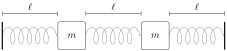

# Introduktion{-}
Fysiske systemer kan ofte beskrives ved differentialligninger. Et simpelt eksempel er et system af to identiske masser sat op med tre fjedre som på @fig-fjedre.

{width=75% #fig-fjedre fig-alg="Fjedersystem med to masser of tre fjedre"}

Vi vil beskrive positionen af masserne som funktion af tiden ved at se på $y_1(t)$ og $y_2(t)$ som på figuren, altså positionerne som afvigelsen fra ligevægtspositionen.

Med identiske fjedre med fjederkonstant $k$ skal $y_1$ og $y_2$ opfylde et system af to andenordens differentialligninger, som udledes fra Hookes lov og Newtons anden lov:

$$\begin{align}
  m y_1''(t)&=-2k y_1(t)+k y_2(t), \\
  m y_2''(t)&=k y_1(t) -2k y_2(t).
\end{align}$${#eq-1}

som kan omskrives til 
$$\begin{bmatrix}y_1''(t)\\y_2''(t)\end{bmatrix}=\frac{k}{m}\begin{bmatrix}-2&1\\1&-2\end{bmatrix}\begin{bmatrix}y_1(t)\\y_2(t)\end{bmatrix}$$
Disse ligninger skal være opfyldt for alle reelle tal $t$ -- det er altså ligninger mellem funktioner: 
$$\begin{bmatrix}y_1''\\y_2''\end{bmatrix}=\frac{k}{m}\begin{bmatrix}-2&1\\1&-2\end{bmatrix}\begin{bmatrix}y_1\\y_2\end{bmatrix}$$

I denne opgave vil vi anvende lineær algebra til at løse sådanne *systemer af lineære sædvanlige differentialligninger*. Følgende resultater fra f.eks. calculus kan tages for givet:

Løsningsmængden til $y''=-ay$ , hvor $a>0$, er $$y(t)=c_1\cos(\sqrt{a}t)+c_2\sin(\sqrt{a}t)$$ hvor $c_1,c_2$ er reelle tal.

# Delopgave 1{#sec-opg1}
1. Lad $B$ være en $2\times 2$ matrix givet ved 
$$B = \frac{k}{m}
    \begin{bmatrix}
      2 & -1 \\
      - 1 & 2 
    \end{bmatrix}.$$

   Definer søjlevektoren
$$\begin{equation*}
    Y(t)=
    \begin{bmatrix}
      y_1(t) \\
      y_2(t)
    \end{bmatrix}.
  \end{equation*}$$
Vis, at systemet @eq-1 kan omskrives som $Y''(t)=-BY(t)$.

1. Vis, at $B$ er ortogonalt diagonaliserbar, i.e., at $B=QDQ^T$, hvor $D$ er diagonal og $Q$ er ortogonal. 
$D=\begin{bmatrix}\frac{k}{m}&0\\0&3\frac{k}{m}\end{bmatrix}$
og 
$Q=\begin{bmatrix}\frac{\sqrt{2}}{2}&\frac{\sqrt{2}}{2}\\\frac{\sqrt{2}}{2}&-\frac{\sqrt{2}}{2}\end{bmatrix}$.

1. Omskriv nu systemet @eq-1 til $$(Q^TY)''=-DQ^TY,$$ og lad $F=\begin{bmatrix}f_1\\f_2\end{bmatrix}=Q^TY$.

1. Løs systemet 
$$\begin{equation*}
    \begin{bmatrix}
      f_1\\f_2\end{bmatrix}''=-D\begin{bmatrix}f_1\\f_2\end{bmatrix}
  \end{equation*}$$
og vis, at
$$\begin{bmatrix}f_1(t)\\f_2(t)\end{bmatrix}
    =\begin{bmatrix}
      c_1\cos\left(\sqrt{\frac{k}{m}}t\right)+c_2\sin\left(\sqrt{\frac{k}{m}}t\right)\\
      c_3\cos\left(\sqrt{3\frac{k}{m}}t\right)+c_4\sin\left(\sqrt{3\frac{k}{m}}t\right)
    \end{bmatrix}$${#eq-solution}
   hvor $c_1,c_2, c_3, c_4$ er reelle tal.
   
1. Find nu løsningen til det oprindelige problem ved at indse, at $Y(t)=QF(t)$. Løs også *begyndelsesværdiproblemet*
$$Y(0)=\begin{bmatrix}0\\0
  \end{bmatrix}$$
  $$Y'(0)=\begin{bmatrix}1\\0\end{bmatrix}$$
  
1. Egenvektorerne $V_1=\begin{bmatrix}\frac{\sqrt{2}}{2}\\\frac{\sqrt{2}}{2}\end{bmatrix}$ $V_2=\begin{bmatrix}\frac{\sqrt{2}}{2}\\-\frac{\sqrt{2}}{2}\end{bmatrix}$ indgår sammen med egenværdierne i løsningen: 
  $$Y(t)=f_1(t)V_1+f_2(t)V_2.$$ 
  (Hvorfor?). Forklar, at en løsning, hvor $c_3= c_4=0$, svarer til, at masserne svinger med periode $2\pi\sqrt{\frac{m}{k}}$, samme amplitude og i samme retning (i takt). Tilsvarende, at $c_1=c_2=0$ betyder, at de svinger med periode $2\pi\sqrt{\frac{m}{3k}}$, samme amplitude og modsat retning af hinanden.

# Delopgave 2{#sec-opg2}
Filen `animateSolution.py` indeholder en Python-funktion, der viser en animation af systemet i @fig-fjedre, når $k$ og $m$ samt $\mathbf{c}=[c_1,c_2,c_3,c_4]$ er givet. I opgaverne herunder, sætter vi $k=m=1$.

::: {.callout-warning title="OBS"}
På nuværende tidspunkt kan animationer fra `matplotlib` ikke køres direkte i browseren. For at se animationen, er I derfor nødt til at hente den og køre den lokalt (hvis I har en Python-installation).

Uanset, om I kan køre koden eller ej, kan I stadig løse begyndelsesværdiproblemerne.
:::

1. Kør først animationen for løsningen $c_1=c_2=1$ og $c_3=c_4=0$, og derefter med $c_1=c_2=0$, og $c_3=c_4=1$. Tjek at masserne svinger i takt eller i modsat takt ligesom beskrevet i sidste del af @sec-opg1.
  
1. Forklar, hvorfor ligningssystemet for begyndelsesværdiproblemet
$$Y(0)=\frac{\sqrt{2}}{4}\begin{bmatrix}1\\-1 \end{bmatrix}
    \quad\text{og}\quad
    Y'\left(\frac{2\pi}{\sqrt{3}}\right)=\frac{\sqrt{6}}{4}\begin{bmatrix}1\\-1 \end{bmatrix}$$
har totalmatrix
$$\renewcommand{\arraystretch}{1.8}
    \left[
      \begin{array}{cccc|c}
        \frac{\sqrt{2}}{2} & 0 & \frac{\sqrt{2}}{2} & 0 & \frac{\sqrt{2}}{4}\\
        \frac{\sqrt{2}}{2} & 0 & -\frac{\sqrt{2}}{2} & 0 & -\frac{\sqrt{2}}{4}\\
        -\frac{\sqrt{2}}{2}\sin(\frac{2\pi}{\sqrt{3}}) & \frac{\sqrt{2}}{2}\cos(\frac{2\pi}{\sqrt{3}}) & 0 & \frac{\sqrt{6}}{2} & \frac{\sqrt{6}}{4}\\
        -\frac{\sqrt{2}}{2}\sin(\frac{2\pi}{\sqrt{3}}) & \frac{\sqrt{2}}{2}\cos(\frac{2\pi}{\sqrt{3}}) & 0 & -\frac{\sqrt{6}}{2} & -\frac{\sqrt{6}}{4}\\
      \end{array}
    \right].$$

   Løs ligningssystemet (I må gerne bruge Python eller et andet CAS-værktøj), og brug `animateSolution` til at illustrere løsningen.
  
1. Betragt begyndelsesværdiproblemet
$$Y(0)=\begin{bmatrix}1\\1 \end{bmatrix}
    \quad\text{og}\quad
    Y(2\pi)=\begin{bmatrix}1\\1\end{bmatrix}.$$
Hvor mange ligninger og hvor mange ubekendte har systemet? I hvor mange af disse ligninger indgår $c_2$? Eksisterer der da en entydig løsning?

# Delopgave 3{#sec-opg3}
Hvis fjedrene i systemet ikke længere har samme fjederkonstant, men i stedet tre forskellige konstanter $k_1$, $k_2$ og $k_3$, beskrives massernes positioner af systemet
$$\begin{align*}
  m z_1''(t)&=-(k_1+k_2) z_1(t)+k_2 z_2(t), \\
  m z_2''(t)&=k_2 z_1(t) -(k_2+k_3) z_2(t),
\end{align*}$$
hvor vi nu bruger $z$ for at understrege, at det ikke er det samme system som @eq-1 (medmindre $k=k_1=k_2=k_3$).
Herunder ser vi på det specifikke eksempel, hvor $k_1=k_3=1$, $k_2=\frac{3}{2}$ og $m=1$. Benyttes samme fremgangsmetode som ovenfor findes $Z$ givet ved
$$\begin{bmatrix}z_1(t)\\z_2(t)\end{bmatrix}
  =\begin{bmatrix}
    c_1\cos(t)+c_2\sin(t)+c_3\cos(2t)+c_4\sin(2t)\\
    c_1\cos(t)+c_2\sin(t)-c_3\cos(2t)-c_4\sin(2t)
  \end{bmatrix}.$$

Vi forestiller os, at vi skal undersøge det modificerede system i mange forskellige konfigurationer, som alle er defineret ud fra fjedrenes positioner og hastigheder til tiden $t=\frac{\pi}{4}$.

1. Argumenter for, at de $c_1,c_2,c_3,c_4$, der løser begyndelsesværdiproblemet $Z(\frac{\pi}{4})=V$ og $Z'(\frac{\pi}{4})=W$, hvor $V,W$ er kendte vektorer, kan findes som løsninger til systemet

   $$\renewcommand{\arraystretch}{1.4}
    \left[
      \begin{array}{rrrr}
        \frac{1}{\sqrt{2}} &  \frac{1}{\sqrt{2}} & 0 & 1\\
        \frac{1}{\sqrt{2}} &  \frac{1}{\sqrt{2}} & 0 & -1\\
        -\frac{1}{\sqrt{2}} & \frac{1}{\sqrt{2}} & -2 & 0\\
        -\frac{1}{\sqrt{2}} & \frac{1}{\sqrt{2}} & 2 & 0
      \end{array}
    \right]
    \left[
      \begin{array}{r}
        c_1 \\ c_2\\ c_3\\ c_4
      \end{array}
    \right]
    =
    \left[
      \begin{array}{c}
        v_1\\ v_2\\ w_1\\ w_2
      \end{array}
    \right].$${#eq-oldSystem}

   Forklar derefter, at dette er ækvivalent med systemet
$$\renewcommand{\arraystretch}{1.4}
    \left[
      \begin{array}{rrrr}
        \frac{1}{\sqrt{2}} &  \frac{1}{\sqrt{2}} & 0 & 1\\
        -\frac{1}{\sqrt{2}} & \frac{1}{\sqrt{2}} & 2 & 0\\
        -\frac{1}{\sqrt{2}} & \frac{1}{\sqrt{2}} & -2 & 0\\
        \frac{1}{\sqrt{2}} &  \frac{1}{\sqrt{2}} & 0 & -1
      \end{array}
    \right]
    \left[
      \begin{array}{r}
        c_1 \\ c_2\\ c_3\\ c_4
      \end{array}
    \right]
    =
    \left[
      \begin{array}{c}
        v_1\\ w_2\\ w_1 \\ v_2
      \end{array}
    \right].$${#eq-newSystem}

1. Kald matricen på venstresiden i @eq-newSystem for $M$, og find så den LU-dekomposition af $M$, der opfylder
$$\renewcommand{\arraystretch}{1.4}
    U=\left[
      \begin{array}{rrrr}
        \frac{1}{\sqrt{2}} & \frac{1}{\sqrt{2}} & 0 & 1\\
        0 & \sqrt{2} & 2 & 1\\
        0 & 0 & -4 & 0\\
        0 & 0 & 0 & -2
      \end{array}
    \right].$$
  Hvad ville ændre sig ved LU-dekompositionen, hvis vi i stedet havde brugt systemet i @eq-oldSystem frem for @eq-newSystem?

1. Lad nu $v_1=2$, $v_2=4$, $w_1=-3$ og $w_2=1$. Løs systemet $L\mathbf{x}=[v_1,w_2,w_1,v_2]^T$. Hvorfor er systemet særligt let at løse?

1. Brug resultatet fra forrige spørgsmål og LU-dekompositionen af $M$ til at bestemme de $c_i$, der løser begyndelsesværdiproblemet
$$Z\left(\frac{\pi}{4}\right)=\begin{bmatrix}2\\4 \end{bmatrix}
    \quad\text{og}\quad
    Z'\left(\frac{\pi}{4}\right)=\begin{bmatrix}-3\\1\end{bmatrix}.$$
