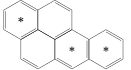
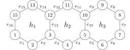

## Introduction{-}
In this workshop you will work with *polycyclic aromatic hydrocarbons*, which are a family of chemical compounds seen in organic chemistry. These compounds are created during an incomplete combustion of organic matter or fossil fuels. An important criterion to predict the properties of such a compound is the number of non-adjacent benzene rings in the structure^[This is called the *Clar-number* after Erich Clar.].
We will consider a simpler problem here by allowing benzene rings to
be adjacent. We want to count the maximal possible number of benzene rings in the
structure, this is called the Fries-number of a hydrocarbon after Karl Theophil Fries.

See @fig-benzopyrene for an example of two hydrocarbons with the same underlying ring structure, but a different placement of the double bonds. Since the hydrocarbon in @fig-fries4 has four benzene rings, the ring structure has a Fries-number of at least four. In @sec-opg3, we will see that the Fries-number is indeed four.

::: {#fig-benzopyrene layout-ncol=2}

{#fig-fries3 width=80% fig-alt="Compound with Fries number 3"}

{#fig-fries4 width=80% fig-alt="Compound with Fries number 4"}

Two Fries-structures on the same ring system. A structures' (possibly adjacent) benzene rings are marked with $\ast$. The compound in @fig-fries4 is called benzopyrene.
:::

When given a ring system for a hydrocarbon we have to consider all possible ways of placing double bonds. The placement that has the most benzene rings, determines the structures Fries-number. The rules for the placement of double bonds can be summarized as follows:

A. Every vertex in a hexagon is connected to exactly one double bond.

A. We call a hexagon a benzene ring if three of its edges are double bonds.

There can be many placements of double bonds such that both rules are satisfied. Hence, it is not viable to try all possible placements. In @sec-opg2, we will see that we can transform this problem into a linear program to find its solution.

## Exercise 1{#sec-opg1}
Even for simple polycyclic aromatic hydrocarbons the linear program has too many variables and constraints to solve it manually. We therefore examine a simpler linear programming problem.
$$\begin{align}
  &\begin{array}{@{}lrrrrl}
    \text{Minimize} & 8x_1 & + & 6x_2\\
    \text{subject to} & x_1 &&&\leq&10\\
                   &&& x_2&\leq& 6\\
                   &x_1 & + & x_2 & = & 12
  \end{array}\\
  &\text{and } x_1\geq0, x_2\geq 0\nonumber
\end{align}$${#eq-minProblem}

1. Draw the constraints into a coordinate system and mark the set of feasible solutions.
  
1. Rewrite the problem in @eq-minProblem to obtain a linear programming problem in canonical form.

1. Is $x_1=x_2=0$ a feasible solution for @eq-minProblem? Justify your answer.

1. Use the canonical form you found above to write out a simplex tableau and find an optimal solution.

1. Write out the dual linear programming problem to the canonical form from above and use the solution to the primal problem to determine an optimal solution to the dual problem.

1. Check that the values for the original and the dual problem are identical.

## Exercise 2{#sec-opg2}
In this exercise, you will examine how the rules A and B can be translated into constraints for a linear programming problem. Furthermore, you will find the objective function we wish to maximize.

We begin by introducing some notation. Let $\mathcal{V}$ denote the set of all vertices in the ring system. $\mathcal{E}$ denotes the set of all bonds (edges), and $\mathcal{H}$ is the set of all hexagons in the system. 
For a vertex $v$ i $\mathcal{V}$ we let $E(v)$ be the set of bonds incident with this vertex, i.e. all bonds that connect $v$ to another vertex. Finally, for each $h_i$ i $\mathcal{H}$, we let $E_1(h_i)$ be the set of three sides of $h_i$ that do not share endpoints, containing the lowest numbered side around $h_i$. The set containing the remaining three sides is called $E_2(h_i)$.

{#fig-antracene width=70% fig-alt="Ring system for anthracene"}

To illustrate these notations, we use the ring system in @fig-antracene. Here, we have the set of vertices $\mathcal{V}=\{v_1,v_2,\ldots,v_{15}\}$, bonds $\mathcal{E}=\{e_1,e_2,\ldots,e_{16}\}$ and hexagons $\mathcal{H}=\{h_1,h_2,h_3\}$.
Furthermore, we see that e.g. $E(v_2)=\{e_1,e_2\}$ and $E(v_{10})=\{e_9,e_{10},e_{11}\}$ since these are the bonds that connect to $v_2$ and $v_10$, respectively. Finally, $E_1(h_2)=\{e_3, e_{10}, e_{12}\}$ since these three bonds are the sides of $h_2$ that do not share endpoints, and $e_3$ is the bond around $h_2$ with the lowest index. This means that $E_2(h_2)=\{e_4, e_{11}, e_{13}\}$ since these are the remaining sides of $h_2$.

The constraints of a linear program are given by sums over all elements of a set. If $\mathcal{A}=\{a_1,a_2,\ldots,a_n\}$ is a set, then the sum of all its elements can be written as
$$\sum_{a\in \mathcal{A}} a\stackrel{\mathrm{def}}{=}a_1+a_2+\cdots+a_n.$$

The expression under the sum sign &ndash; the big sigma, $\Sigma$ &ndash; shows which elements are terms in the sum. Here, every element of $A$ is substituted for the variable $a$, and the resulting expressions are summed up.

Using this notation, we can now define our linear programming problem. For every bond $e_i$ in $\mathcal{E}$, we define a variable $x_i$ that indicates whether the bond is a double bond. If $x_i=1$, then the bond is a double bond and otherwise $x_i=0$.
For every hexagon $h_i$ in $\mathcal{H}$, we define two variables $y_1(h_i)$ and $y_2(h_i)$ since there are two possible placements of double bonds that make $h_i$ a benzene ring. More precisely, $y_1(h_i)=1$ indicates that all the bonds in $E_1(h_i)$ are double bonds, and hence $h_i$ is a benzene ring. Analogously, $y_2(h_i)=1$ indicates that all bonds in $E_2(h_i)$ are double bonds, and hence $h_i$ is a benzene ring. The variables in the linear programming problems are therefore
$$x_1,x_2,\ldots,x_m,y_1(h_1),y_2(h_1),y_1(h_2),\ldots,y_2(h_m),$$
subject to $x_i\geq 0$, $y_1(h_i)\geq 0$ and $y_2(h_i)\geq 0$. We furthermore require that all variables are maximally $1$, but as you will show below, this is already implied by the other constraints.^[For our solution, we also want all variables to be integers. This is not necessarily the case for general linear programming problems, but it can be shown that is holds for this specific problem.]

1. Consider the ring system in @fig-antracene, and write the two sums
$$\sum_{e_i\in E(v_3)} x_i
\hspace{1cm}\text{og}\hspace{1cm}
\sum_{h_i\in \mathcal{H}} y_1(h_i)$$
out such that all terms are visible.

1. Explain, using the rule A, why at most one of $y_1(h_i)$ and $y_2(h_i)$ can be $1$.

   Use this to argue that $h_i$ is a benzene ring exactly if $y_1(h_i)+y_2(h_i)=1$.
  
1. Show that rule A is equivalent to the following constraint: For every $v$ in $\mathcal{V}$ we have
$$\sum_{e_i\in E(v)}x_i=1.$${#eq-sumDoubleBonds}

1. Let $h_i$ in $\mathcal{H}$, and let $E_1(h_i)=\{e_{j_1}, e_{j_2}, e_{j_3}\}$.
Explain why the constraints
$$x_{j_1}-y_1(h_i)\geq 0,
		\quad
		x_{j_2}-y_1(h_i)\geq 0
		\quad\text{and}\quad
		x_{j_3}-y_1(h_i)\geq 0$${#eq-sufficientDoubleBonds}
ensure that $y_1(h_i)$ can only be $1$ if $x_{j_1}=x_{j_2}=x_{j_3}=1$.

   Then, write out the corresponding constraints for $y_2(h_i)$ and $E_2(h_i)$.
  
1. We require that $x_i\leq 1$ for ever $e_i$ in $\mathcal{E}$.
Argue that these constraints directly follow from @eq-sumDoubleBonds together with the constraints $x_i\geq 0$.


1. Combine $x_i\leq 1$ from above with the constraints in @eq-sufficientDoubleBonds to obtain $y_1(h_i)\leq 1$.

1. Use your observations in items&nbsp;1 and 5 to justify that we can find the Fries-number by maximizing the objective function
$$\sum_{h_i\in\mathcal{H}} \big( y_1(h_i)+y_2(h_i) \big)$$
subject to the constraints we laid out previously.


## Exercise 3{#sec-opg3}
In this exercise, you will use the Python code at the bottom to find the Fries-number. There is one code block where the necessary functions are defined and one code block where you can add your own code and call the function.

The code contains a function `friesNumber(M)`, which builds and solves the linear programming problem to find the Fries-number.
As an input, the function takes an $n\times 6$-matrix, whose rows are defined in the following way: The $i$'th row contains the indices of the $e_j$ that form the sides of the hexagon $h_i$. The indices must be put in following *positive orientation* &ndash; counter clockwise &ndash; but it is irrelevant which edge you start with. This is important for the program to correctly assemble the hexagons. For example, the input for the ring system in @fig-antracene could be
$$M=\left[
    \begin{array}{*{6}{c}}
      1 & 2 & 13 & 14 & 15 & 16\\
      3 & 4 & 10 & 11 & 12 & 13\\
      5 & 6 & 7 & 8 & 9 & 10
    \end{array}
  \right].$${#eq-pythonInput}

1. First, look at @fig-antracene and try to guess what the Fries-number is. Then use the Python function on the matrix $M$ as in @eq-pythonInput. Draw the resulting double bounds into a sketch of the ring system.

   Is this the result you would have expected?

1. Finally, set up the matrix for the ring system in @fig-benzopyrene and use the Python function to determine its Fries-number. Check that the bonds are the same as in @fig-fries4.

```{pyodide-python}
#| read-only: true
import numpy
import scipy.optimize

def findIndices(A, x):
    return [(r, c) for r in range(A.shape[0]) for c in range(A.shape[1]) if A[r,c]==x]

def friesNumber(M):
    """
    friesNumber computes the Fries number of a PAH.
    This function computes the Fries number of a polycyclic aromatic
    hydrocarbon using linear programming.

    Inputs:
    	- M: nx6 matrix, whose i'th row contains the indices of the
    	     edges of the i'th hexagon. The indices must be ordered by traversing
    	     the boundary of the hexagon in positive direction of rotation (i.e.
    	     counter-clockwise).
    """
    if M.shape[1]!=6:
        raise ValueError("Input matrix must have six columns")

    nEdges = numpy.max(M)
    nRings = M.shape[0]
    nVars = nEdges+2*nRings

    # Variables will be ordered as
    # x_1 x_2 ... x_nEdges y_1(h_1) y_2(h_1) y_1(h_2) ... y_2(h_nRings)

    # Construct the objective function
    # The linprog method of scipy minimizes, so scale by -1
    f = -1*numpy.hstack(
        [numpy.zeros([1,nEdges]),
         numpy.ones([1, 2*nRings])]
    )

    # Define constraint matrices ensuring that a benzene ring is only counted
    # when all three of the corresponding edges are 1
    ABenzene = numpy.zeros([0, nVars])
    bBenzene = numpy.zeros([3*2*nRings, 1])

    for i in range(nRings):
        for offset in range(2):
            objectIndex = nEdges + 2*i + offset
            for j in range(3):
                edgeIndex = M[i, 2*j + offset] - 1

                # Construct corresponding constraint vector and append it to the
                # full matrix
                tmp = numpy.zeros([1, nVars])
                tmp[0, edgeIndex] = -1
                tmp[0, objectIndex] = 1

                ABenzene = numpy.vstack([ABenzene, tmp])

    # Define constraint matrix ensuring that all vertives are connected to
    # exactly one double bond. (This is an equality constraint matrix)
    ADoubleBond = numpy.empty([0, nVars])

    for i in range(1, nEdges+1):
        # Find rings where edge i appears
        matches = findIndices(M, i)

        if len(matches)==0:
            # No edge has index i
            continue

        tmp = numpy.zeros([1, nVars])
        
        if len(matches)==1:
            # edge i only appears once

            # Find the next edge when traversing the ring (the condition
            # containing edge i and the preceding edge will be added when
            # processing the previous edge)
            nextEdge = M[matches[0][0], (matches[0][1] + 1)%6]

            if len(findIndices(M, nextEdge))>1:
                # nextEdge is found in multiple rings. The constraints will be
                # handled when that edge is handled by the loop.
                continue

            # Construct the row corresponding to the equality condition
            # edge_i + nextEdge = 1
            tmp[0, i-1] = 1
            tmp[0, nextEdge-1] = 1

        elif len(matches)==2:
            # edge i appears in two separate rings

            # Find the next and previoys edges in both of the rings
            nextEdge1 = M[matches[0][0], (matches[0][1] + 1)%6]
            nextEdge2 = M[matches[1][0], (matches[1][1] + 1)%6]

            prevEdge1 = M[matches[0][0], (matches[0][1] + 5)%6]
            prevEdge2 = M[matches[1][0], (matches[1][1] + 5)%6]

            # To construct the conditions, note edge i is traversed in opposite
            # directions in both rings. Thus, we take the previous edge from one
            # traversal and the next edge from the other traversal (and vice
            # versa.)
            tmp[0, i-1] = 1
            tmp[0, nextEdge1-1] = 1
            tmp[0, prevEdge2-1] = 1

            tmp = numpy.vstack([tmp, numpy.zeros([1, nVars])])
            tmp[1, i-1] = 1
            tmp[1, nextEdge2-1] = 1
            tmp[1, prevEdge1-1] = 1
        else:
            raise ValueError('Edge {0:d} is found in more than two rows of input.'.format(i))

        # Extend the full condition matrix
        ADoubleBond = numpy.vstack([ADoubleBond, tmp])

    # The right-hand side is simply a one-vector of same length as the condition
    # matrix.
    bDoubleBond = numpy.ones([ADoubleBond.shape[0], 1])

    res = scipy.optimize.linprog(f, ABenzene, bBenzene, ADoubleBond, bDoubleBond, bounds=(0,None))

    if not res.success:
        # No solution was found
        return

    # Pretty-print the Fries number
    print('The Fries number is {0:.0f}\n'.format(-res.fun)) # Recall that linprog minimizes

    # Pretty-print the indices with double bonds
    print("The double bonds are in positions:")
    print([i+1 for i in range(nEdges) if res.x[i]==1])

```
::: {.callout-tip}
Run the code block above to read the functions into memory. Otherwise you will experience an error when trying to call the function in the code block below.
:::


```{pyodide-python}
## Write your matrix here
M = numpy.array([
	[1, 2, 13, ...],
	[3, ...],
	[5, ...]
]);

friesNumber(M)
```

::: {.callout-warning}
Remember to save your modified Python code in a separate file. If you close this HTML file and open it again, it will show the original code with the unfinished matrices.
:::
