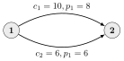
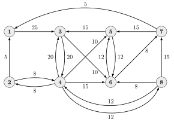
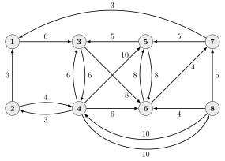

# Introduktion{-}
Når data sendes over et netværk (eksempelvis internettet), er det som oftest ikke muligt at forbinde afsenderen og modtageren direkte. I stedet skal datapakkerne sendes gennem flere mellemliggende routere i netværket, og forskellige dele af netværket kan være kontrolleret af forskellige netværksudbydere. Det betyder, at der kan være forskellige omkostninger forbundet med brugen af forskellige forbindelser i netværket. Derudover kan der være en maksimal kapacitet for en given forbindelse.
I denne workshop ser vi på et simpelt eksempel på, hvordan givne efterspurgte overførsler kan sendes gennem et netværk, så den samlede omkostning minimeres -- herunder tænker vi på omkostning som pris per overført dataenhed, men man kunne også bruge omkostningen til at modellere overførselstid, pålidelighed eller lignende.

Et netværk kan modelleres matematisk ved en *graf*, der består af en mængde *punkter* $\mathcal{V}$ og en mængde forbindelser $\mathcal{E}$ mellem par af punkter. Disse forbindelser har en retning, og kan kun sende data i denne ene retning -- med et fint ord har vi en *orienteret* graf. I grafteori kaldes disse orienterede forbindelser ofte *buer*. Eksempler på grafer kan ses på @fig-toyExample, @fig-largeExampleCap og @fig-largeExamplePrice.

For at beskrive netværkets egenskaber matematisk definerer vi for hver bue $e\in\mathcal{E}$ en variabel $x_{e}^{(s,t)}$ der beskriver den datamængde fra $s$ til $t$, der overføres gennem $e$. Derudover har vi for hver bue $e$ en kapacitet $c_e$, der betegner den maksimale datastrøm, forbindelsen kan håndtere, samt en pris $p_e$ per overført dataenhed (I kan tænke på enheden som MB, GB el. lign.).
De efterspurgte overførsler repræsenteres ved par af punkter $(s,t)\in\mathcal{V}\times\mathcal{V}$, og mængden af alle efterspørgsler noteres med $\mathcal{D}$. Til hver overførsel $(s,t)$ hører også en efterspurgt datamængde $d_{(s,t)}$.

Det problem, vi forsøger at løse, er således at finde ruter gennem netværket, så hver af efterspørgslerne i $\mathcal{D}$ bliver mødt. Dette skal ske, sådan at ingen af buekapaciteterne $c_e$ overstiges, og sådan at omkostningen -- defineret fra $p_e$ og $x_e^{(s,t)}$ -- minimeres.^[Bemærk, at eksemplet i denne workshop er simplificeret en del. I praksis vil man ofte ønske, at datapakkerne ikke deles over flere forbindelser, men dette er et sværere problem at løse.]

{width=50% #fig-toyExample fig-alt="Graf for et meget simpel netværk"}

# Delopgave 1{#sec-opg1}
I denne delopgave ser vi på det *meget* simple netværk på @fig-toyExample, så programmeringsproblemet er overskueligt at løse i hånden. Der bliver efterspurgt en overførsel på mindst  $12$ fra punktet $1$ til punktet $2$. Ruteproblemet i dette netværk kan beskrives ved det lineære programmeringsproblem
$$\begin{align}
  &\begin{array}{@{}lrrrrl}
    \text{Minimér} & 8x_1 & + & 6x_2\\
    \text{u.b.b.} & x_1 &&&\leq&10\\
                   &&& x_2&\leq& 6\\
                   &x_1 & + & x_2 & \geq & 12
  \end{array}\\
  &\text{og } x_1\geq0, x_2\geq 0\nonumber
\end{align}$${#eq-minProblem}

1. Tegn bibetingelserne ind i et koordinatsystem, og markér det brugbare område.
  
1. Omskriv problemet i @eq-minProblem for at opnå et lineært programmeringsproblem på kanonisk form.

1. Er $x_1=x_2=0$ en brugbar løsning til @eq-minProblem? Begrund dit svar.

1. Opstil simplex-tabellen for det kanoniske problem fra 2., og find en optimal løsning til problemet.


# Delopgave 2{#sec-opg2}
I denne delopgave betragter vi mere generelle netværk, og opgaverne handler om de bibetingelser, der skal opstilles for at løse problemet. Vi bruger her notationen $E_{\mathrm{in}}(v)$ til at beskrive de buer, der har $v$ som endepunkt, og $E_{\mathrm{out}}(v)$ de buer, der har $v$ som startpunkt.

Bibetingelserne repræsenteres ved at summere over alle elementer i en mængde. Når $\mathcal{A}=\{a_1,a_2,\ldots,a_n\}$ er en mængde, kan summen af alle elementerne beskrives kort ved
$$\sum_{a\in \mathcal{A}} a\stackrel{\mathrm{def}}{=}a_1+a_2+\cdots+a_n.$$

Udtrykket under sumtegnet -- det store sigma, $\Sigma$ -- indikerer, hvilke led, der indgår i summen. I dette tilfælde skal variablen $a$ erstattes af hvert element i $\mathcal{A}$, og de resulterende udtryk skal lægges sammen. Et mere specifikt eksempel for netværket kunne være, at vi ønsker at beskrive den samlede efterspørgsel, når $\mathcal{D}=\{(1,2),(2,3)\}$ med $d_{(1,2)}=4$ og $d_{(2,3)}=7$. Dette er givet ved summen
$$\sum_{(s,t)\in\mathcal{D}} d_{(s,t)}= d_{(1,2)}+d_{(2,3)}=4+7=11.$$

Vi erstatter altså $(s,t)$ i udtrykket efter sumtegnet med hvert af de to elementer i $\mathcal{D}$, og de led, vi opnår, lægges sammen.

(@) Argumentér for, at prisen for at udføre de efterspurgte overførsler -- dvs. objektfunktionen -- er givet ved
$$\sum_{e\in\mathcal{E}}\sum_{(s,t)\in\mathcal{D}} p_e x_e^{(s,t)}.$$
  
(@) Forklar, hvorfor bibetingelsen $\sum_{(s,t)\in\mathcal{D}} x_e^{(s,t)}\leq c_e$ sikrer, at kapaciteten for buen $e$ ikke overskrides.

    Hvor mange af denne type bibetingelser har det lineære programmeringsproblem, når netværket indeholder $|\mathcal{E}|$ buer?


Betragt nu et fastlagt $(s,t)\in\mathcal{D}$. Opgaverne herunder guider jer til at beskrive de bibetingelser, der modellerer kravene til, hvordan data fra $s$ til $t$ skal sendes gennem netværket.

(@) Lad $v\in\mathcal{V}$ være et punkt forskelligt fra $s$ og $t$. Argumenter for, at bibetingelsen
$$\sum_{e\in E_{\mathrm{out}}(v)} x_e^{(s,t)} - \sum_{e\in E_{\mathrm{in}}(v)} x_e^{(s,t)}=0$${#eq-preserve}
fortæller, at alt det data $v$ modtager, når $s$ overfører til $t$ også sendes videre i netværket -- altså, at mængden af data ind er lig mængden af data ud.

    Hvis netværket indeholder $|\mathcal{V}|$ punkter, hvor mange betingelser af denne type får vi så for overførselen $(s,t)$?

(@) I stil med @eq-preserve skal vi for $s$ og $t$ have betingelserne
$$\sum_{e\in E_{\mathrm{out}}(s)} x_e^{(s,t)} - \sum_{e\in E_{\mathrm{in}}(s)} x_e^{(s,t)}=d_{(s,t)}
    \quad\text{og}\quad
    \sum_{e\in E_{\mathrm{out}}(t)} x_e^{(s,t)} - \sum_{e\in E_{\mathrm{in}}(t)} x_e^{(s,t)}=-d_{(s,t)}.$$
	Hvad sikrer disse?

(@) Brug de ovenstående opgaver til at give et udtryk for antallet af bibetingelser, når netværket indeholder $|\mathcal{V}|$ punkter og $|\mathcal{E}|$ buer, og der efterspørges $|\mathcal{D}|$ overførsler.


# Delopgave 3{#sec-opg3}
Filen `optimizeRoutes.py` og kodeblokken nederst indeholder en Python-funktion, der kan opstille bibetingelser og løse ruteproblemet, hvis den får en beskrivelse af netværket og efterspørgslen som input. Mere præcist forventer den tre $|\mathcal{V}|\times|\mathcal{V}|$-matricer $C$, $P$ og $D$. Matricen $C$ skal indeholde kapaciteterne, så indgang $(i,j)$ er kapaciteten $c_{(i,j)}$. Hvis netværket ikke indeholder en bue mellem $i$ og $j$, sættes indgangen til at være $0$.
Matricerne $P$ og $D$ defineres tilsvarende, så indgang $(i,j)$ er prisen $p_{(i,j)}$ i $P$ og efterspørgslen $d_{(i,j)}$ i $D$.

Vi betragter nu netværket, hvis kapaciteter er vist på @fig-largeExampleCap, og hvis priser er vist på @fig-largeExamplePrice.

{width=75% #fig-largeExampleCap fig-alt="Graf med buekapaciteter"}

{width=75% #fig-largeExamplePrice fig-alt="Graf med priser"}

1. Opstil de tre matricer $C$, $P$, $D$ for netværket på @fig-largeExampleCap og @fig-largeExamplePrice, når de overførsler, der efterspørges er $\mathcal{D}=\{(1,6),(2,7),(8,3)\}$ med datamængder $d_{(1,6)}=20$, $d_{(2,7)}=8$ og $d_{(8,3)}=15$.

1. Brug `optimizeRoutes` til at løse ruteproblemet, og tegn løsningen ind på en skitse. I kan tage udgangspunkt i den nederste kodeblok, der indeholder starten af et script.

```{pyodide-python}
#| read-only: true
import numpy
import scipy.linalg, scipy.optimize

def cbv(n, i):
    """
    cbv returns the i'th canonical basis vector (counting from zero) as a row
    vector.

    Inputs:
    	- n: Vector length
    	- i: Index

    Returns:
    	- A row vector of length n with 1 in entry i and zeros elsewhere.
    """
    return numpy.eye(n)[[i],:]

def optimizeRoutes(C, P, D):
    """
    optimizeRoutes solves the linear programming problem for network routing
    This function find the optimal solution for routing given demands through a
    network as specified in the workshop.

    Inputs:
    	- C: Matrix where capacity of arc (i,j) is C(i,j)
    	- P: Matrix where price of arc (i,j) is P(i,j)
    	- D: Matrix where the demand from i to j is D(i,j)

    Returns:
    	- The values of the variables in the solution as a vector. The variables
    	  are ordered according to the demand matrix (in row-wise fashion), and
    	  then according to arc ordering in C.
    	- The value of the problem.
    """
    if C.shape[0]!=C.shape[1] or P.shape[0]!=P.shape[1] or D.shape[0]!=D.shape[1] \
       or C.shape[0]!=P.shape[0] or C.shape[0]!=D.shape[0]:
        raise ValueError("Matrices C, P, and D must be square and of same dimensions!")

    nRoutes = numpy.count_nonzero(D)

    # Form the objective function by concatenating the rows of P as many times as
    # there are routes in the demand matrix
    f = numpy.tile(P.reshape(P.size, 1), [nRoutes, 1])

    # Add the edge capacity constraints to the matrix A and vector b.
    # Each row has the form [e_i,e_i,...,e_i]<=c_i where c_i is the i'th element
    # in C when traversed row-wise
    A = numpy.tile(numpy.eye(C.size), [nRoutes, nRoutes])
    b = numpy.tile(C.reshape(C.size, 1), [nRoutes, 1])

    # Construct a matrix containing the conditions on preservation of data trough
    # each vertex. For a specific demand (s,t) the submatrix has the form
    # [0111|1000|1000|1000]=0
    # [0100|1011|0100|0100]=0
    # [0010|0010|1101|0010]=0
    # [0001|0001|0001|1110]=0
    # (except when considering the source or destination for a demand. Then the
    # right-hand side must be +/- the demand).
    # These are then put in a diagonal block matrix with a diagonal matrix for
    # each (s,t) (this is why the Kronecker product is used)
    APreserve = numpy.kron(numpy.eye(C.shape[0]), numpy.ones([1, C.shape[1]])) \
        - numpy.tile(numpy.eye(C.shape[0]), [1,C.shape[0]])
    APreserve = numpy.kron(numpy.eye(nRoutes), APreserve)

    # Initialize the right-hand side
    # (demands and zeros will be filled into appropriate entries in later loop)
    bPreserve = numpy.empty((0,1))

    # Construct the matrix ensuring that demands are met
    ADemand = numpy.zeros((0,0))
    bDemand = numpy.empty((0,1))
    # Loop over all entries in D to find the nonzero demands
    for i in range(D.shape[0]):
        for j in range(D.shape[1]):
            if D[i,j]==0:
                continue
            
            #Fill in demand in bPreserve
            bPreserve = numpy.vstack([bPreserve, D[i,j]*numpy.transpose(cbv(C.shape[1],i)-cbv(C.shape[1],j))])

            allOnes = numpy.ones([1, C.shape[1]])
            # Demand is met for source if we include row
            # [0000|1111|0000|0000]=d
            # where the ones are in the position corresponding to the vertex number
            tmpMat = numpy.kron(cbv(C.shape[1], i), allOnes)

            # Demand is met for destination if we include row
            # [0010|0010|0010|0010]=d
            # where the ones are in the position corresponding to the vertex number
            tmpMat = numpy.vstack([tmpMat, numpy.kron(allOnes, cbv(C.shape[1], j))])

            ADemand = scipy.linalg.block_diag(ADemand, tmpMat)
            bDemand = numpy.vstack([bDemand, D[i,j], D[i,j]])


    res = scipy.optimize.linprog(f, A, b, numpy.vstack([APreserve, ADemand]), numpy.vstack([bPreserve, bDemand]), bounds=(0, None))
    # res is a special scipy-object, whose attributes describe the solution. Of
    # particular interest are
    #	- success: Whether an optimum was found or not.
    #	- fun: Function value at optimum
    #	- x: Variable values at optimum
    
    if not res.success:
        # No solution was found
        return

    if res.fun.is_integer():
        print('Problem value is {0:.0f}.'.format(res.fun))
    else:
        print('Problem value is {0:.2f}.'.format(res.fun))

    # Present solution in matrix form
    count = 0
    for i in range(D.shape[0]):
        for j in range(D.shape[1]):
            if D[i,j]==0:
                continue
            print('\nRouting {0:.2f} from vertex {1:d} to vertex {2:d} via arcs:'.format(D[i,j], i, j))
            entries = res.x[count*C.size:(count+1)*C.size]
            entries = numpy.maximum(entries, 0) # Ensure that solution is also numerically non-negative
            print(entries.reshape(C.shape))
            count += 1
```

::: {.callout-warning title="OBS"}
Husk at køre kodeblokken ovenfor, inden du bruger koden herunder. Ellers giver Python en fejl om, at `optimizeRoutes` ikke er defineret.
:::

```{pyodide-python}
C = numpy.array([
    [0, 0, 25,  0,  0,  0,  0,  0],
    [ ,  ,   ,   ,   ,   ,   ,   ],
    [ ,  ,   ,   ,   ,   ,   ,   ],
    [ ,  ,   ,   ,   ,   ,   ,   ],
    [ ,  ,   ,   ,   ,   ,   ,   ],
    [ ,  ,   ,   ,   ,   ,   ,   ],
    [ ,  ,   ,   ,   ,   ,   ,   ],
    [ ,  ,   ,   ,   ,   ,   ,   ]
])

P = numpy.array([
    
])

D = numpy.array([
    
])

optimizeRoutes(C,P,D);
```
