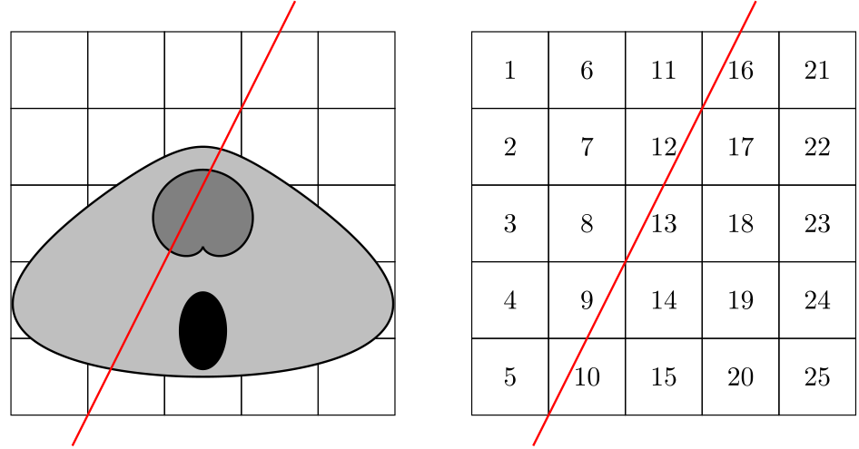
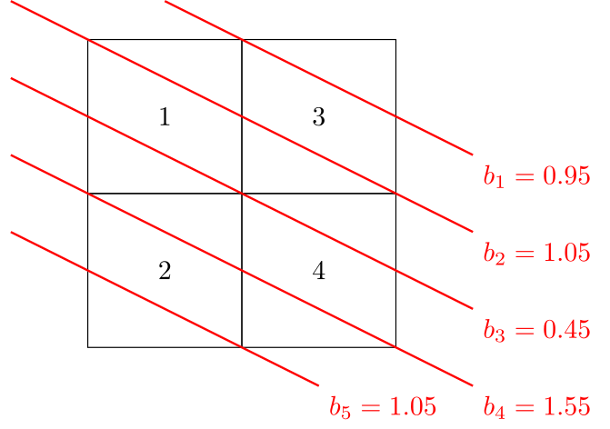

# Introduktion{-}
Tomografi betegner dannelsen af snitbilleder af et objekt ved at sende gennemtrængende stråling eller bølger gennem objektet.
I medicinsk sammenhæng udnyttes dette ofte til at danne billeder af indre organer &ndash; f.eks. ved MR-scanning, CT-scanning, ultralydsscanning osv. Dermed kan der diagnosticeres uden at lave et kirurgisk indgreb.

I denne workshop skal I se på en simpel, diskret model for tomografisk billedrekonstruktion. I praksis anvendes ofte transformationsbaserede metoder, men disse kræver mere avancerede værktøjer end dem, I ser i lineær algebra-kurset.

Vi tager udgangspunkt i et todimensionalt objekt, som I kan tænke på som tværsnittet af en menneskekrop. Når en røntgenstråle sendes gennem objektet, vil strålen dæmpes afhængigt af typen af væv, den passerer igennem.
Hvis strålen parametriseres ved $\gamma(t)=\mathbf{p}_0 + t\mathbf{v}$ med $0\leq t\leq L$, så giver BeerlLamberts lov, at dæmpningen langs linjen er givet ved integralet
$$b_\gamma
= \int_0^L \mu\big(\gamma(t)\big) \lVert \gamma'(t)\rVert \,\mathrm{d}t
= \int_0^L \mu(\mathbf{p}_0 + t\mathbf{v})\lVert\mathbf{v}\rVert \,\mathrm{d}t,$${#eq-beerLambert}
hvor funktionen $\mu$ kaldes dæmpningskoefficienten. Denne er ukendt, så målet med computertomografi er at bestemme $\mu$ ud fra de målte dæmpninger $b_\gamma$ for et antal røntgenstråler.

{#fig-illustration width=75% fig-alt="Illustration af scanning"}

I vores forsimplede model placeres objektet i et kvadratisk gitter bestående af $n$ kvadrater ligesom på @fig-illustration med $n=25$. Hvert kvadrat i gitret vil vi kalde en pixel, og de nummereres som i @fig-illustration.
Selvom gitret er kvadratisk, samler vi pixelværdierne i en vektor $\mathbf{x}$, så $x_j$ betegner værdien i pixel $j$.
Vi antager, at objektet gennemstråles med $m$ røntgenstråler, og at vi måler dæmpning $b_i$ for den $i$'te stråle. I modellen reducerer @eq-beerLambert til
$$b_i = \sum_{j=1}^n a_{ij}x_j,$$
hvor $a_ij$ angiver længden af stråle $i$ indenfor pixel $j$.
Som eksempel vil strålen på @fig-illustration have dæmpning
$$b=\frac{\sqrt{5}}{2}x_9 + \frac{\sqrt{5}}{2}x_{10} + \frac{\sqrt{5}}{2}x_{12} + \frac{\sqrt{5}}{2}x_{13} + \frac{\sqrt{5}}{2}x_{16},$$
hvis sidelængden af hver pixel er 1.

Ved at definere en $m\times n$-matrix $A=[a_{ij}]$ samt vektoren $\mathbf{b}=[b_1,b_2\ldots,b_m]^\top$, kan problemet opskrives som ligningssystemet
$$A\mathbf{x}=\mathbf{b}.$${#eq-leastSquares}
I praksis kender vi dog ikke $\mathbf{b}$ præcist, da der er målefejl. Det betyder, at vi faktisk ikke forventer, at @eq-leastSquares er konsistent, men at vi i stedet må nøjes med en mindste kvadraters løsning. Derudover vil $n$ i praksis være meget større end $25$, da $n$ bestemmer opløsningen af billedet. Dermed bliver matricen $A$ også meget stor, og rækkereduktion er derfor for langsomt i praksis.

I stedet for at rækkereduceres bruges Cimminos metode, hvor man starter med et gæt $\mathbf{x}_0$ og så iterativt forbedrer gættet ved
$$\mathbf{x}_{k+1} = \mathbf{x}_k + A^\top W^2(\mathbf{b} - A\mathbf{x}_k),\quad k\geq 0.$${#eq-cimmino}
Her er $W$ en diagonalmatrix, hvor diagonalindgangene er givet ved
$$w_1=\frac{\sqrt{\alpha_1}}{\lVert\mathbf{r}_1\rVert}, \ldots, w_m=\frac{\sqrt{\alpha_m}}{\lVert\mathbf{r}_m\rVert},$${#eq-diagEntries}
hvor $\mathbf{r}_j$ betegner $j$'te række i $A$ og $\alpha_1,\ldots,\alpha_m>0$ er reelle tal, der opfylder
$$\sum_{j=1}^m \alpha_j \leq 2.$${#eq-alphaSum}
Bemærk, at det i praksis ikke er et problem at dividere med $\lVert\mathbf{r}_j\rVert$, da stråle $j$ vil have en positiv længde i mindst én pixel, og vektornormen derfor er positiv.

# Delopgave 1{#sec-opg1}
Vi ser først et simpelt eksempel for at få en fornemmelse for beregningerne, der indgår i Cimminos metode. Vi vælger $\alpha_1=\alpha_2=\alpha_3=1/3$ samt
$$A= \begin{bmatrix*}[r]
    2 & 1 & 1 \\
    1 & 2 & 1 \\
    1 & 1 & 2    
  \end{bmatrix*}, \quad \text{og} \quad \mathbf{b}=\begin{bmatrix*}[r]
    1 \\ 0 \\1
  \end{bmatrix*}.$$

1. Bestem $W^2$ og vis at 
$$A^\top W^2 \mathbf{b}=\frac{1}{18}\begin{bmatrix*}[r]
    3\\2\\3\end{bmatrix*}, \quad \text{og} \quad  A^\top W^2 A=\frac{1}{18} \begin{bmatrix*}[r]
    6 & 5 & 5 \\
    5 & 6 & 5 \\
    5 & 5 & 6    
  \end{bmatrix*}.$$
  
1. Vis at hvis $\mathbf{x}_0=[0, 0, 0]^\top$ så er $\mathbf{x}_1=\frac{1}{18}[3, 2, 3]^\top$.

   Vis derefter, at hvis $\mathbf{x}_0=\frac{1}{2}[1, -1, 1]^\top$, så er $\mathbf{x}_0=\mathbf{x}_1=\mathbf{x}_2=\ldots\;$. 

1. Vis at $[1,1,1]^\top$, $[1,-1,0]^\top$ og $[-1,-1,2]^\top$ er ortogonale egenvektorer til $I-A^\top W^2A$, 
  og bestem en diagonalisering af $I-A^\top W^2A$.
  
Som I skal se i @sec-opg3, spiller matricen $I-A^\top W^2A$ en stor rolle Cimminos metode.


# Delopgave 2{#sec-opg2}
Cimminos metode approksimerer en *vægtet* mindste kvadraters løsning, og i denne opgave skal I gøre dette mere præcist.

Lad $w_1,\ldots,w_m>0$ være vilkårlige positive reelle tal, og definer diagonalmatricen $W$ med diagonalindgange som i @eq-diagEntries.
For systemet $A\mathbf{x}=\mathbf{b}$ kaldes $\hat{\mathbf{x}}\in\mathbb{R}^n$ en mindste kvadraters løsning med vægtning $w_1,\ldots,w_m$, hvis
$$\lVert W(\mathbf{b}-A\hat{\mathbf{x}})\rVert \leq \lVert W(\mathbf{b}-A\mathbf{x})\rVert$${#eq-weightedLS}
gælder for alle $\mathbf{x}\in\mathbb{R}^n$.

1. Gør rede for, at mængden af mindste kvadraters løsninger til $A\mathbf{x}=\mathbf{b}$ med vægtning $w_1,\ldots,w_m$ må stemme overens med mængden af løsninger til
$$(WA)^\top WA\mathbf{x} = (WA)^\top W\mathbf{b}.$${#eq-weightedNormal}

   Argumenter desuden for, at der eksisterer mindst én løsning til @eq-weightedNormal.
   
   :::{.callout-tip title="Vink" collapse=true}
   Udnyt Sætning&nbsp;13 på side 407 i lærebogen (Lay, Lay &amp; McDonald).
   :::
   
1. Antag, at $\mathbf{b}\in\mathrm{Col}(A)$, og lad $\hat{\mathbf{x}}$ være en mindste kvadraters løsning af $A\mathbf{x}=\mathbf{b}$ med vægtning $w_1,\ldots,w_m$. Vis at $A\hat{\mathbf{x}}=\mathbf{b}$.

   :::{.callout-tip title="Vink" collapse=true}
   Hvis $\mathbf{b}\in\mathrm{Col}(A)$, eksisterer et $\mathbf{x}$, så $A\mathbf{x}=\mathbf{b}$. Udnyt dette på højresiden i @eq-weightedLS samt at $W$ er inverterbar.
   :::

1. Vis, at matricerne $A$, $WA$ og $(WA)^\top WA$ alle har samme nulrum.

1. Antag nu, at søjlerne af $A$ er lineært uafhængige. Vis da, at der eksisterer en *entydig* mindste kvadraters løsning til $A\mathbf{x}=\mathbf{b}$ med vægtning $w_1,\ldots,w_m$.

   :::{.callout-tip title="Vink" collapse=true}
   Brug 3. til at konkludere, at $\mathrm{Null}\big((WA)^\top WA\big) = \{\mathbf{0}\}$. Argumenter derefter for, at $(WA)^\top WA$ er kvadratisk og derfor inverterbar. 
   :::

# Delopgave 3{#sec-opg3}

Vi lader her $B$ være en symmetrisk $n\times n$-matrix med spektraldekomposition
$$B=\lambda_1\mathbf{u}_1\mathbf{u}_1^\top + \cdots + \lambda_n\mathbf{u}_n\mathbf{u}_n^\top.$$
Det vil sige, at $\{\mathbf{u}_j\}_{j=1}^n$ er en ortonormal basis for $\mathbb{R}^n$ bestående af egenvektorer for $B$.
For de tilhørende egenværdier antager vi
$$0\leq\lambda_1\leq\lambda_2\cdots\leq\lambda_n <2.$${#eq-eigenvalues}

(@) Gør rede for, at vi for ethvert positivt heltal $k$ har
$$(I-B)^k = (1-\lambda_1)^k \mathbf{u}_1\mathbf{u}_1^\top + \cdots + (1-\lambda_n)^k \mathbf{u}_n\mathbf{u}_n^\top.$${#eq-spektralDekomp}

    :::{.callout-tip title="Vink" collapse=true}
	Vis først, at $\mathbf{u}_j$ er en egenvektor for $I-B$ med egenværdi $1-\lambda_j$. Udnyt derefter, at basen er ortonormal, så
	$$\mathbf{u}_i^\top\mathbf{u}_j=\begin{cases}
	1 & i=j\\
	0 & i\neq j.
	\end{cases}$$
	:::
	
(@) For enhver matrix $M$ gælder $\mathrm{Null}(M^\top)=\mathrm{Col}(M)^\perp$. Brug dette til at vise
$$\mathrm{Col}(B)=\mathrm{Null}(B)^\perp.$${#eq-colNull}

(@) Lad $a$ være den maksimale værdi af $\lvert 1-\lambda_j\rvert$ for de egenværdier, der opfylder $\lambda_j\neq 0$. Konkluder fra @eq-spektralDekomp og @eq-colNull samt Pythagoras' sætning, at
$$\lVert (I-B)^k\mathbf{x}\rVert^2 \leq a^{2k}\lVert\mathbf{x}\rVert^2$$
gælder for alle $\mathbf{x}\in\mathrm{Col}(B)$.

    :::{.callout-tip title="Vink" collapse=true}
	Husk, at $\{\mathbf{u}_1,\ldots,\mathbf{u}_n\}$ er en ortonormal basis, så $\mathbf{x}=\mathbf{u}_1\mathbf{u}_1^\top\mathbf{x} + \cdots + \mathbf{u}_n\mathbf{u}_n^\top\mathbf{x}$.
	:::
	
For ligningssystemet $B\mathbf{x}=\mathbf{c}$ definerer vi nu afbildningen $T(\mathbf{x})=(I-B)\mathbf{x} + \mathbf{c}$. Man kan vise, at der for ethvert $\mathbf{x}_0\in\mathbb{R}^n$ eksisterer et *entydigt* $\hat{\mathbf{x}}\in\mathbb{R}^n$, sådan at $B\hat{\mathbf{x}}=\mathbf{c}$ og $\hat{\mathbf{x}}-\mathbf{x}_0\in\mathrm{Null}(B)^\perp$.

Ved at udregne $T^k(\mathbf{x}_0)$ og $(I-B)^k\hat{\mathbf{x}}$ for de første værdier af $k$ kan man udlede, at
$$T^k(\mathbf{x}_0) -\hat{\mathbf{x}} = (I-B)^k (\mathbf{x}_0-\hat{\mathbf{x}}),\quad k\geq 1.$${#eq-iterationDiff}

(@) Lad $\hat{\mathbf{x}}$ være den entydige løsning beskrevet ovenfor. Brug @eq-iterationDiff til at vise, at
$$\lVert T^k(\mathbf{x}_0) - \hat{\mathbf{x}}\rVert \leq a^k\lVert\mathbf{x}_0 - \hat{\mathbf{x}}\rVert,
\quad k\geq 1.$${#eq-iterationError}

Vi lader nu $A$, $\mathbf{b}$ og $W$ være givet som i @eq-leastSquares og @eq-diagEntries, og sætter
$$B=(WA)^\top WA,\quad \mathbf{c}=(WA)^\top W\mathbf{b}.$$
Vi skal vise, at dette er et gyldigt valg af $B$ &ndash; altså, at matricen er 
kvadratisk og at @eq-eigenvalues er opfyldt &ndash; samt at afbildningen $T$ beskriver iterationen i Cimminos metode.

(@) Vis, at @eq-cimmino netop stemmer overens med $\mathbf{x}_{k+1}=T(\mathbf{x}_k)$ for disse valg af $B$ og $\mathbf{c}$.

(@) Betragt en egenværdi $\lambda$ for $B$ og en tilhørende egenvektor $\mathbf{v}$ med $\lVert\mathbf{v}\rVert = 1$. Argumenter først for, at $\lambda = \mathbf{v}\cdot (B\mathbf{v})$.

    Brug derefter dette til at vise ligheden
	$$\lambda = \lVert WA\mathbf{v}\rVert^2 = \sum_{j=1}^m \alpha_j \frac{(\mathbf{r}_j\cdot\mathbf{v})^2}{\lVert\mathbf{r}_j\rVert^2}.$${#eq-lambdaExpression}
	
(@) Udnyt Cauchy-Schwarz' ulighed på @eq-lambdaExpression til at vise, at $\lambda<2$, når $\mathrm{rank}(A)\geq 2$.

    :::{.callout-note title="Cauchy-Schwarz' ulighed"}
	For alle vektorer $\mathbf{r}_j$ og $\mathbf{v}$ gælder
	$(\mathbf{r}_j\cdot\mathbf{v})^2\leq \lVert\mathbf{r}_j\rVert^2 \lVert\mathbf{v}\rVert^2$. Lighed sker, hvis og kun hvis $\{\mathbf{v},\mathbf{r}_j\}$ er lineært afhængig.
	:::
	
	:::{.callout-tip title="Vink" collapse=true}
	Hvis $\mathrm{rank}(A)\geq 2$ eksisterer mindst ét $j$, $\mathbf{v}$ ikke ligger i spændet af $\mathbf{r}_j$. Hvad betyder det for $\{\mathbf{v}, \mathbf{r}_j\}$?
	:::
	
(@) Konkluder ud fra de ovenstående observationer samt @eq-iterationError, at for tilstrækkeligt stort $k$, vil Cimminos metode give en god approksimation af den entydige $\hat{\mathbf{x}}$ som opfylder

    - $\hat{\mathbf{x}}$ er en mindste kvadraters løsning til $A\mathbf{x}=\mathbf{b}$ med vægtning $w_1,w_2,\ldots,w_m$
	- $\mathbf{x}_0-\hat{\mathbf{x}}\in\mathrm{Null}(A)^\perp$

Bemærk, at Cimminos metode kun fungerer, hvis $W$ vælges, så @eq-alphaSum er opfyldt. I praksis vælges $\alpha_j$ ud fra overvejelser, der bygger på f.eks. viden om målefejl eller erfaring med tidligere numeriske implementationer.

# Delopgave 4{#sec-opg4}
Vi betragter nu et simpelt, konkret eksempel, hvor vi antager, at målingerne er givet som på @fig-example. Vi antager desuden, at sidelængden på de enkelte pixels er valgt sådan, at strålelængden indenfor hver pixel er 1.

{#fig-example width=60% fig-alt="Eksempler på måleresultater"}

I stil med @sec-opg1 vælger vi $\alpha_j=\frac{1}{m}$, hvor $m$ er antallet af rækker i $A$. Gennemgå scriptet herunder og fortolk de plots, scriptet producerer.
```{pyodide-python}
import numpy
from numpy.linalg import inv
import matplotlib.pyplot as plt

A = numpy.array([
	[0, 0, 1, 0],
	[1, 0, 1, 0],
	[1, 0, 0, 1],
	[0, 1, 0, 1],
	[0, 1, 0, 0]
])
m = numpy.shape(A)[0]

b = numpy.array([0.95, 1.05, 0.45, 1.55, 1.05])

## Vi konstruerer først W
rNorms = numpy.sqrt(numpy.diagonal(A @ A.T))
W = numpy.diag(1/m * rNorms)

AtW2 = A.T @ W**2

## Bestem den vægtede mindste kvadraters løsning
xHat = inv(AtW2 @ A) @ AtW2 @ b

iterations = 100
x = numpy.array([1, 0, 1, 0])
N = iterations//5

## Det er ikke nødvendigt at gemme alle x_k undervejs i Cimminos metode.
## Vi gemmer her start, slut og fire ligeligt fordelte iterationer undervejs.
## Dette gør det simplere, når vi skal generere plots til sidst.
X = numpy.empty([6,4])
X[0] = x # Gem x_0 i første række

## Lav iterationen fra Cimmino
for i in range(1,iterations+1):
    ## Beregn den nye x_k
    x = x + AtW2 @ (b - A@x)

    if i%N == 0:
        ## Denne iteration skal gemmes, så den senere kan plottes
        X[i//N] = x


## Opret plottet og bestem mindste og største værdier i de fundne matricer
## (dette bruges til at fastlægge en fælles skala for alle plots)
fig, ax = plt.subplots(3,2)
minVal = min(numpy.min(X), numpy.min(xHat))
maxVal = max(numpy.max(X), numpy.max(xHat))

for i in range(numpy.shape(X)[0]):
    im = ax[i//2][i%2].imshow(numpy.reshape(X[i],[2,2]), vmin=minVal, vmax=maxVal)
    ax[i//2][i%2].set_title("$x_{{{}}}$".format(i*N))

## Juster afstande og tilføj farveskala
plt.subplots_adjust(hspace=.6, wspace=0)
fig.colorbar(im, ax=ax.ravel().tolist())
plt.show()
```
Til sidst vil vi sammenligne estimatet $\mathbf{x}_k$ fra Cimmino med den analytiske løsning til @eq-weightedNormal. Kør scriptet og fortolk det resulterende plot. Ændrer det sig, hvis man vælger en anden startværdi $\mathbf{x}_0$ eller antallet af iterationer?
```{pyodide-python}
## Opret et nyt plot til at sammenligne sidste iteration fra Cimmino
## med den analytiske mindste kvadraters løsning
figCompare, axCompare = plt.subplots(1,2)
axCompare[0].imshow(numpy.reshape(x, [2,2]), vmin=minVal, vmax=maxVal)
axCompare[0].set_title("$x_{{{}}}$".format(iterations))

im = axCompare[1].imshow(numpy.reshape(xHat, [2,2]), vmin=minVal, vmax=maxVal)
axCompare[1].set_title("$\\hat{x}$")

## Juster afstande og tilføj farveskala
plt.subplots_adjust(wspace=.4)
figCompare.colorbar(im, ax=axCompare)
plt.show()
```


<!-- Local Variables: -->
<!-- ispell-local-dictionary: "da_DK" -->
<!-- End: -->
