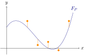

## Introduction{-}
In this workshop, you will work with parametric curve fitting, which is an important application of least squares. When performing such a fitting, we choose the parameters for a function $F_P(X)$ such that it describes a given data set as well as possible.
More precisely, this means that we given points $(x_i,y_i)_{1\leq i\leq m}$ try to determine a parameter set $P$ such that
$$\left\lVert \left(F_{P}(x_i)\right)_{1\leq i \leq m} - \left(y_i\right)_{1\leq i \leq m} \right\rVert = \sqrt{\sum_{i=1}^m (F_P(x_i)-y_i)^2 }$$
is minimized.

{#fig-fries3 width=60% fig-alt="Example of a curve fitting"}

## Exercise 1{#sec-opg1}
The normal equation $A^\top A \mathbf{x} = A^\top  \mathbf{b}$ has a unique solution if the matrix $A^\top A$ is invertible. Below, you will show that this is the case when $A$ has full column rank; that is, when the columns of $A$ are linearly independent.

1. Show that any matrix $A$ satisfies that if $A\mathbf{x}=\mathbf{0}$, then $A^\top A\mathbf{x}=\mathbf{0}$.

1. Show that $A^\top A\mathbf{x}=\mathbf{0}$ implies $A\mathbf{x}=\mathbf{0}$.

   :::{.callout-tip title="Hint" collapse=true}
   If $A^\top A\mathbf{x}=\mathbf{0}$, then we have $\mathbf{x}^\top A^\top A\mathbf{x}=0$. Rewrite this as the length of a vector.
   :::
   
1. Explain that the two observations above prove that $A$ and $A^\top A$ have the same null space.

1. Now assume that the columns of $A$ are linearly independent. Show that $A$ has a trivial null space in this case. That is, argue that the only vector $\mathbf{x}$ satisfying $A\mathbf{x}=\mathbf{0}$ is the zero vector $\mathbf{x}=\mathbf{0}$.

1. Combine the previous observations to conclude that $A^\top A$ is invertible if $A$ has full column rank.


## Exercise 2{#sec-opg2}
You will now attempt to solve the normal equation if a diagonalization of $A^\top A$ is known. Below, we assume that $A$ is $m\times n$, implying that $A^\top A$ is $n\times n$.

1. Argue that regardless of the entries in $A$, $A^\top A$ will always have a diagonalization $A^\top A=PDP^{-1}$.

   Furthermore, explain why we can choose $P$ such that its columns form an orthonormal basis for $\mathbb{R}^n$.

   :::{.callout-tip title="Hint" collapse="true"}
   Check that $A^\top A$ is symmetric.
   :::
   
1. Now assume that $A$ has full rank. Use the last question in @sec-opg1 to conclude that $D$ must be invertible. What does that tell us about the eigenvalues of $A^\top A$?

   :::{.callout-tip title="Hint" collapse="true"}
   Can $0$ be an eigenvalue?
   :::
   
1. Explain why the unique solution $\mathbf{x}$ to the normal equation is given by
$$\mathbf{x}=(A^\top A)^{-1}A^\top \mathbf{b},$${#eq-normalSolution}
when $A$ has full rank.

   Utilize the diagonalization $A^\top A=PDP^{-1}$ to rewrite @eq-normalSolution such that $D$ is the only matrix that needs to be inverted.

   :::{.callout-tip title="Hint" collapse="true"}
   Recall that $P$ is orthogonal. What is the inverse in that case?
   :::


## Exercise 3{#sec-opg3}
We wish to use least squares to determine the best possible line through a dataset $\{ (x_1, y_1), \dots, (x_m,y_m) \}$. A line
$$ax+b=y$$
is determined by two parameters $a,b \in \mathbb{R}$. Chosen parameters $\hat{a}, \hat{b}$ can be used to compute estimates $\hat{y}_i$ for the values $y_i$ in the points $x_i$ by
$$\hat{a}x_i+\hat{b} = \hat{y}_i.$$
The goal is to find those values of $\hat{a}$ og $\hat{b}$ that minimize the errors
$$\lVert\hat{y}_i-y_i\rVert = \lVert\hat{a}x_i+\hat{b}-y_i\rVert$$
collectively. More precisely, we wish to minimize
$$\sqrt{\sum_{i=1}^m (\hat{y}_i-y_i)^2}=  \left\lVert \begin{pmatrix} \hat{y}_1-y_1 \\ \vdots \\ \hat{y}_m-y_m \end{pmatrix}\right\rVert.$${#eq-mini}

(@) Show that the minimization problem in @eq-mini can be rewritten to a least squares problem with design matrix
$$A=\begin{bmatrix} 1 & x_1\\ \vdots & \vdots \\ 1 & x_m \end{bmatrix}$${#eq-vanderMonde}

    The least squares solution to the problem is then to determine $a,b$ such that the following is minimized:
$$\left\lVert A\begin{pmatrix} b \\ a \end{pmatrix} - \begin{pmatrix} y_1 \\ \vdots \\ y_m \end{pmatrix} \right\rVert.$$

(@) Show that any matrix on the form in @eq-vanderMonde has full column rank. Here, you can assume that the $x_i$'s are not all equal. Conclude from @sec-opg1 that the least squares solution to @eq-mini is unique.

We now use this method to fit a line to three separate datasets. All datasets share the same $x$-coordinates so they all use the same matrix $A$. The data is shown in the table below.

```{=html}
<table>
  <caption>The three different datasets.</caption>
  <tbody>
	<tr style="vertical-align:middle;">
      <th>$$x_i$$</th>
	  <td>10.0</td>
	  <td>8.0</td>
	  <td>13.0</td>
	  <td>9.0</td>
	  <td>11.0</td>
	  <td>14.0</td>
	  <td>6.0</td>
	  <td>4.0</td>
	  <td>12.0</td>
	  <td>7.0</td>
	  <td>5.0</td>
	</tr>
	<tr style="vertical-align:middle;">
	  <th>$$y_i^{(1)}$$</th>
	  <td>8.04</td>
	  <td>6.95</td>
	  <td>7.58</td>
	  <td>8.81</td>
	  <td>8.33</td>
	  <td>9.96</td>
	  <td>7.24</td>
	  <td>4.26</td>
	  <td>10.84</td>
	  <td>4.82</td>
	  <td>5.68</td>
	</tr>
	<tr style="vertical-align:middle;">
	  <th>$$y_i^{(2)}$$</th>
	  <td>9.14</td>
	  <td>8.14</td>
	  <td>8.74</td>
	  <td>8.77</td>
	  <td>9.26</td>
	  <td>8.1</td>
	  <td>6.13</td>
	  <td>3.1</td>
	  <td>9.13</td>
	  <td>7.26</td>
	  <td>4.74</td>
	</tr>
	<tr style="vertical-align:middle;">
	  <th>$$y_i^{(3)}$$</th>
	  <td>7.46</td>
	  <td>6.77</td>
	  <td>12.74</td>
	  <td>7.11</td>
	  <td>7.81</td>
	  <td>8.84</td>
	  <td>6.08</td>
	  <td>5.39</td>
	  <td>8.15</td>
	  <td>6.42</td>
	  <td>5.73</td>
	</tr>
  </tbody>
</table>
```
	
As an example, the first dataset contains the point $(10.0, 8.04)$, while the second contains $(10.0, 9.14)$.

In the following, you can perform the computations manually, or you can use the Python code blocks at the end of this exercise.

(@) Show that
$$A^\top A= \begin{bmatrix}11 & 99 \\ 99 & 1001 \end{bmatrix}.$$

(@) For every dataset we have (approximately)
$$A^\top  y^{(i)} = \begin{pmatrix} 82.5 \\ 797.6 \end{pmatrix}.$$
Find the least squares solution by solving the normal equation.

We can check that the total error is roughly 3.71 for all three datasets. In other words, it seems like the fitted curve describes all three datasets equally well.

```{pyodide-python}
#| read-only: true
import numpy

## Define the three datasets
x = numpy.array([[10.0, 8.0, 13.0, 9.0, 11.0, 14.0, 6.0, 4.0, 12.0, 7.0, 5.0]]).T;
y1 = numpy.array([[8.04, 6.95, 7.58, 8.81, 8.33, 9.96, 7.24, 4.26, 10.84, 4.82, 5.68]]).T;
y2 = numpy.array([[9.14, 8.14, 8.74, 8.77, 9.26, 8.1, 6.13, 3.1, 9.13, 7.26, 4.74]]).T;
y3 = numpy.array([[7.46, 6.77, 12.74, 7.11, 7.81, 8.84, 6.08, 5.39, 8.15, 6.42, 5.73]]).T;
```
::: {.callout-tip}
Run the code block above to read the four vectors into memory. Otherwise, you will experience an error when trying to call the function in the code block below.
:::


```{pyodide-python}
from numpy.linalg import lstsq

A = numpy.hstack([
	numpy.ones((x.size, 1)),
	x
])

## In Numpy, a matrix is transposed using '.T' like in the block above.
## Matrix products are written with @.
print("Exc. 3.3:")
print(A.T@A)

print("\nExc. 3.4:")
print(A.T@y1)
## continue the code yourself for the other datasets

## Solving the normal equation
print("\nDataset 1:")
sol1 = lstsq(A.T@A, A.T@y1)[0]
residual1 = y1 - A@sol1
print("Parameters:\n{}\nError: {}".format(
	sol1,
	numpy.sqrt(residual1.T@residual1)[0,0]
))
## continue the code yourself for the other datasets
```

::: {.callout-warning}
Remember to save your modified Python code in a separate file. If you close this HTML file and re-open it, it will show the original code without your changes.
:::

(@) Execute the code below to perform a graphical comparison between the three datasets and the line found using least squares. What do you see? Does the line appear to be a good description of all three datasets?

```{pyodide-python}
import matplotlib.pyplot as plt

fig, ax = plt.subplots(2,2)	# Create a 2x2 grid for plots

## Plot each of the three datasets
ax[0,0].set_title("Dataset 1")
ax[0,0].scatter(x, y1, color="orange")
ax[0,0].plot(x, sol1[0]+sol1[1]*x, color="navy")

ax[0,1].set_title("Dataset 2")
ax[0,1].scatter(x, y2, color="orange")
ax[0,1].plot(x, sol2[0]+sol2[1]*x, color="navy")

ax[1,0].set_title("Dataset 3")
ax[1,0].scatter(x, y3, color="orange")
ax[1,0].plot(x, sol3[0]+sol3[1]*x, color="navy")

## Remove the extra plot window and adjust spacing
ax[1,1].remove()
plt.subplots_adjust(hspace=0.4)

plt.show()
```

## Exercise 4
Many processes in nature follow an exponential curve. These curves are described by two parameters $a$ and $b$ through the formula
$$d_{a,b}(t)= b e^{at}.$$
The parameter $b$ is assumed to be positive, and it describes the state of the process at time $t=0$. For positive $a$, the function describes an exponential growth that could for instance be growth of bacteria. On the other hand, negative values of $a$ correspond to exponential decay such as the nuclear decay of a radioactive material.

Since $d_{a,b}$ is not a linear combination of different variables &ndash; like polynomial are, for instance &ndash; it is not obvious how least squares can be used to find good parameters $a, b$ to fit a curve to a given dataset.

A common trick is to use the logarithm to transform the function and the dataset. Rather than minimizing
$$\lVert d_{a,b}(t_i)-y_i \rVert= \lVert b e^{at_i}-y_i \rVert,$$
we instead consider
$$\lVert \log(b e^{at_i})-\log(y_i) \rVert = \lVert \log(b)+ a t_i-\log(y_i) \rVert.$$
The problem is now equivalent to the one in @sec-opg3: the line $\log(b)+ a t$ must be fitted to the dataset $(t_i,\log(y_i))$.

1. Utilize least squares to fit a curve on the form $be^{at}$ to the dataset $D=\{(1,e^1), (2,e^2), (10,e^{11})\}$.

1. It turns out that the logarithmic version of the problem applies a weighting to errors that differs from the original least squares. Consider the function $d_{-2,1}(t)=1e^{-2t}$, and assume that it is used to fit a dataset containing the points $(t_1,y_1)=(1,0.15)$ and $(t_2,y_2)=(2,0.008)$.

    a. Compute the residual errors $\lVert d_{-2,1}(t_i)-y_i \rVert$ for these two points.

    a. Compute the residual errors $\lVert -2t_i-\log(y_i) \rVert$ for the logarithmic reformulation of the problem.

We see that the errors are scaled differently. This implies that least squares will not find the optimal solution to the original problem since it will apply a different weight to some data points. Nonetheless, the method will still give a reasonable starting point that can for instance be improved by using numerical methods that approximate an optimal solution to the original problem.
