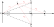

## Introduktion{-}
*Trilateration* bruges til positionsbestemmelse ved brug af data fra f.eks. GPS til biler eller teledata fra telefonmaster. I mindre skala kan det også bruges til at positionsbestemme en robot ud fra stationære sensorer.
Den ukendte position $\mathbf{x}$ bliver bestemt ud fra viden om positionen af mindst tre sensorer $S_1, S_2, S_3,\dots$ hver med en afstand $r_1, r_2, r_3,\dots$ til $\mathbf{x}$. Afstanden $r_j$ kan f.eks. estimeres ved at udsende et signal fra $S_j$ og beregne forsinkelsen inden det modtages hos en sender i $\mathbf{x}$ &ndash; f.eks. hvis $S_j$ er en telemast og $\mathbf{x}$ er en mobiltelefon. I 2D-tilfældet kan $\mathbf{x}$ så findes som skæringspunktet mellem cirkler, mens det i 3D (såsom for GPS) bliver skæring af kugleflader. I begge tilfælde vil cirklerne/kuglefladerne have centrum i hvert $S_j$ og radius $r_j$ som på @fig-1.
	
{#fig-1 width=40% fig-alt="Tre cirkler, der skærer i ét entydigt punkt"}
	
I hverdagstale kaldes dette nogle gange *triangulering*, men dette er strengt taget forkert, da triangulering er baseret på vinklerne mellem sensorer og $\mathbf{x}$. Dette antydes også i navnet, da *angulus* er latin for vinkel, mens *lateralis* er relateret til siden af noget; for trilateration er dette tre &lsquo;sidelængder&rsquo;.

## Delopgave 1{#sec-opg1}
Lad tre sensorer $S_1$, $S_2$ og $S_3$ være givet som på @fig-2. Figuren viser også en fjerde sensor $S_4$, men den bruger vi først i @sec-delopg3.
Koordinatsystemet placeres så $S_1$ har koordinaterne $(0,0)$. Ved at rotere koordinatsystemet, kan vi altid placere en anden sensor $S_2$ på førsteaksen i et punkt $(b,0)$ hvor $b> 0$.
Den tredje sensor $S_3$ ligger som vist på @fig-2 med første koordinat $a> 0$. Med en geometrisk overvejelse indses, at andet koordinat for $S_3$ er $a\tan(\alpha)$, hvor $\alpha$ er vinklen mellem stedvektorerne for $S_2$ og $S_3$.

{#fig-2 width=60% fig-alt="Koordinatsystem med sensorpositioner"}

Sensor $S_j$ har en afstand $r_j>0$ til en ukendt position $\mathbf{x} = [x_1,x_2]^\top$. Der gælder derfor, ved at se på skæring mellem cirkler med centrum i $S_j$ og radius $r_j$, at $x$ er løsning til følgende ikke-lineære ligningssystem:
$$\begin{align*}
	r_1^2 &= x_1^2 + x_2^2,\\
	r_2^2 &= (x_1 - b)^2 + x_2^2, \\
	r_3^2 &= (x_1 - a)^2 + (x_2 - a\tan(\alpha))^2.
\end{align*}$${#eq-nonlinear}
	
		
1. Vi ønsker først at omskrive til et lineært system. Vis derfor, at $\mathbf{x}$ er en løsning til det lineære ligningssystem $A_0 \mathbf{y} = \mathbf{v}$ med
$$
A_0 = \begin{bmatrix}
1 & 0 \\
1 & \tan(\alpha)
\end{bmatrix}, \qquad \mathbf{v} = \begin{bmatrix}
v_1\\
v_2
\end{bmatrix} = \begin{bmatrix}
	\frac{r_1^2 - r_2^2 + b^2}{2b} \\[2mm]
				\frac{r_1^2 - r_3^2 + a^2(1+\tan^2(\alpha))}{2a}
\end{bmatrix}.$${#eq-linsys}

   :::{.callout-tip title="Vink" collapse=true}
   Første række i ligningssystemet findes ved at trække anden ligning fra tredje ligning i @eq-nonlinear.
   Tilsvarende kommer anden række fra at trække tredje ligning fra første.
   :::

1. Argumenter for at $A_0$ ikke er ortogonalt diagonaliserbar. 

   :::{.callout-tip title="Vink" collapse=true}
   Er $A$ symmetrisk? Hvad fortæller det om en evt. ortogonal diagonalisering?
   :::

## Delopgave 2
Vi vil nu undersøge, hvor stor fejl der kan forekomme på positionsbestemmelsen af $\mathbf{x}$, hvis der er usikkerheder på positioner eller afstande af sensorerne.
I praksis kan man forvente, at der er usikkerheder på samtlige størrelser, men for at kunne lave udregninger i hånden, tager vi en forsimplet situation, hvor der kun er usikkerhed på sensoren $S_2$.
	
Antag derfor, at der er en lille usikkerhed $\varepsilon$, med $\lvert \varepsilon \rvert < 1$, på sensoren $S_2$. Matricen i ligningssystemet @eq-linsys er nu erstattet med
$$A_\varepsilon = \begin{bmatrix}
1+\varepsilon & 0 \\ 1 & \tan(\alpha)
\end{bmatrix}.$${#eq-linsys2}

Dette svarer til, at der er en multiplikativ fejl på $v_1$, der kommer fra målefejl af enten $b$ eller $r_2$ (eller begge). Bemærk at den oprindelige matrix $A_0$ svarer til at sætte $\varepsilon = 0$ i @eq-linsys2.
		
1. Vis at $A_\varepsilon$ er inverterbar for $\lvert \varepsilon \rvert < 1$ og $0 < \alpha < \frac{\pi}{2}$, og at dens inverse er givet ved

$$A_\varepsilon^{-1} = \begin{bmatrix}
				\frac{1}{1+\varepsilon} & 0 \\[2mm] \frac{-1}{(1+\varepsilon)\tan(\alpha)} & \frac{1}{\tan(\alpha)}
			\end{bmatrix}.$$
		
1. Lad $\mathbf{x}_\varepsilon$ opfylde $A_\varepsilon \mathbf{x}_\varepsilon = \mathbf{v}$. Så betegner vektoren $\mathbf{x}-\mathbf{x}_\varepsilon$ fejlen i positionsbestemmelsen svarende til henholdsvis første og andet koordinat. 
		
   Find matricen $M_\varepsilon = A_0^{-1} - A_\varepsilon^{-1}$, og vis at $\mathbf{x}-\mathbf{x}_\varepsilon = M_\varepsilon \mathbf{v}$.
   
1. Brug ovenstående til at forklare, at fejlen på førstekoordinatet kun afhænger af $\varepsilon$ og $v_1$, mens fejlen på andenkoordinatet afhænger af $\varepsilon$, $v_1$ og $\alpha$.
		
1. Den absolutte fejl af positionsbestemmelsen er givet ved $\lVert\mathbf{x}-\mathbf{x}_\varepsilon\rVert$. Vis at der er gælder:
$$\lVert\mathbf{x}-\mathbf{x}_\varepsilon\rVert = \frac{\lvert \varepsilon \rvert}{\lvert 1+\varepsilon \rvert}\lvert v_1 \rvert\sqrt{1+\tfrac{1}{\tan^2(\alpha)}}.$$

   Hvad sker der (selv for en lille usikkerhed $\varepsilon$), når $\alpha$ kommer tæt på 0 &ndash; altså når sensorerne $S_1$, $S_2$ og $S_3$ næsten ligger på samme rette linje? 


## Delopgave 3{#sec-delopg3}
Vi undersøger nu hvad der sker med fejlen, hvis vi inkluderer endnu en sensor $S_4$ med afstand $r_4>0$ til $\mathbf{x}$. Denne sensor er placeret modsat $S_3$ og med samme afstand til førsteaksen som på @fig-2.
	
Dermed fås et overbestemt ligningssystem $\hat{A}_\varepsilon \mathbf{y} = \hat{\mathbf{v}}$ for hvert $\varepsilon$. Her er vektoren $\hat{\mathbf{v}} = [v_1,v_2,v_3]^\top$ med $v_1$ og $v_2$ som i @eq-linsys, mens $\hat{A}_\varepsilon$ og $v_3$ er givet ved
$$\hat{A}_\varepsilon = \begin{bmatrix}
	1+\varepsilon & \phantom{-}0 \\ 1 & \phantom{-}\tan(\alpha) \\ 1 & -\tan(\alpha)
	\end{bmatrix}, 
	\qquad v_3 = \frac{r_1^2 - r_4^2 + a^2(1+\tan^2(\alpha))}{2a}.$$

Vi er nu interesserede i at anvende *mindste kvadraters metode* til at finde en approksimativ løsning af ligningssystemet $\hat{A}_\varepsilon \mathbf{y} = \hat{\mathbf{v}}$.
Dette svarer til at finde en løsning $\hat{\mathbf{x}}_\varepsilon \in \mathbb{R}^2$ til normalligningerne $(\hat{A}_\varepsilon^\top\hat{A}_\varepsilon)\mathbf{y} = \hat{A}_\varepsilon^\top\hat{\mathbf{v}}$. 


1. Vis at $\hat{A}_\varepsilon$ ikke er inverterbar uanset værdierne på $\varepsilon$ og $\alpha$. 
		
   For $\varepsilon = 0$ (ingen måleusikkerhed) opfylder $\mathbf{x}$ ligningen $\hat{A}_0 \mathbf{x} = \hat{\mathbf{v}}$. Hvorfor er dette ikke i modstrid med, at matricen $\hat{A}_0$ ikke er inverterbar?
		
1. Vis at $\hat{A}_\varepsilon^\top\hat{A}_\varepsilon$ er en diagonalmatrix og at dens tilhørende kvadratiske form er givet ved 
$$Q(y) = \lVert\hat{A}_\varepsilon \mathbf{y}\rVert^2.$$

   Er $Q$ positiv definit (eller semidefinit), negativ definit (eller semidefinit) eller indefinit når $\lvert \varepsilon \rvert<1$ og $0 < \alpha < \frac{\pi}{2}$? Hvad hvis $\alpha = 0?$
		
1. Vi undersøger nu, om der stadig er fejl på andet koordinat, efter den fjerde sensor er blevet tilføjet. Dette gør vi via følgende trin:

    a. Bestem den inverse af $\hat{A}_\varepsilon^\top\hat{A}_\varepsilon$ når $0 < \alpha < \frac{\pi}{2}$. Er matricen inverterbar for $\alpha=0$?
   
       ::: {.callout-tip title="Vink" collapse=true}
       En diagonalmatrix $D = \mathrm{diag}(d_1,d_2)$ er inverterbar hvis og kun hvis både $d_1\neq0$ og $d_2\neq0$. Så er $D^{-1} = \mathrm{diag}(1/d_1, 1/d_2)$. 
       :::

    a. Vis, at anden række af matricen $B_\varepsilon = (\hat{A}_\varepsilon^\top\hat{A}_\varepsilon)^{-1}\hat{A}_\varepsilon^\top$ er givet ved
$$\frac{1}{2\tan(\alpha)}[0,1,-1].$$


   Konkluder nu, at anden række af matricen $B_0 - B_\varepsilon$ en nulrække. Kombiner dette med $\mathbf{x} - \hat{\mathbf{x}}_\varepsilon = (B_0 - B_\varepsilon)\hat{\mathbf{v}}$ for at vise, at der ikke er nogen fejl på andet koordinat uanset værdierne på $\varepsilon$ og $\alpha$.
		
1. Betragt nedenstående overbestemte system, som svarer til at dividere med $1+\varepsilon$ i den første ligning af systemet $\hat{A}_\varepsilon \mathbf{y} = \hat{\mathbf{v}}$:
$$\begin{bmatrix}
1 & \phantom{-}0 \\ 1 & \phantom{-}\tan(\alpha) \\ 1 & -\tan(\alpha)
\end{bmatrix}\begin{bmatrix} y_1 \\ y_2
\end{bmatrix} = \begin{bmatrix} \frac{v_1}{1+\varepsilon} \\ v_2 \\ v_3
\end{bmatrix}.$${#eq-linsys3}

   Hvis $\tilde{\mathbf{x}}_\varepsilon$ er mindste kvadraters løsning til @eq-linsys3 viser det sig at $\tilde{\mathbf{x}}_\varepsilon \neq \hat{\mathbf{x}}_\varepsilon$ når $\varepsilon\neq 0$. Hvordan kan dette være muligt?
   
## Delopgave 4
Lad os nu overveje mange sensorer $S_j$ for $j = 1,2,\ldots,N$ med tilhørende afstande $r_j>0$ til den ukendte position $\mathbf{x}$.
Vi lægger igen Origo i positionen for $S_1$, men dropper rotationen fra ovenstående opgaver der gjorde at $S_2$ lå på førsteaksen. I stedet angives positionen af sensor $S_j$ med koordinater $(a_j,b_j)$ for $j>1$.
Det relevante overbestemte ligningssystem til bestemmelse af $\mathbf{x}$ er da givet ved
$$\begin{bmatrix}
a_2 & b_2 \\
			a_3 & b_3 \\
				a_4 & b_4 \\
				\vdots & \vdots \\
				a_N & b_N
\end{bmatrix} \begin{bmatrix}
x_1 \\ x_2
\end{bmatrix} = \frac{1}{2}\begin{bmatrix}
r_1^2 - r_2^2 + a_2^2 + b_2^2 \\
r_1^2 - r_3^2 + a_3^2 + b_3^2 \\
r_1^2 - r_4^2 + a_4^2 + b_4^2 \\
\vdots \\
r_1^2 - r_N^2 + a_N^2 + b_N^2
\end{bmatrix}.$${#eq-finalsys}

I nedenstående kodeblok findes en implementation af mindste kvadraters løsning af systemet i @eq-finalsys.
På hver sensor tilføjes en uniform fejl på både position of afstande. De fejlbehæftede positioner $(\tilde{a}_j,\tilde{b}_j)$ og afstande $\tilde{r}_j$ overholder
$$\lVert[a_j-\tilde{a}_j,b_j-\tilde{b}_j]\rVert \leq p
\quad\text{og}\quad
\frac{\lvert r_j-\tilde{r}_j\rvert}{r_j} \leq q.$$
Det vil sige, at positionen oplever en absolut fejl, hvor den fejlagtige position ligger indenfor en cirkel med radius $p$ og centrum i den sande position. Fejlen på afstanden er derimod relativ, så fejlen typisk bliver større, jo længere væk sensoren er fra målet.

I linje&nbsp;16 fastlægges det *seed*, som tilfældighedsgeneratoren bruger. Dette sikrer, at I får samme output, hver gang I kører koden. Hvis I ændrer seedet, får I andre tilfældige fejl &ndash; I kan også fjerne `seed=1234` helt, hvis I vil have nye tilfældige fejl, hver gang koden køres.

Scriptet beregner både den estimerede position og afstanden mellem dette estimat og den sande position. I plottet vises de fejlbehæftede positioner som cirkler, mens linjestykket fra midten af cirklen indikerer positionsfejlen. Den sande sensorposition er altså for enden af dette linjestykke.

Kommenter på resultaterne, når I ændrer værdierne på $N$, $p$ og $q$. I kan f.eks. undersøge, om det er bedst at kende sensorernes positioner præcist men have fejl på afstandene, eller om det er bedre at have fejlagtige positioner med eksakte afstande.

```{pyodide-python}
import numpy
import numpy.random as rand
from numpy.linalg import lstsq
import matplotlib.pyplot as plt
from matplotlib import collections

## Definer parametre
N = 30;		# Antal sensorer (skal være mindst 3)
p = 5e-2;	# Fejl på position
q = 5e-3;	# Fejl på afstand

x = [0.3, 0.1];	# Korrekt placering

## Definer en generator af tilfældige tal
## Herefter giver rng.random() et uniformt tal i [0,1[
rng = rand.default_rng(seed=1234)

## Placer sensorerne
pos = numpy.empty((N,2))
pos[0, 0] = 0;
pos[0, 1] = 0;
for i in range(1,N):
	pos[i,0] = 2*rng.random()-1
	pos[i,1] = 2*rng.random()-1

## Beregn sande afstande
r = numpy.empty((N,1))
for i in range(N):
	r[i] = numpy.sqrt( (pos[i,0]-x[0])**2 + (pos[i,1]-x[1])**2 )
	
## Simuler fejl på sensorpositioner
## Vi tilføjer en tilfældig fejl med længde op til p
posFejl = numpy.empty((N,2))
for i in range(N):
	errAngle = rng.random()*2*numpy.pi
	errLen = rng.random()*p
	posFejl[i, 0] = pos[i,0] + numpy.cos(errAngle)*errLen
	posFejl[i, 1] = pos[i,1] + numpy.sin(errAngle)*errLen
	
## Simuler fejl på de målte afstande
## Vi tilføjer en multiplikativ fejl i [1-q, 1+q]
rFejl = numpy.empty((N,1))
for i in range(N):
	errSize = 2*q*(rng.random()-1)
	rFejl[i] = (1+errSize)*r[i]
	
## Løs systemet ved hjælp af mindste kvadrater
v = numpy.empty((N-1,1))
for i in range(N-1):
	v[i] = (rFejl[0]**2 - rFejl[i+1]**2 + posFejl[i+1,0]**2 + posFejl[i+1,1]**2)/2

sol = lstsq(pos[1:N,:], v)[0]
fejlafstand = numpy.sqrt((sol[0,0]-x[0])**2 + (sol[1,0]-x[1])**2)

print("Sand position:\t\t({:.3f}, {:.3f})".format(x[0], x[1]))
print("Estimeret position:\t({:.3f}, {:.3f})".format(sol[0,0], sol[1,0]))
print("Fejlafstand:\t\t{:.3g}".format(fejlafstand))

## Plot løsningen
plt.close("all")
fig, ax = plt.subplots()
ax.set_aspect("equal", "box")
ax.scatter(posFejl[:,0], posFejl[:,1], facecolors="None", edgecolors="Navy")

ax.scatter(sol[0], sol[1], facecolor="None", edgecolor="DarkOrange")

ax.add_collection(
    collections.LineCollection(
        [ [pos[i], posFejl[i]] for i in range(N) ],
		color="Navy"
    ),
)
ax.add_collection(
	collections.LineCollection([[x, sol[:,0]]], color="DarkOrange")
)

ax.legend(
	["Sensor (med fejl)", "Est. position"],
	bbox_to_anchor=(.5, 1.04), loc="lower center", ncol=2
)
plt.subplots_adjust(top=0.9)

plt.show()
```

<!-- Local Variables: -->
<!-- ispell-local-dictionary: "da_DK" -->
<!-- End: -->
