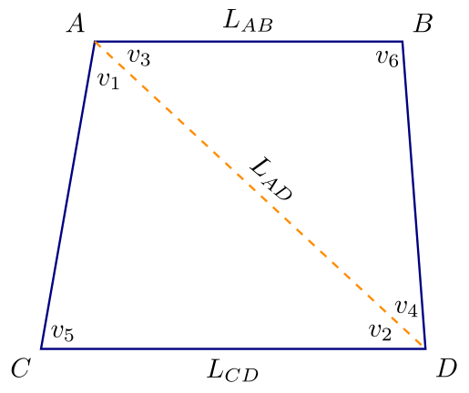

# Introduktion{-}
I denne workshop skal I undersøge, hvordan overbestemmelse kan hjælpe med at korrigere eventuelle målefejl i en landmåling.
Som et meget simpelt eksempel kan I forestille jer, at vi har målt alle tre vinkler i en trekant og har opnået
$$m_1=100.405\mathrm{gon},\quad
m_2=48.202\mathrm{gon},\quad
m_3=51.399\mathrm{gon}.$$

Her får vi summen $m_1+m_2+m_3 = 200.06$, hvilket selvfølgelig ikke kan være sandt, da vinkelsummen i en trekant skal være $200\mathrm{gon}$.
En simpel antagelse er, at hver måling typisk vil være udsat for lignende fejl &ndash; altså, at der f.eks. ikke er én måling der er mere upræcis, når alle målingerne er taget på samme måde. Derfor kan et fornuftigt bud på korrigerede målinger være
$$\begin{align*}
\hat{m}_1 &= m_1-0.2\mathrm{gon} = 100.403\mathrm{gon}\\
\hat{m}_2 &= m_2-0.2\mathrm{gon} = 48.202\mathrm{gon}\\
\hat{m}_3 &= m_3-0.2\mathrm{gon} = 51.399\mathrm{gon},
\end{align*}$$
så fejlen fordeles ligeligt mellem de tre målinger.

Hvis vi forestiller os, at de sande vinkler er
$$v_1 = 100.401\mathrm{gon},\quad
v_2 = 48.201\mathrm{gon},\quad
v_3 = 51.498\mathrm{gon},$$
så vil vores oprindelige målefejl være $m_1-v_1=0.04\mathrm{gon}$, $m_2-v_2=0.01\mathrm{gon}$ og $m_3-v_3=0.01\mathrm{gon}$, mens de korrigerede fejl er $\hat{m}_1-v_1=0.02\mathrm{gon}$, $\hat{m}_2-v_2=-0.01\mathrm{gon}$ og $\hat{m}_3-v_3 = -0.01\mathrm{gon}$.
For anden og tredje måling har vi derfor samme absolutte afvigelse, mens den absolutte afvigelse på første måling er blevet halveret.

For mere komplicerede måleplaner er det ikke lige så åbenlyst, hvordan korrektionen skal laves.
Vi betragter her måleplanen på @fig-trapez, som vi forestiller os er en byggegrund, hvis areal skal bestemmes. Vi ved på forhånd, at grunden er trapez-formet, så linjestykkerne $AB$ og $CD$ er parallelle.

{#fig-trapez width=60% fig-alt="Skitse af måleområdet"}

Vi har indsamlet målinger for længder $L$ og vinkler $v$ som på @fig-trapez. I denne workshop antager vi, at længderne ikke har nævneværdige fejl, mens vinklerne kan være fejlbehæftede. De målte vinkler betegner vi med $\mathbf{m}=[m_1,m_2,\ldots,m_6]^\top$. Målefejlene resulterer i en fejl i arealberegningen, og vores opgave er at minimere denne fejl.

# Delopgave 1{#sec-opg1}
1. Argumenter for, at vinklerne opfylder ligningssystemet
$$\begin{align}
v_1+v_2+v_5 &= 200\\
v_2 &= v_3\\
v_3+v_4+v_6 &= 200,
\end{align}$${#eq-vinkler}
hvor vinklerne angives i $\mathrm{gon}$.

1. Betragt vektoren
$$\mathbf{w} = [w_1, w_2,\ldots,w_6]^\top = [v_1, v_2-200, v_3-200, v_4, v_5, v_6]^\top.$$
Vis, at @eq-vinkler er ækvivalent med
$$\begin{align*}
w_1 &= -w_2-w_5\\
w_2 &= w_2\\
w_3 &= w_2\\
w_4 &= -w_2-w_6\\
w_5 &= w_5\\
w_6 &= w_6.
\end{align*}$$

1. Konkludér fra ovenstående, at vi kan betragte $w_2$, $w_5$ og $w_6$ som frie variable. Vis, at dette betyder, at $\mathbf{w}$ ligger i
$$L = \mathrm{Span}\{\mathbf{x}_1, \mathbf{x}_2, \mathbf{x}_3\} =
\mathrm{Span}\left\{
\left[
\begin{array}{r}
-1\\ 1\\ 1\\ -1\\ 0\\ 0
\end{array}
\right],
\left[
\begin{array}{r}
-1\\ 0\\ 0\\ 0\\ 1\\ 0
\end{array}
\right],
\left[
\begin{array}{r}
0\\ 0\\ 0\\ -1\\ 0\\ 1
\end{array}
\right]
\right\}.$$

# Delopgave 2{#sec-opg2}
I denne delopgave skal I vise, at de korrigerede målinger kan findes ved en ortogonalprojektion.

(@) Forklar, at det eksakte areal af grunden kan beregnes som
$$A = \frac{1}{2}L_{AD}(L_{CD}+L_{AB})\sin(v_2).$${#eq-areal}

I arealformelen ovenfor kan vi selvfølgelig indsætte vores målte $m_2$, men vi kunne også indsætte $m_3$, da @eq-vinkler fortæller, at $v_2=v_3$. Når målingerne kan være udsat for fejl, vil det potentielt give to forskellige arealestimater.
En simpel strategi er at bruge gennemsnittet $\frac{m_2+m_3}{2}$, men så udnytter vi ikke de andre vinkelmålinger, vi har foretaget.

I stedet transformerer vi vores vinkelmålinger på samme måde, som vi tidligere gjorde for de sande vinkler:
$$\mathbf{n}=[n_1,n_2,\ldots,n_6]^\top = m_1, m_2-200, m_3-200, m_4, m_5, m_6]^\top.$$
Hvis målingerne ikke indeholder nogen fejl, vil $\mathbf{n}$ ligge i underrummet $L$ (idet $\mathbf{n}=\mathbf{w}$ i det tilfælde).
Dermed kan vi finde et fornuftigt bud på de sande vinkler ved at bestemme den vektor i $L$, der ligger tættest på $\mathbf{n}$.

(@) Argumenter for, at den vektor i $L$, der ligger tættest på $\mathbf{n}$ netop er ortogonalprojektionen $p_L(\mathbf{n})$ på $L$.

    :::{.callout-tip title="Vink" collapse=true}
	Måske én af sætningerne i afsnit&nbsp;6.3 af lærebogen (Lay, Lay &amp; McDonald) kunne bruges?
    :::
	
(@) Vis, at $\mathbf{x}_2$ og $\mathbf{x}_3$ er ortogonale.

(@) Lad nu $\mathbf{b}_1=\mathbf{x}_2$ og $\mathbf{b}_2=\mathbf{x}_3$. Brug så Gram-Schmidt til at bestemme $\mathbf{b}_3$ sådan at $\{\mathbf{b}_1,\mathbf{b}_2,\mathbf{b}_3\}$ er en ortogonal basis for $L$.

(@) Angiv $QR$-faktoriseringen af
$$X = [\mathbf{x}_2\; \mathbf{x}_3\; \mathbf{x}_1].$${#eq-X}

Fra &lsquo;den ortogonale dekompositionssætning&rsquo; på side&nbsp;392 i lærebogen ved vi nu, at ortogonalprojektionen $p_L(\mathbf{n})$ er givet ved
$$p_L(\mathbf{n}) = \frac{\mathbf{n}\cdot\mathbf{b}_1}{\mathbf{b}_1\cdot\mathbf{b}_1}\mathbf{b}_1 + \frac{\mathbf{n}\cdot\mathbf{b}_2}{\mathbf{b}_2\cdot\mathbf{b}_2}\mathbf{b}_2 + \frac{\mathbf{n}\cdot\mathbf{b}_3}{\mathbf{b}_3\cdot\mathbf{b}_3}\mathbf{b}_3.$$
For at vurdere fejlen på målingerne, er det naturligt at beregne den såkaldte _residualvektor_, som giver komponenten i $L^\perp$ i den ortogonale dekomposition. Altså er residualvektoren
$$\mathbf{r} = \mathbf{n} - p_L(\mathbf{n}).$$

# Delopgave 3{#sec-opg3}
Her skal I vise, at projektionen også kan bestemmes ud fra matricen $X$ givet i @eq-X.

1. Vis ved hjælp af $QR$-faktoriseringen af $X$, at $X^\top X$ har positiv determinant, og konkluder, at den derfor er inverterbar.

   :::{.callout-tip title="Vink" collapse=true}
   Brug $X=QR$ i $\det(X^\top X)$ sammen med, at determinanten er multiplikativ.
   :::
   
1. Vis, at projektionen er givet ved
$$p_L(\mathbf{n}) = X(X^\top X)^{-1} X^\top\mathbf{n}$${#eq-projektion}
ved følgende trin:

   a. Forklar, at $\mathbf{n}$ har en entydig ortogonal opsplitning $\hat{\mathbf{n}} + \mathbf{r}$ med $\hat{\mathbf{n}}\in L$ og $\mathbf{r}\in L^\perp$. Forklar, at dette betyder $p_L(\mathbf{n})=\hat{\mathbf{n}}$.
   
      :::{.callout-tip title="Vink til anden del" collapse=true}
	  Brug, at projektionen $p_L$ er lineær.
	  :::
	  
   a. Vis, at $\hat{\mathbf{n}}=X\mathbf{c}$ for et passende valg af $\mathbf{c}$. Konkluder deraf, at $X(X^\top X)^{-1}X^\top\mathbf{n} = \hat{\mathbf{n}}$.
   
   a. Forklar, hvorfor $X^\top\mathbf{r}=\mathbf{0}$ må holde. Konkluder derfor, at $X(X^\top X)^{-1} X^\top\mathbf{r}=\mathbf{0}$.
   
   a. Kombiner de ovenstående observationer til at konkludere, at @eq-projektion holder for alle mulige valg af $\mathbf{n}$.
   
      :::{.callout-tip title="Vink" collapse=true}
	  Tjek at højre- og venstresiden er ens, og at dette ikke afhænger af de specifikke værdier i $\mathbf{n}$.
	  :::
	  
# Delopgave 4 {#sec-opg4}
Antag, at vi har noteret måleresultater
$$\mathbf{m} = [65.1, 54.1, 44.9, 50.2, 89.7, 104.7]^\top.$$

1. Fyld den fundne $\mathbf{b}_3$ in i Python-koden herunder (der, hvor der står `???`), og brug den til at bestemme residualvektoren. Hvilken af målingerne ser ud til at være fejlbehæftet?
   ```{pyodide-python}
   import numpy
   from numpy.linalg import inv
   
   m = numpy.array([65.1, 54.1, 44.9, 50.2, 89.7, 104.7])
   n = m - [0, 200, 200, 0, 0, 0]
   
   b1 = numpy.array([-1, 0, 0, 0, 1, 0])
   b2 = numpy.array([0, 0, 0, -1, 0, 1])
   b3 = numpy.array([???])
   
   X = numpy.column_stack((b1, b2, b3))
   
   pLn = X @ inv(X.T @ X) @ X.T @ n
   r = n - pLn
   print("Projektion:\t{}\nResidual:\t{}".format(pLn, r))
   ```

1. Efter at have dobbelttjekket målebogen, opdager vi, at de to første målinger er blevet byttet om. Kør koden herunder for at finde den opdaterede residualvektor.
   ```{pyodide-python}
   mNy = m
   mNy[0], mNy[1] = mNy[1], mNy[0]
   
   nNy = mNy - [0, 200, 200, 0, 0, 0]
   
   pLnNy = X @ inv(X.T @ X) @ X.T @ nNy
   rNy = nNy - pLnNy
   print("Projektion:\t{}\nResidual:\t{}".format(pLnNy, rNy))
   ```
   
1. Brug den tilrettede projektion ovenfor til at bestemme de korrigerede målinger $\hat{m}_2$ og $\hat{m}_3$. Brug dem til at estimere arealet via @eq-areal.

   Sammenlign dette estimat med estimatet man får, hvis man i stedet bruger gennemsnittet af $m_2$ og $m_3$.

<!-- Local Variables: -->
<!-- ispell-local-dictionary: "da_DK" -->
<!-- End: -->
