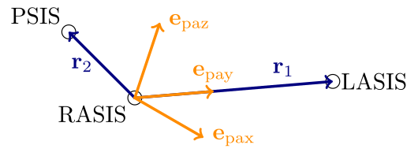

# Introduktion{-}
I denne workshop skal vi undersøge, hvordan begrebet ortogonalitet fra lineær algebra indgår i en analyse af en forsøgspersons gangart. Ved at placere markører forskellige steder på forsøgspersonens krop kan man beregne, hvordan forskellige kropsdele bevæger sig i forhold til hinanden under forsøgspersonens gang.
Dette gøres ved at filme forsøgspersonens gang og bagefter bruge markørernes bevægelser til at udregne et koordinatsystem (ortonormal basis) for hver kropsdel, man ønsker at analysere.
Ved at sammenligne koordinatsystemer for forskellige kropsdele kan man bestemme deres orientering relativt til hinanden eller til forsøgslokalet. For at kunne bestemme sådanne koordinatsystemer skal man bruge mindst tre markører (som ikke ligger på samme linje i rummet). For at give et korrekt billede af gangarten er det vigtigt, at markørerne placeres, hvor knoglerne sidder tæt på huden. 

Vi vil i denne workshop se, hvordan man beskriver et koordinatsystem for forsøgspersonens bækken.
Der placeres markører på højre og venstre *spina iliaca anterior superior* (forkortet hhv. RASIS og LASIS fra engelsk) samt på højre *spina iliaca posterior superior* (forkortet PSIS). Se @fig-hofte for en en illustration af punkterne placering på hoftebenet &ndash; RASIS og PSIS findes øverst til højre og venstre på @fig-hofteYderside.

::: {#fig-hofte layout-ncol=2}

_-_Vol2_Part1-_Fig_122.png))](QuainsElementsAnatomy_122.png){#fig-hofteYderside width=85% fig-alt="Ydersiden af højre hofteben"}

_-_Vol2_Part1-_Fig_124.png))](QuainsElementsAnatomy_124.png){width=85% fig-alt="Forsiden af højre hofteben"}

T.W.P. Lawrences illustrationer af det mandlige højre hofteben fra *&lsquo;Quain's Elements of Anatomy&rsquo;* (1891).
:::

Vi antager, at forsøgslokalet er beskrevet ved koordinatsystemet givet ved standardbasen
$$\mathbf{e}_1=\begin{bmatrix}
    1\\0\\0
  \end{bmatrix},\quad \mathbf{e}_2=\begin{bmatrix*}[r]
    0\\1\\0
  \end{bmatrix*},\quad \mathbf{e}_3\begin{bmatrix*}[r]
    0\\0\\1
  \end{bmatrix*}.$$

I forhold til standardbasen er markørerne givet ved koordinaterne
$$\mathbf{m}_{\mathrm{RASIS}}=\begin{bmatrix*}[r]
    -0.850\\-0.802\\0.652 
  \end{bmatrix*},\quad \mathbf{m}_{\mathrm{LASIS}}=\begin{bmatrix*}[r]
    -0.832 \\ -0.662\\ 0.670
  \end{bmatrix*},\quad \mathbf{m}_{\mathrm{PSIS}}=\begin{bmatrix*}[r]
    -1.047\\  -0.712 \\ 0.716
  \end{bmatrix*}.$$

Disse tre punkter ligger i planen udspændt af de to vektorer 
$$\mathbf{r}_1=\mathbf{m}_{\mathrm{LASIS}}-\mathbf{m}_{\mathrm{RASIS}}=\begin{bmatrix*}[r]
    0.0180\\
    0.1400\\
    0.0180  \end{bmatrix*}, \quad \mathbf{r}_2= \mathbf{m}_{\mathrm{PSIS}}-\mathbf{m}_{\mathrm{RASIS}}=\begin{bmatrix*}[r]
      -0.1970\\
    0.0900\\
    0.0640\\
  \end{bmatrix*}.$$

Vi ønsker et ortonormalt koordinatsystem, tager udgangspunkt i bækkenets placering og orientering. Den første vektor $\mathbf{e}_{\mathrm{pay}}$ er en enhedsvektor i retning $\mathbf{r}_1$ (mærkatet &lsquo;pa&rsquo; markerer, at det nye koordinatsystem er et *pelvis-anatomisk* koordinatsystem).
Vektoren $\mathbf{e}_{\mathrm{paz}}$ vælges til at være ortogonal på planet udspændt af $\mathbf{r}_1$ og $\mathbf{r}_2$, og til sidst vælges $\mathbf{e}_{\mathrm{pax}}$ til at være ortogonal på både $\mathbf{e}_{\mathrm{pay}}$ og $\mathbf{e}_{\mathrm{paz}}$. Se @fig-paSystem for en skitse af koordinatsystemet.

{#fig-paSystem width=75% fig-alt="Illustration af pelvis-anatomisk koordinatsystem"}

Når vi har konstrueret $\{\mathbf{e}_{\mathrm{pax}}, \mathbf{e}_{\mathrm{pay}}, \mathbf{e}_{\mathrm{paz}}\}$, vil vi gerne bestemme, hvordan dette koordinatsystem er orienteret i forhold til det koordinatsystem, som beskriver forsøgslokalet (standardbasen).

Vi skal i @sec-opg1 se, hvordan krydsproduktet kan anvendes til at konstruere vores koordinatsystem.
I @sec-opg2 vil vi se på, hvordan orienteringen af koordinatsystemet $\{\mathbf{e}_{\mathrm{pax}}, \mathbf{e}_{\mathrm{pay}}, \mathbf{e}_{\mathrm{paz}}\}$ i forhold til forsøgslokalets kooordinatsystem kan beskrives af såkaldte Euler-vinkler.
Til sidst vil vi i @sec-opg3 anvende Matlab til at udregne de relevante størrelser for vores konkrete data.


# Delopgave 1{#sec-opg1}
Vi definerer krydsproduktet for to vektorer $\mathbf{x}=[x_1,x_2,x_3]^T$ og $\mathbf{y}=[y_1,y_2,y_3]^T$ i $\mathbb{R}^3$ til at være 
$$\mathbf{x}\times\mathbf{y}=\begin{bmatrix*}[r]
    x_2y_3-x_3y_2\\
    x_3y_1-x_1y_3\\
    x_1y_2-x_2y_1
  \end{bmatrix*}$$


1. Vis at hvis $\mathbf{z}=[z_1,z_2,z_3]^T$, så gælder, at 
$$\mathbf{z}\cdot (\mathbf{x}\times \mathbf{y})=\det \left( \begin{bmatrix*}[r]
  z_1 &z_2 &z_3\\
  x_1 & x_2 & x_3\\
  y_1 & y_2 & y_3
\end{bmatrix*} \right)$$

   :::{.callout-tip title="Vink" collapse=true}
   Lav kofaktorudvikling i forhold til første række i matricen.
   :::
   

1. Vis at krydsproduktet er antisymmetrisk dvs. at $\mathbf{x}\times \mathbf{y}=-\mathbf{y}\times \mathbf{x}$.

   :::{.callout-tip title="Vink" collapse=true}
   Ved at bruge (i) har vi at der for alle $\mathbf{z}$ i $\mathbb{R}^3$ gælder at
$$\mathbf{z}\cdot\Big( (\mathbf{x}\times \mathbf{y})+(\mathbf{y}\times \mathbf{x})\Big)=\det \left( \begin{bmatrix*}[r]
  z_1 &z_2 &z_3\\
  x_1 & x_2 & x_3\\
  y_1 & y_2 & y_3
\end{bmatrix*} \right)+\det \left( \begin{bmatrix*}[r]
  z_1 &z_2 &z_3\\
  y_1 & y_2 & y_3\\
  x_1 & x_2 & x_3
\end{bmatrix*}\right).$$
Summen af de to determinanter kan så udregnes ved at huske at en rækkeombytning skifter fortegn på determinanten.
   :::
   
1. Vis at $\mathbf{x}\times\mathbf{y}$ står vinkelret på  $\mathbf{x}$ og $\mathbf{y}$, dvs. vis at $\mathbf{x}\cdot (\mathbf{x} \times \mathbf{y})=\mathbf{y}\cdot (\mathbf{x}\times\mathbf{y})=0$.

   :::{.callout-tip title="Vink" collapse=true}
   Hvad er
$$\det \left( \begin{bmatrix*}[r]
    x_1 &x_2 &x_3\\
    x_1 & x_2 & x_3\\
    y_1 & y_2 & y_3
  \end{bmatrix*} \right) \quad \text{og} \quad \det \left( \begin{bmatrix*}[r]
    y_1 &y_2 &y_3\\
    x_1 & x_2 & x_3\\
    y_1 & y_2 & y_3
  \end{bmatrix*} \right)?$$
   :::
   
1. Vis at $\left\Vert \mathbf{x}\times\mathbf{y}\right\Vert^2=\left\Vert \mathbf{x}\right\Vert ^2\left\Vert \mathbf{y}\right\Vert ^2-(\mathbf{x}\cdot \mathbf{y})^2$

1. Brug formlen $\mathbf{x}\cdot \mathbf{y}=\left\Vert \mathbf{x}\right\Vert \left\Vert \mathbf{y}\right\Vert \cos(\theta)$ til at vise, at
$$\left\Vert \mathbf{x}\times\mathbf{y}\right\Vert=\left\Vert \mathbf{x}\right\Vert \left\Vert \mathbf{y}\right\Vert \left\vert \sin(\theta)\right\vert,$$
hvor $\theta$ angiver vinklen mellem $\mathbf{x}$ og $\mathbf{y}$.

   Argumenter efterfølgende for at $\left\Vert \mathbf{x} \times \mathbf{y}\right\Vert$ angiver arealet af parallelogrammet udspændt af $\mathbf{x}$ og $\mathbf{y}$. 

1. Hvad sker der med $\mathbf{x}\times \mathbf{y}$, når $\mathbf{x}$ og $\mathbf{y}$ er ortogonale, og hvad sker der, når $\mathbf{y}=k\mathbf{x}$ for en konstant $k$?


# Delopgave 2{#sec-opg2}
For at bestemme orienteringen af koordinatsystemet $\{\mathbf{e}_{\mathrm{pax}}, \mathbf{e}_{\mathrm{pay}}, \mathbf{e}_{\mathrm{paz}}\}$ i forhold til koordinatsystemet $\{\mathbf{e}_1,\mathbf{e}_2,\mathbf{e}_3\}$ anvendes såkaldte Euler-vinkler (nogle gange også kaldet Tait-Bryan vinkler).
Vi vil i denne delopgave se, hvordan man ved hjælp af tre elementære rotationer &ndash; altså rotationer om akserne i vores faste koordinatsystem &ndash; kan beskrive et koordinatsystem i forhold til et andet. 

Generelt gælder, at en rotationsmatrix er en ortogonal matrix med determinant lig 1. Med andre ord er $R$ en rotationsmatrix, hvis og kun hvis
$$R^TR=I, \quad \text{og} \quad \det(R)=1.$$


(@) Vis at hvis $R_1$ og $R_2$ er rotationer, så er $R_1R_2$ også en rotation.


I denne opgave vil vi først rotere omkring $y$-aksen med en vinkel $\theta_y$, herefter omkring $x$-aksen med en vinkel $\theta_x$ og til sidst omkring $z$-aksen med en vinkel $\theta_z$ vha. rotationsmatricerne
$$R_y=\begin{bmatrix*}[r]
    \cos \theta_y & 0 & \sin\theta_y\\
    0 & 1 & 0\\
    -\sin \theta_y & 0 & \cos \theta_y
  \end{bmatrix*},\quad 
  R_x=\begin{bmatrix*}[r]
    1 & 0 & 0\\
    0 & \cos \theta_x & -\sin \theta_x\\
    0 & \sin \theta_x & \cos \theta_x
  \end{bmatrix*},\quad 
  R_z\begin{bmatrix*}[r]
    \cos \theta_z & -\sin \theta_z &0\\
    \sin \theta_z & \cos \theta_z&0\\
    0 & 0 & 1
  \end{bmatrix*}.$$
  
Bemærk at der gælder, at 
$$\begin{align}
  R_{yxz}&=R_zR_xR_y\nonumber\\
  &=\left[\small\begin{array}{ccc}
    \cos \theta_y \cos \theta_z- \sin \theta_z\sin \theta_x\sin\theta_y& -\sin\theta_z \cos \theta_x & \cos \theta_z \sin \theta_y +\sin \theta_z \sin \theta_x \cos \theta_y\\
    \sin \theta_z \cos \theta_y +\cos \theta_z\sin\theta_x\sin \theta_y & \cos \theta_z \cos \theta_x & \sin\theta_z\sin \theta_y-\cos \theta_z \sin \theta_x\cos \theta_y\\
    -\cos \theta_x \sin \theta_y & \sin \theta_x & \cos \theta_x \cos \theta_y
  \end{array}\right]
\end{align}$${#eq-rotProd}

(@) Vis at $R_x$, $R_y$ og $R_z$ er rotationsmatricer. Konkludér fra første del af opgaven, at $R_{yxz}$ også er en rotationsmatrix.

I de resterende opgaver vil vi antage, at $\theta_x=\frac{\pi}{4}$, $\theta_y=\frac{\pi}{2}$ og $\theta_z=-\frac{\pi}{4}$. Så gælder, at 
$$R_{yxz}=\frac{1}{2}\begin{bmatrix*}[r]
  1 & 1 & \sqrt{2}\\
  1 & 1 & -\sqrt{2}\\
  -\sqrt{2}& \sqrt{2} & 0
\end{bmatrix*}$$


(@) Vis at vektoren $\mathbf{x}=[1, 1, 0]^T$ er en egenvektor for $R_{yxz}$ med tilhørende egenværdi $1$.

(@) Vis at $\mathbf{y}=[-1,1,0]^T$ og $\mathbf{x}$ er ortogonale. 

(@) Vis at vinklen mellem $\mathbf{y}$ og $R_{yxz}\mathbf{y}$ er $\frac{\pi}{2}$. Konkluder at $R_{yxz}$ roterer med en vinkel på $\frac{\pi}{2}$ omkring rotationsaksen givet ved $[1,1,0]^T$.

    :::{.callout-tip title="Vink" collapse=true}
	Anvend formlen
	$$\cos\theta=\frac{\mathbf{y} \cdot R_{yxz}\mathbf{y}}{\left\Vert \mathbf{y} \right\Vert \left\Vert R_{yxz}\mathbf{y}\right\Vert },$$
	hvor $\theta$ angiver vinklen mellem $R_{yxz}\mathbf{y}$ og $\mathbf{y}$.
	:::


# Delopgave 3{#sec-opg3}
I denne opgave skal vi bruge nogle af de egenskaber vi viste i @sec-opg1 for krydsprodukter til at bestemme koordinatsystemet $\{\mathbf{e}_{\mathrm{pax}}, \mathbf{e}_{\mathrm{pay}}, \mathbf{e}_{\mathrm{paz}} \}$, der beskriver bækkenet.
Efterfølgende vil vi anvende rotationerne fra @sec-opg2 til at bestemme vinklerne $\theta_x$, $\theta_y$ og $\theta_z$, således at 
$$\begin{align}
  R_zR_xR_y \mathbf{e}_1&=\mathbf{e}_{\mathrm{pax}}\label{1}\\
  R_zR_xR_y \mathbf{e}_2&=\mathbf{e}_{\mathrm{pay}}\label{2}\\
  R_zR_xR_y \mathbf{e}_3&=\mathbf{e}_{\mathrm{paz}}\label{3}.
\end{align}$${#eq-rotationer}

Til nogle af opgaverne er der givet en stump Python-kode, som kan hjælpe med beregningerne.

```{pyodide-python}
import numpy
from numpy.linalg import norm

mRASIS = numpy.array([-0.850, -0.802, 0.652])
mLASIS = numpy.array([-0.832, -0.662, 0.670])
mPSIS  = numpy.array([-1.047, -0.712, 0.716])

r1 = mLASIS-mRASIS
r2 = mPSIS-mRASIS
```

1. Bestem $\mathbf{r}_3=\mathbf{r}_1\times \mathbf{r}_2$ og $\mathbf{r}_4=\mathbf{r}_1\times \mathbf{r}_3$.

   ```{pyodide-python}
   r3 = numpy.cross(r1,r2)
   r4 = numpy.cross(r1,r3)
   
   print("r3 = {}".format(r3))
   print("r4 = {}".format(r4))
   ```

1. Argumenter for at det ortogonale komplement til planen udspændt af $\mathbf{r}_1$ og $\mathbf{r}_2$ er givet ved $\mathrm{Span}(\mathbf{r}_3)$.

1. Argumenter vha. delopgave 1 for at $\{\mathbf{r}_1,\mathbf{r}_3,\mathbf{r}_4\}$ er en ortogonal mængde. 

1. Konstruer den ortonormale basis $\{\mathbf{e}_{\mathrm{pax}}, \mathbf{e}_{\mathrm{pay}}, \mathbf{e}_{\mathrm{paz}}\}$ som vist i @fig-paSystem.

   ```{pyodide-python}
   epax = r4/norm(r4)
   epay = r1/norm(r1)
   epaz = r3/norm(r3)
   
   print("epax = {}".format(epax))
   print("epay = {}".format(epay))
   print("epaz = {}".format(epaz))
   ```

1. Antag at @eq-rotationer gælder. Brug @eq-rotProd til at vise, der så gælder, at
$$\begin{align*}
  \theta_x&=\sin^{-1}(\mathbf{e}_{\mathrm{pay}}\cdot \mathbf{e}_3)\\
  \theta_y&=-\sin^{-1} \left( \frac{\mathbf{e}_{\mathrm{pax}}\cdot \mathbf{e}_3}{\cos(\theta_x)} \right)\\
  \theta_z&=-\sin^{-1}\left( \frac{\mathbf{e}_{\mathrm{pay}}\cdot \mathbf{e}_1}{\cos(\theta_x)} \right)
\end{align*}$${#eq-vinkler}

1. Brug @eq-vinkler til at bestemme vinklerne $\theta_x$, $\theta_y$ og $\theta_z$. Fyld selv de manglende udtryk ind i koden herunder.

   ```{pyodide-python}
   e1 = numpy.array([1, 0, 0])
   e2 = numpy.array([0, 1, 0])
   e3 = numpy.array([0, 0, 1])
   
   thetax = ## Skriv udtrykket for thetax her
   thetay = -numpy.asin(numpy.dot(epax, e3))/numpy.cos(thetax)
   thetaz = ## Skriv udtrykket for thetaz her
   
   print("thetax = {:.4f} (≈pi/{:.1f})".format(thetax, numpy.pi/thetax))
   print("thetay = {:.4f} (≈pi/{:.1f})".format(thetay, numpy.pi/thetay))
   print("thetaz = {:.4f} (≈pi/{:.1f})".format(thetaz, numpy.pi/thetaz))
   ```

:::{.callout-warning}
Husk at gemme din kode i en separat fil. Hvis du lukker denne fil og åbner den igen, vil den vise den oprindelige kode, hvor linje 6 og 7 mangler.
:::
