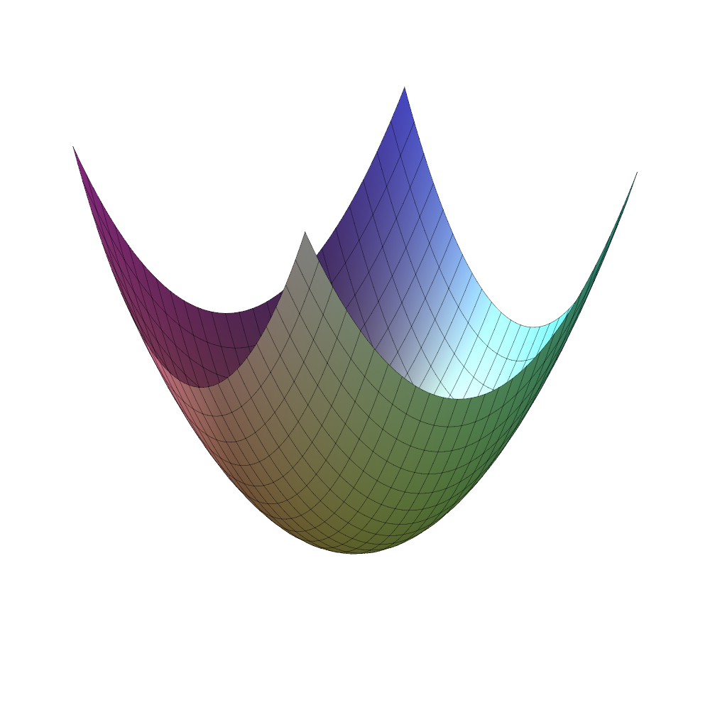
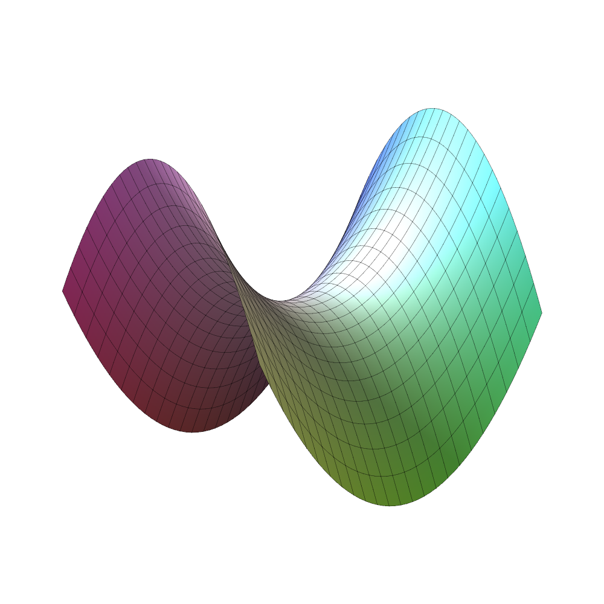
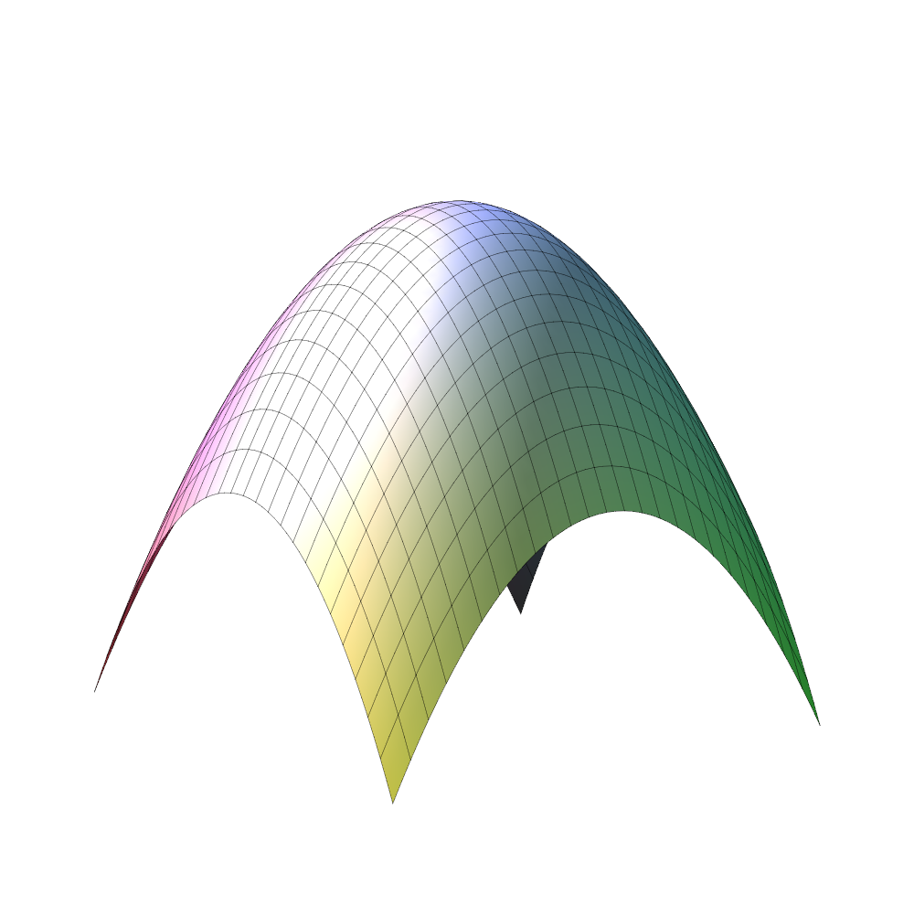
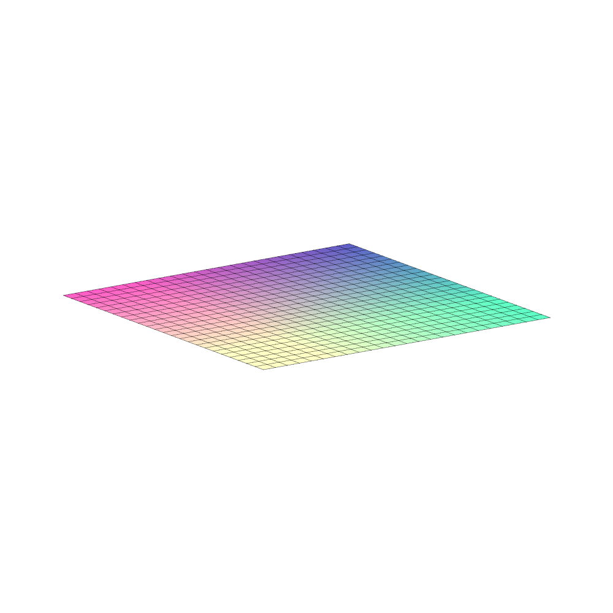
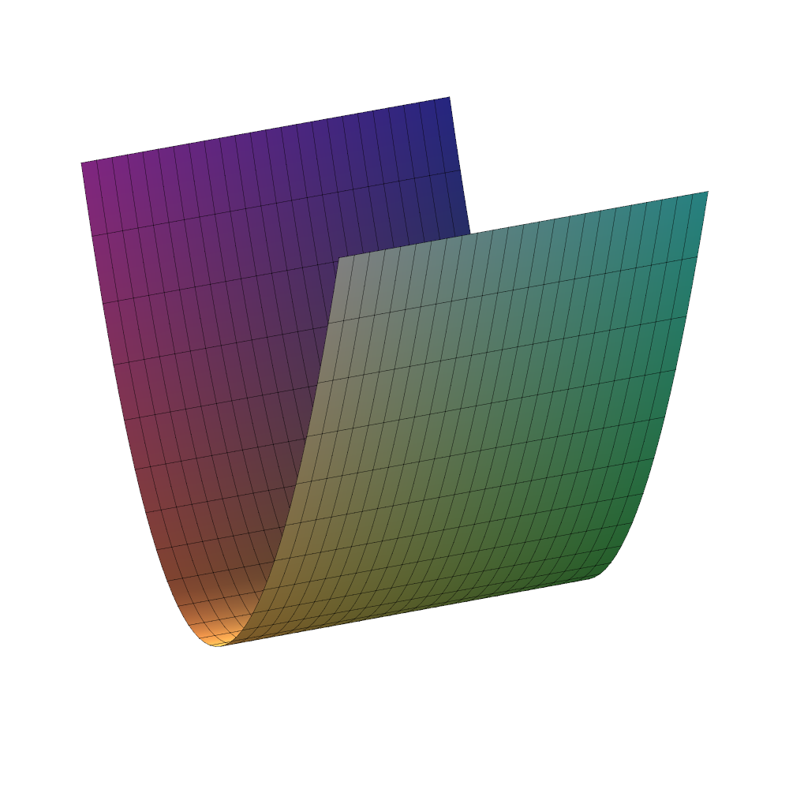

# Introduktion{-}
Når man vil opføre en vindmølle på en given lokalitet, skal man beregne hvor store ekstremlaster og udmattelseslaster, der forventes at komme, for at sikre, at møllen kan holde til belastningerne. Belastningen, *responsen*, afhænger blandt andet af *baggrundsvariable* middelvindhastigheden, turbulensen, luftens densitet og ændringen af vindhastigheden med højden.


Ønsker vi at bestemme eksempelvis den maksimale last i løbet af 50 år, kræver den præcise beregning tidskrævende *aerostatiske* simuleringer med forskellige værdier for baggrundsvariablene. Skal dette gøres for mange mulige placeringer af vindmøllen, spares meget tid og beregningskraft ved at bruge en simplere model, hvor eksempelvis polynomier tilnærmer den resultaterne fra de beregningstunge simuleringer.
Man har altså data fra kørsel af den komplicerede model på én lokalitet og skal nu tilnærme data med polynomier. Når modellen skal bruges et nyt sted, anvendes den simplere model.

Her går vi ud fra, der er to baggrundsvariable og responsvariablen er belastningen.
Der er lavet simulationer, som giver datapunkter -- det $j$'te datapunkt er  $(x_1^{(j)},x_2^{(j)},v_j)$.

Denne workshop handler om anvendelsen af *mindste kvadraters metode* og *regressionsanalyse*, til at approksimere en ukendt funktion af flere variable (*responsvariablen*) udfra et antal datapunkter. I RSM, Response Surface Methodology, som i eksemplet med vindmøllerne, ønsker man at finde maksima eller minima for belastningerne.

Vi approksimerer belastningsfunktionen med et andengradspolynomium i to variable:
$$g(x_1,x_2)=u_1+u_2x_1+u_3x_2+u_4x_1^2+u_5x_1x_2+u_6x_2^2.$$

På @fig-andengrads ses en række eksempler på plots af sådanne polynomier, og vi har med andre ord antaget, at belastningsfunktionen opfører sig som en af disse.
Den sande belastningfunktion er ikke nødvendigvis et andengradspolynomium og der er usikkerhed på data, så vi forventer ikke, at $g(x_1^{(j)},x_2^{(j)})=v_j$. 

::: {#fig-andengrads layout-ncol=5}

{fig-alt="Plot af andengradspolynomium med minimum i toppunktet"}

{fig-alt="Plot af andengradspolynomium med saddelform"}

{fig-alt="Plot af andengradspolynomium med maksimum i toppunktet"}

{fig-alt="Plot af et plan"}

{fig-alt="Plot af andengradspolynomium med uendeligt mange minima"}

Eksempler på plots af andengradspolynomier.
:::

Workshoppen går ud på at finde $u_1,\ldots,u_6$, så andengradspolynomiet tilnærmer datapunkterne bedst muligt. 
Altså at finde minimum for
$$\begin{align}
&F(u_1,...,u_6)=\\
  \sum_{j=1}^n &\left ( v_j- \big(u_1 +u_2 x_1^{(j)}+u_3 x_2^{(j)} +u_4 (x_1^{(j)})^2 + u_5 x_1^{(j)} x_2^{(j)} +u_6  (x_2^{(j)})^2 \big) \right )^2.
\end{align}$${#eq-1}
 

Workshoppen består af tre delopgaver.

# Delopgave 1{#sec-opg1}
1. Lad $X$ være $n\times 6$ matricen givet udfra data ved
$$X= 
\begin{bmatrix}
1 & x_1^{(1)} &  x_2^{(1)} & \left (x_1^{(1)}\right )^2 & x_1^{(1)}x_2^{(1)} &\left (x_2^{(1)}\right )^2\\
1 & x_1^{(2)} &  x_2^{(2)} & \left (x_1^{(2)}\right )^2 & x_1^{(2)}x_2^{(2)} &\left (x_2^{(2)}\right )^2 \\
. & .& . & .&.&.\\
. & .& . & .&.&.\\
1 & x_1^{(n)} &  x_2^{(n)} & \left (x_1^{(n)}\right )^2 & x_1^{(n)}x_2^{(n)}& \left (x_2^{(n)}\right )^2
\end{bmatrix}.$$

   Vis, at @eq-1 kan omskrives som 
   $$F(\mathbf{u})=\left \Vert \mathbf{v} -X\mathbf{u}\right \Vert^2.$$

   Et minimumspunkt for $F(\mathbf{u})$ er derfor en vektor $\hat{\mathbf{u}}$, som opfylder, at $\|\mathbf{v}-X\hat{\mathbf{u}}\|\leq \|\mathbf{v}-X\mathbf{u}\|$ for alle $\mathbf{u}$. 
   $\hat{\mathbf{u}}$ kaldes da en *mindste kvadraters løsning* til $X\mathbf{u}=\mathbf{v}$.

   I @sec-opg2 vises, at $\hat{\mathbf{u}}$ er en mindste kvadraters løsning til $X\mathbf{u}=\mathbf{v}$ hvis og kun hvis $\hat{\mathbf{u}}$ er løsning til *normalligningen*
$$\begin{align}
    X^TX \hat{\mathbf{u}}=X^T\mathbf{v}.
\end{align}$${#eq-2}


1. Vi ser på det simplere problem: Find det andetgradspolynomium $u_1+u_2x+u_3x^2$, som bedst tilnærmer datapunkterne 
$$(x^{(1)},v_1), (x^{(2)},v_2), (x^{(3)},v_3),(x^{(4)},v_4),(x^{(5)},v_5).$$
Opstil den $5\times 3$ matrix, der svarer til matricen $X$.


1. Datapunkterne 
$$(x^{(1)},v_1)=(-1,1), (x^{(2)},v_2)=(1,1), (x^{(3)},v_3)=(0,0), (x^{(4)},v_4)=(2,1)$$ 
ønskes tilnærmet med et andetgradspolynomium.
Opstil $4\times 3$ matricen $X$ og vis, at \begin{equation*} X^TX=\begin{bmatrix}4&2&6\\2&6&8\\6&8&18\end{bmatrix} \end{equation*}
og at $X^TX$ er invertibel.

1. Løs normalligningen $X^TX\hat{\mathbf{u}}=X^T\mathbf{v}$, hvor
$\mathbf{v}=\begin{bmatrix}1&1&0&1\end{bmatrix}^T$

   Opstil det andetgradspolynomium, der bedst tilnærmer de fire datapunkter og tegn det og punkterne i et plant koordinatsystem.
\item Vis, at hvis $X^TX$ er invertibel og $X=QR$ er en $QR$-faktorisering, så er $\hat{\mathbf{u}}=R^{-1}Q^T\mathbf{v}$. (I behøver ikke vise, at $R$ er invertibel.)

# Delopgave 2{#sec-opg2}
I denne delopgave vises, at $\hat{\mathbf{u}}$ er en mindste kvadraters løsning til $X\mathbf{u}=\mathbf{v}$, hvis og kun hvis $\hat{\mathbf{u}}$ er en løsning til normalligningen @eq-2, og at denne ligning altid er konsistent.

1. $X\mathbf{u}$ ligger i søjlerummet Col($X$), så  $\| \mathbf{v} -X\mathbf{u}\|$ er mindst, hvis $X\mathbf{u}$ er den vektor i søjlerummet, der ligger tættest på $\mathbf{v}$. 
Indse, at $X\mathbf{u}$ skal være projektionen af $\mathbf{v}$ på Col($X$). Projektionen kaldes nu $\hat{\mathbf{v}}$. I skal ikke udregne $\hat{\mathbf{v}}$.

   Gør rede for, at ligningen $X\mathbf{u}=\hat{\mathbf{v}}$ er konsistent og konkluder, at der findes et minimum for $F(\mathbf{u})$.
   
1. Gør rede for, at $\mathbf{v}-\hat{\mathbf{v}}$ ligger i (Col($X$)$)^\perp$ og derfor $X^T(\mathbf{v}-\hat{\mathbf{v}})=0$.

   ::: {.callout-tip title="Vink" collapse="true"}
   Rækkerne i $X^T$ er søjlerne i $X$. Disse er ortogonale på $\mathbf{v}-\hat{\mathbf{v}}$
   :::

1. Lad $\hat{\mathbf{u}}$ være et minimum for $F$ i @eq-1. Konkludér fra 2.1, at $\hat{\mathbf{u}}$ er en løsning til $X\mathbf{u}=\hat{\mathbf{v}}$. Brug nu 2.2 til at udlede
$$X^T(\mathbf{v}-X\hat{\mathbf{u}})=0.$$
Konkludér derfor, at *hvis* $\hat{\mathbf{u}}$ er mindste kvadraters løsning til @eq-1, *så* er $\hat{\mathbf{u}}$ løsning til @eq-2.
Konkludér desuden, at hvis $X^TX$ er invertibel, så er der en entydig løsning 
$$\hat{\mathbf{u}}=(X^TX)^{-1}X^T\mathbf{v}.$${#eq-valueCoeffs}

1. Brug nedenstående trin til at vise det omvendte udsagn. Altså, at enhver løsning til @eq-2 også er en mindste kvadraters løsning til $X\mathbf{u}=\mathbf{v}$:
   a. Lad $\mathbf{w}$ være en løsning til @eq-2. Vis, at $\mathbf{v}-X\mathbf{w}$ er i (Col($X))^\perp$
   a. Konkluder, at $X\mathbf{w}$ er den ortogonale projektion af $\mathbf{v}$ ind på Col($X$).
   a. og derfor, at $X\mathbf{w}=\hat{\mathbf{v}}$

   Hvorfor er argumentet færdigt nu?
   
   ::: {.callout-tip title="Vink" collapse="true"}
   Brug spørgsmål 1. og 2. i denne delopgave.
   :::


# Delopgave 3{#sec-opg3}
I skal nu bruge Python til at finde mindste kvadraters løsning for tre dataeksempler. De tre eksempler er givet i filen `dataEksempler.py`. I filen indlæses funktionen `leastSquares.fit` fra den tilhørende fil `leastSquares.py`, som I først skal have gemt på jeres computer (I kan med fordel gemme den sammen med resten af filerne til denne workshop). For at Python kan finde filen, skal I desuden sikre, at arbejdsmappen i Python er den mappe, hvor filerne ligger.
Alternativt kan alt koden køres gennem browseren via kodeblokkene nedenfor.

(@) Udfyld det, der mangler, i linjerne 18 og 19 i `leastSquares.py` eller herunder. I kan antage, at $X^TX$ er inverterbar, så @eq-valueCoeffs fra @sec-opg2 kan benyttes.

    Bemærk her, at matrixproduktet $AB$ skrives som `A.dot(B)` i numpy, den transponerede $A^T$ skrives `A.T`, og den inverse $A^{-1}$ kan findes ved `inv(A)`.

::: {.callout-warning}
Husk at gemme jeres ændrede Python-kode i en anden fil. Hvis I lukker denne HTML-fil og åbner den igen, vil den vise den oprindelige kode med <code>???</code>.
:::

```{pyodide-python}
import numpy
from numpy.linalg import inv
import matplotlib.pyplot as plt

def leastSquaresFit(X, v):
    """
    Find mindste kvadraters løsning u til Xu=vHat, sådan
    at ||v-vHat||^2 minimeres. Fungerer kun på andengrads-
    polynomier som i workshoppen.

    Args:
    	X: Designmatrix
    	v: Datavektor

    Returns:
    	(u, vHat)
    """
    u = ???                     # Fyld selv ind. Bemærk, at matrixproduktet
    vHat = ???                  # A*B er A.dot(B) i numpy

    # Evaluer modellen på et x/y-gitter
    x = numpy.arange(-10, 10, 0.1)
    y = numpy.arange(-10, 10, 0.1)
    xg, yg = numpy.meshgrid(x, y)
    zg = (
        numpy.ones(numpy.shape(xg)) * u[0] +
        xg * u[1] +
        yg * u[2] +
        xg**2 * u[3] +
        xg*yg * u[4] +
        yg**2 * u[5]
    )

    # Plot datapunkterne v sammen med modellen
    fig, ax = plt.subplots(subplot_kw={"projection": "3d"})
    ax.plot_surface(xg, yg, zg, alpha=0.7)
    ax.scatter(X[:,1], X[:,2], v, s=20, color='k')

    plt.show(block=False)

    return(u, vHat)
```
   
(@) Brug Python-funktionen på hvert af de tre eksempler ved at bruge `dataEksempler.py` eller kodeblokken herunder. Undersøg plottet for at tjekke, at målepunkterne ligger tæt på det fittede andengradspolynomium.

```{pyodide-python}
# Eksempel 1
X = numpy.array([
    [1.0000,   3.7843,   6.3461,  14.3209,  24.0153,  40.2725],
    [1.0000,   4.9630,   7.3739,  24.6317,  36.5969,  54.3743],
    [1.0000,  -0.9892,  -8.3113,   0.9785,   8.2213,  69.0774],
    [1.0000,  -8.3236,  -2.0043,  69.2819,  16.6833,   4.0174],
    [1.0000,  -5.4205,  -4.8026,  29.3814,  26.0323,  23.0649],
    [1.0000,   8.2667,   6.0014,  68.3391,  49.6118,  36.0164],
    [1.0000,  -6.9524,  -1.3717,  48.3364,   9.5368,   1.8816],
    [1.0000,   6.5163,   8.2130,  42.4627,  53.5184,  67.4526],
    [1.0000,   0.7668,  -6.3631,   0.5881,  -4.8795,  40.4885],
    [1.0000,   9.9227,  -4.7239,  98.4599, -46.8742,  22.3156],
    [1.0000,  -8.4365,  -7.0892,  71.1744,  59.8081,  50.2570],
    [1.0000,  -1.1464,  -7.2786,   1.3143,   8.3445,  52.9784],
    [1.0000,  -7.8669,   7.3858,  61.8888, -58.1040,  54.5507],
    [1.0000,   9.2380,   1.5941,  85.3399,  14.7262,   2.5411],
    [1.0000,  -9.9073,   0.9972,  98.1549,  -9.8796,   0.9944],
    [1.0000,   5.4982,  -7.1009,  30.2303, -39.0423,  50.4228]
])

v = numpy.array([
    -439.5409,
    -604.6152,
    -635.5055,
    -107.7673,
    -247.3446,
    -465.4821,
      52.8437,
    -578.4494,
    -307.5579,
     -27.8916,
    -549.6634,
    -359.3613,
    -392.4302,
     -80.7559,
      72.9325,
    -323.3382
])

leastSquaresFit(X, v);

# Eksempel 2
X = numpy.array([
    [1.0000,   6.2945,  -1.5648,  39.6204,  -9.8494,   2.4485],
    [1.0000,   8.1158,   8.3147,  65.8668,  67.4808,  69.1344],
    [1.0000,  -7.4603,   5.8441,  55.6555, -43.5989,  34.1540],
    [1.0000,   8.2675,   9.1898,  68.3518,  75.9772,  84.4533],
    [1.0000,   2.6472,   3.1148,   7.0076,   8.2455,   9.7021],
    [1.0000,  -8.0492,  -9.2858,  64.7895,  74.7429,  86.2255],
    [1.0000,  -4.4300,   6.9826,  19.6252, -30.9331,  48.7565],
    [1.0000,   0.9376,   8.6799,   0.8792,   8.1385,  75.3401],
    [1.0000,   9.1501,   3.5747,  83.7250,  32.7090,  12.7785],
    [1.0000,   9.2978,   5.1548,  86.4485,  47.9282,  26.5720],
    [1.0000,  -6.8477,   4.8626,  46.8915, -33.2982,  23.6454],
    [1.0000,   9.4119,  -2.1555,  88.5830, -20.2869,   4.6460],
    [1.0000,   9.1433,   3.1096,  83.6006,  28.4317,   9.6693],
    [1.0000,  -0.2925,  -6.5763,   0.0855,   1.9235,  43.2473],
    [1.0000,   6.0056,   4.1209,  36.0673,  24.7486,  16.9820],
    [1.0000,  -7.1623,  -9.3633,  51.2982,  67.0628,  87.6722]
])

v = numpy.array([
     250.0334,
     197.9215,
      69.1349,
     252.0619,
      41.4893,
     597.4172,
    -255.0650,
    -323.1510,
     495.1405,
     547.6792,
     147.4902,
     455.4288,
     458.9399,
     -63.0295,
     206.4838,
     340.9787
])

leastSquaresFit(X, v);

# Eksempel 3
X = numpy.array([
    [1.0000,  -2.3076,   1.8871,   5.3251,  -4.3548,   3.5612],
    [1.0000,   1.6597,  -9.5497,   2.7547, -15.8500,  91.1977],
    [1.0000,  -4.9639,  -1.4948,  24.6401,   7.4201,   2.2345],
    [1.0000,  -4.1912,  -3.7456,  17.5660,  15.6986,  14.0297],
    [1.0000,   2.3418,  -6.7703,   5.4841, -15.8548,  45.8370],
    [1.0000,  -4.6944,  -6.4247,  22.0372,  30.1599,  41.2765],
    [1.0000,   6.4875,  -1.5423,  42.0880, -10.0056,   2.3786],
    [1.0000,   9.6533,  -8.1154,  93.1856, -78.3403,  65.8599],
    [1.0000,   4.6050,   1.9705,  21.2058,   9.0740,   3.8828],
    [1.0000,  -3.1225,  -0.5815,   9.7498,   1.8158,   0.3382],
    [1.0000,   1.6814,   3.9190,   2.8271,   6.5893,  15.3585],
    [1.0000,  -7.8446,   3.9978,  61.5381, -31.3609,  15.9821],
    [1.0000,   8.1262,   2.7706,  66.0345,  22.5145,   7.6763],
    [1.0000,   7.5931,  -9.3279,  57.6548, -70.8276,  87.0102],
    [1.0000,   6.3552,  -8.6239,  40.3887, -54.8066,  74.3713],
    [1.0000,  -4.7854,  -3.6080,  22.9004,  17.2659,  13.0177]
])

v = numpy.array([
     44.7094,
    791.6215,
    120.2077,
    329.2580,
    471.6056,
    642.3050,
    189.6169,
    870.2549,
    153.6623,
     21.7418,
    177.4107,
    381.0897,
    604.9550,
    991.5774,
    755.9955,
    425.1984
])

leastSquaresFit(X, v);
```

(@) Hvilket af tilfældene i @fig-andengrads falder hvert af de tre eksempler ind under?
